First of all we check that we have connection with IP target.
```bash
$ ping -c 1 10.10.11.42
```
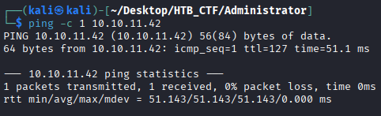

This TTL value on HTB indicates that is a Windows machine.

The initial Nmap output reveals many ports open SMB on port 445 , LDAP on port 389 , and Kerberos on port 88 , indicating that the machine uses Active Directory . We also notice that FTP is listening on port 21 .
```bash
$ sudo nmap -p- --open -sS -sC -sV --min-rate 5000 -n -Pn -A 10.10.11.11  -oX nmap.xml
$ xsltproc nmap.xml -o nmap.html
```
-p- → Scans all 65,535 TCP ports, not just the most common ones. All 65,535 TCP ports, not just the most common ones, not just the most common ones. 

--open → Shows only ports that are open, filtering out closed or filtered ones.

-sS → Performs a TCP SYN scan (half-open scan), which is fast and stealthy and requires root privileges.

-sC → Runs default NSE (Nmap Scripting Engine) scripts to gather additional information such as common vulnerabilities and service details.

-sV → Attempts to detect service versions running on open ports.

--min-rate 5000 → Forces Nmap to send at least 5000 packets per second, speeding up the scan but increasing the chance of detection or packet loss. 

-n →  Disables DNS resolution to make the scan faster.

-Pn → Skips host discovery and assumes the target is alive, useful when ICMP is blocked.

-A → Enables aggressive scan options, including OS detection, version detection, script scanning, and traceroute.

-oX → Output option: write results in XML format to file nmap.xml.  Other formats: -oN (normal), -oG (grepable), -oA (all formats).

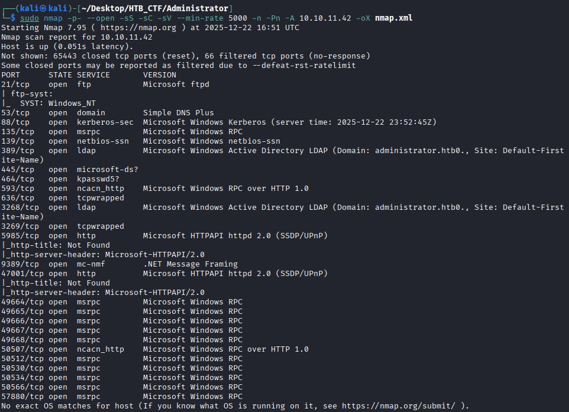
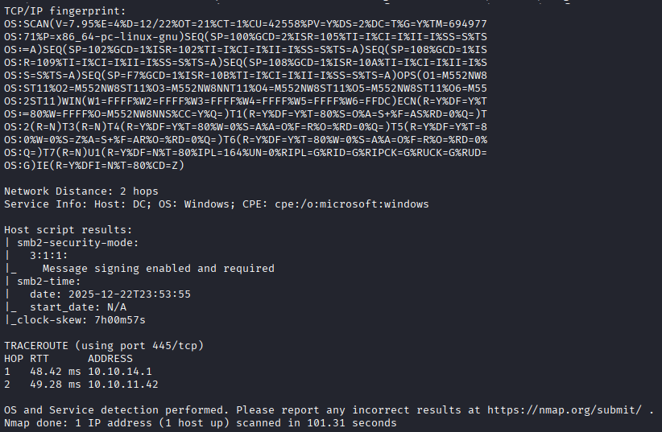


We get the domain name administrator.htb , which we add to our /etc/hosts file.
```bash
$ echo "10.10.11.42 administrator.htb" | sudo tee -a /etc/hosts
```
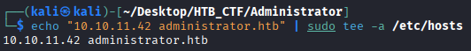

Using **rpcclient** and the default obtained credentials (Username: Olivia Password: ichliebedich), we attempt to connect to the machine and we will enumerate users inside the machine that we have access;
```bash
$ rpcclient -U  "olivia%ichliebedich" 10.10.11.42 -c 'enumdomusers'
```
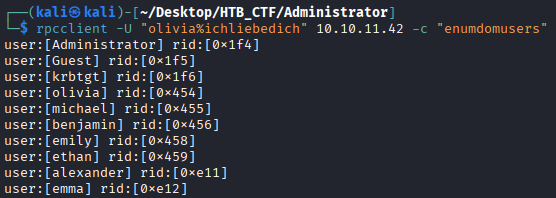

We can also enumerate de groups
```bash
$ rpcclient -U  "olivia%ichliebedich" 10.10.11.42 -c 'enumdomgroups'
```

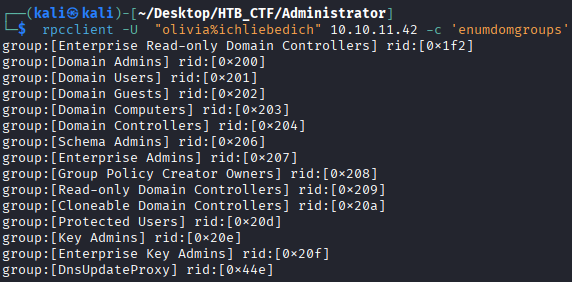


We will use **netexec** to attempt to enumerate the SMB service on the provided IP address. We will check the **shares** directory to see what we can do, what we have access to, and which permissions are assigned.
```bash
$ netexec smb 10.10.11.42 -u'olivia' -p'ichliebedich' --shares 
```
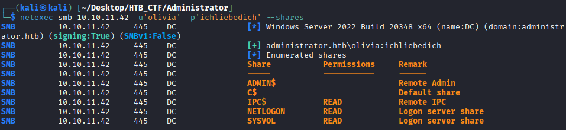

Using the provided credentials olivia:ichliebedich , we enumerate the Domain Controller using bloodhound .
```bash
$ bloodhound-python -d administrator.htb -u 'olivia' -p 'ichliebedich' -ns 10.10.11.42 -c all 
```
 bloodhound-python →  Launches the Python-based BloodHound ingestor.

 -d administrator.htb →  Specifies the Active Directory domain to target.

 -u 'olivia' →  The username used to authenticate to the domain.

 -p 'ichliebedich' →  The password for the specified user account.

 -c all →  Enables all collection methods, including users, groups, computers, sessions, ACLs, trusts, etc.

 -ns 10.10.11.42 → Specifies the DNS server IP address for resolving domain names.
 
 Running this command generates one or more .json / .zip output files containing AD relationship data. These files can be uploaded to the Bloodhound GUI connected to a Neo4j database for anaysis.

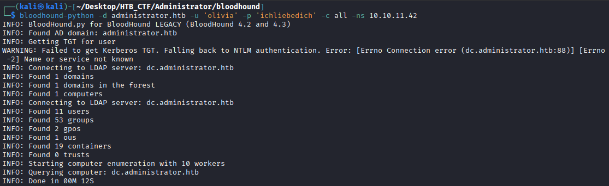


We add the domain dc.administrator.htb to our /etc/hosts

To install Bloodhound we need follow the following → https://bloodhound.specterops.io/get-started/quickstart/community-edition-quickstart

Once you have all like the guide, then:
```bash
$ docker-compose pull && docker-compose up
```
And wait

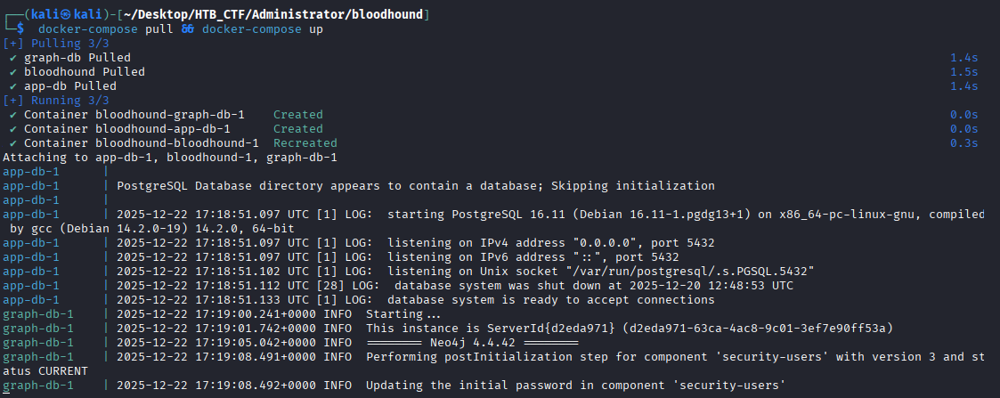

### You need to save your password to later authenticate yourself on Bloodhound.

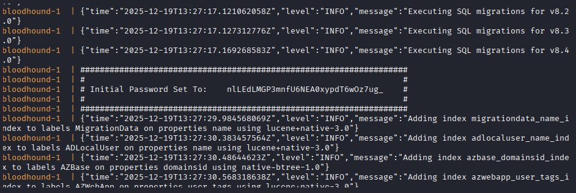


Initial Password Set To:    nlLEdLMGP3mnfU6NEA0xypdT6wOz7ug_

When the proccess ended, you will see in your terminal.

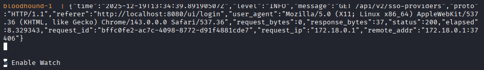


Then you can go to your browser → http://localhost:8080/

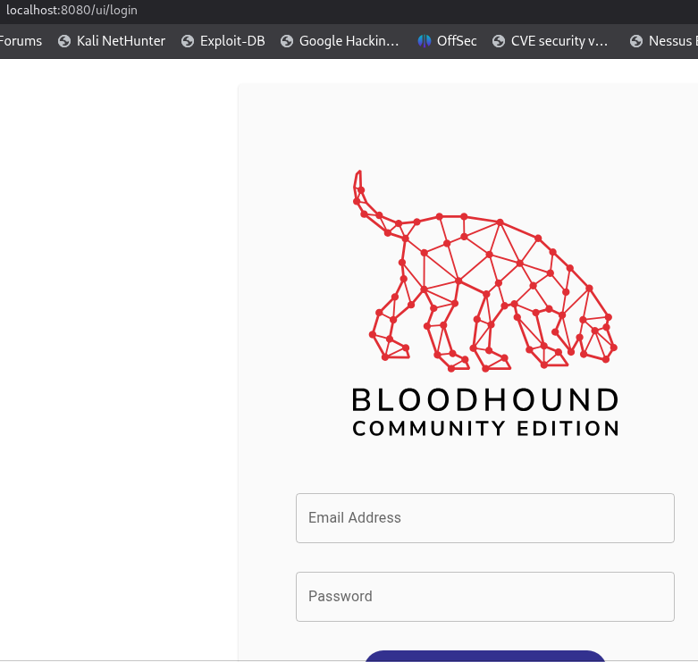


The user is: admin
Password : nlLEdLMGP3mnfU6NEA0xypdT6wOz7ug_ (provided in previous step)

And then you need to change your password

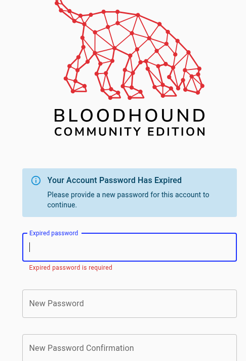


After change the password, you need to upload the data. To update data in .zip, we can do a zip file with all the information extrat previously.
```bash
$ bloodhound-python -u 'olivia' -p 'ichliebedich' -c All --zip -ns 10.10.11.42 -d administrator.htb
```
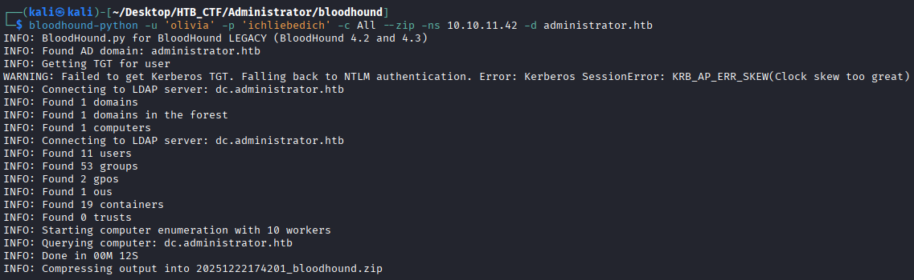
```bash
If you have any problem with the clock sync → $ sudo ntpdate administrator.htb
```
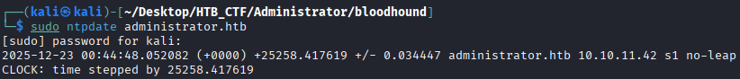

Now we can upload this file to bloodhound

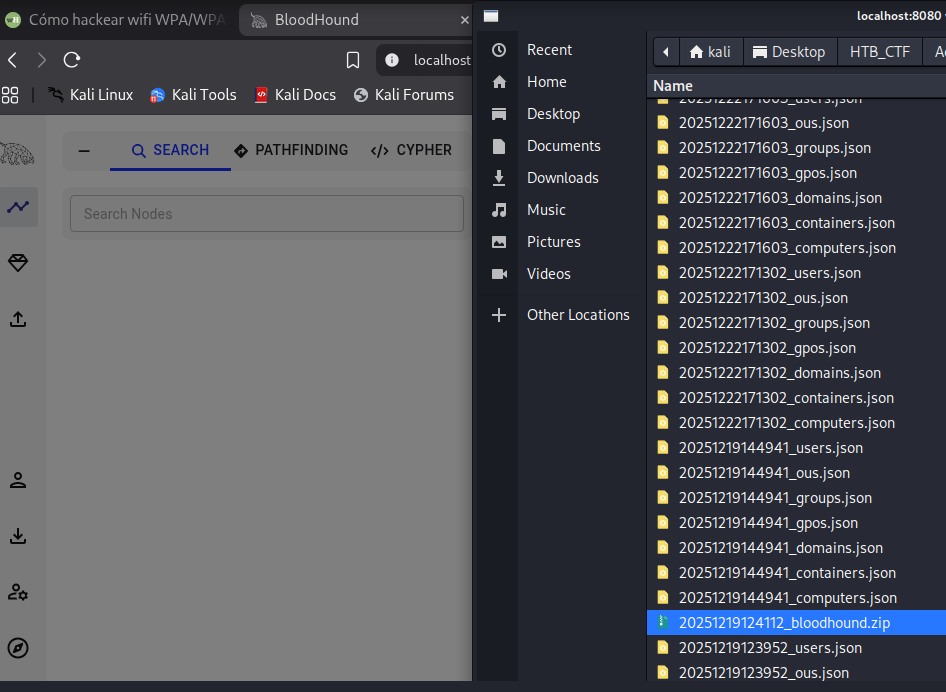

And we wait until the file status will be “Complete”

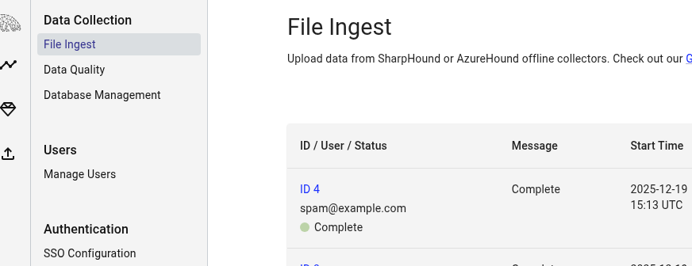

Then we will go to Explore, and there we will go to the section that shows the image.

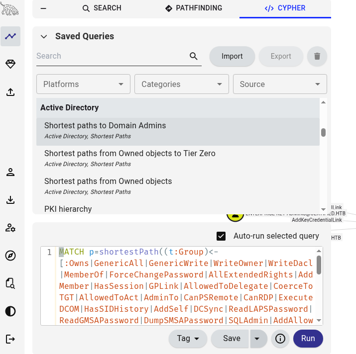

Now we look for the user olivia, who is the user that was provided to us.

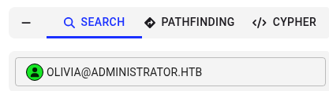

We right-click and select 'Owned' to add the user and in the right menu choose “Outbound Object Control”  to see what can do. We can see that Olivia user has “GenericAll” permissions over Michael user.

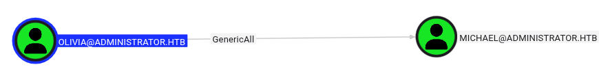


[Back](README.md)