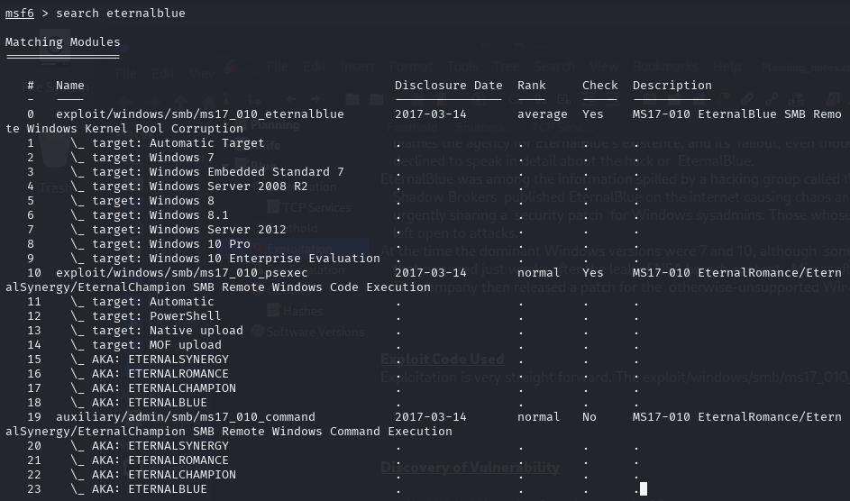
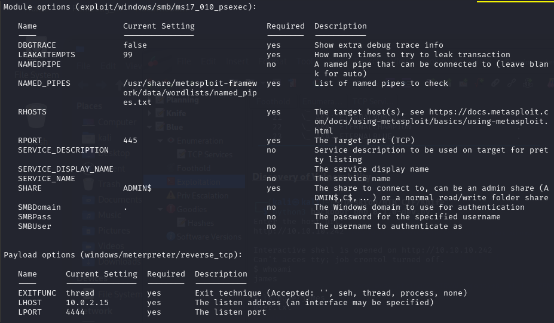

### Service Exploited:
Microsoft Windows 7 SP1 “EternalBlue” SMB Remote Code Execution (MS17-010).
  
### Vulnerability Type:
Searching for vulnerabilities related to this version reveals that it has a known Remote Code Execution (RCE).

### Description: 

EternalBlue is a Windows exploit created by the US National Security Agency (NSA) and used in the 2017 WannaCry ransomware attack. 
EternalBlue exploits a vulnerability in the Microsoft implementation  of the Server Message Block (SMB) Protocol. This dupes a Windows machine  that has not been patched against the vulnerability into allowing  illegitimate data packets into the legitimate network. These data  packets can contain malware such as a trojan, ransomware or similar  dangerous program. 
The SMB Protocol is a standard, generally secure system that creates a  connection between client and server by sending responses and requests.  When printing a document a person may use their computer, the client,  to send a request to a colleague’s computer, the server, with a request  to print the document. The client and server are communicating over the  SMB Protocol. 
The NSA did not alert Microsoft about EternalBlue’s existence for a  period of five years until a breach of the NSA compelled the agency to  do so. Microsoft blames the agency for EternalBlue’s existence, and its  fallout, even though EternalBlue is based on what was then a Windows  vulnerability. The NSA has declined to speak in detail about the hack or  EternalBlue. 
EternalBlue was among the information spilled by a hacking group called the Shadow Brokers,  who in 2017 hacked an NSA trove of cyber weapons. Shadow Brokers  published EternalBlue on the internet causing chaos and embarrassment  for the NSA. Microsoft was advised and took action by urgently sharing a  security patch  for Windows sysadmins. Those whose systems were unpatched or who were  running older Windows versions were left open to attacks. 
At the time the dominant Windows versions were 7 and 10, although  some large enterprises were still using Windows XP. During the WannaCry  event that occurred just weeks after the leak of NSA breach content,  Microsoft (upon NSA notice) had already released a patch for Windows  versions 7 and 10. The company then released a patch for the  otherwise-unsupported Windows XP. 

### Exploit Code Used
Exploitation is very straight forward. The exploit/windows/smb/ms17_010_eternalblue. Metasploit module will immediately grant a root shell.
You can also use github repo → https://github.com/worawit/MS17-010

### Discovery of Vulnerability

[Back](README.md)