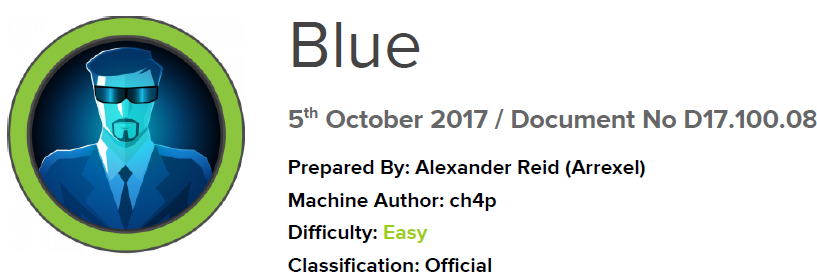

# Scope

Blue, while possibly the most simple machine on Hack The Box, demonstrates the severity of the EternalBlue exploit, which has been used in multiple large-scale ransomware and crypto-mining attacks since it was leaked publicly.

# Index
- [Enumeration](Enumeration.md)
- [Foothold](Foothold.md)
- [Exploitation](Exploitation.md)
- [Priv Escalation](Priv_Escalation.md)
- [Software Versions](Software_Versions.md)

Go back to [Hack-The-Box_CTF](https://github.com/ChusLee/Hack-The-Box_CTF)
