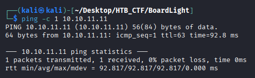
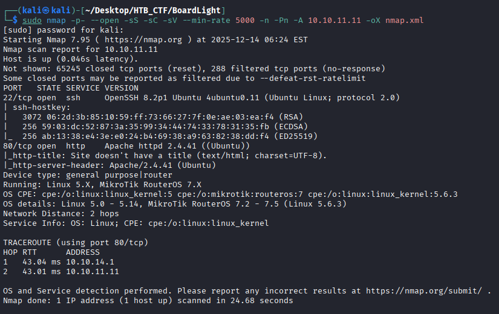
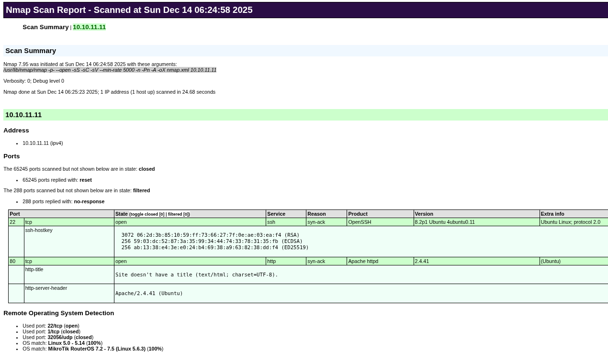
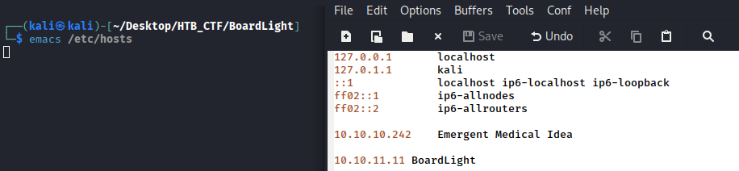
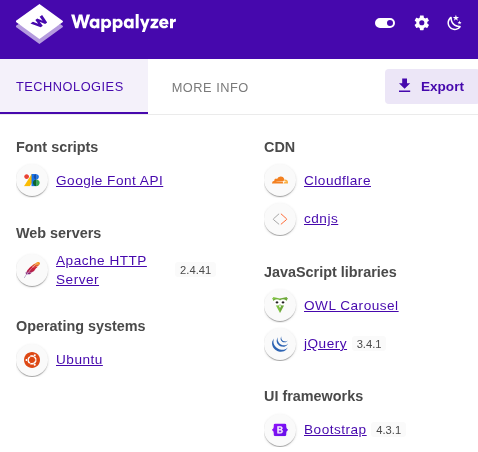
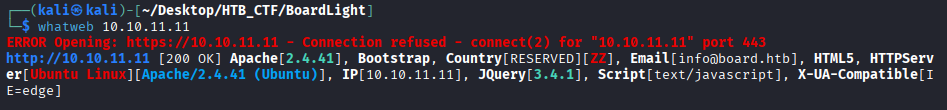

First of all we check that we have connection with IP target.



This TTL value on HTB indicates that is a Linux machine.

We will start with our usual Nmap scan and find two ports open. The first is OpenSSH on port 22, and the other is a website hosted by Nginx over HTTP on port 80.

$ sudo nmap -p- --open -sS -sC -sV --min-rate 5000 -n -Pn -A 10.10.11.11  -oX nmap.xml

$ xsltproc nmap.xml -o nmap.html

-p- → Scans all 65,535 TCP ports, not just the most common ones. All 65,535 TCP ports, not just the most common ones, not just the most common ones. 

--open → Shows only ports that are open, filtering out closed or filtered ones.

-sS → Performs a TCP SYN scan (half-open scan), which is fast and stealthy and requires root privileges.

-sC → Runs default NSE (Nmap Scripting Engine) scripts to gather additional information such as common vulnerabilities and service details.

-sV → Attempts to detect service versions running on open ports.

--min-rate 5000 → Forces Nmap to send at least 5000 packets per second, speeding up the scan but increasing the chance of detection or packet loss. 

-n →  Disables DNS resolution to make the scan faster.

-Pn → Skips host discovery and assumes the target is alive, useful when ICMP is blocked.

-A → Enables aggressive scan options, including OS detection, version detection, script scanning, and traceroute.

-oX → Output option: write results in XML format to file nmap.xml.  Other formats: -oN (normal), -oG (grepable), -oA (all formats).






To access the website, we must add the domain name planning.htb to our /etc/hosts file to resolve the connection with the IP address.



Now we can navigate to the website in our browser.


With the Wappalyzer application, we can obtain more information about the website, just as we can by using the whatweb command.


```bash
$ whatweb 10.10.11.11
```



[Back](README.md)