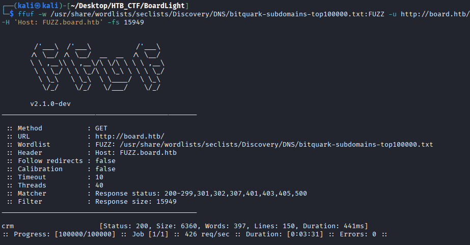
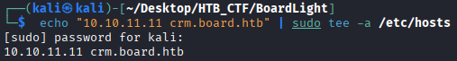
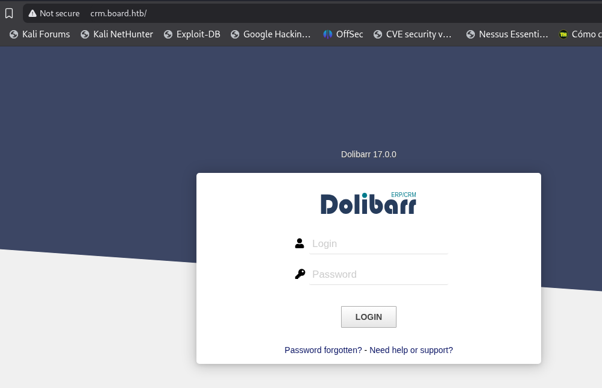

The Ffuf tool will allow us to scan for hidden resources such as subdomains, directories, and parameters.

Let's look for hidden subdomains. To construct our command, we will need to specify:
```bash
$  ffuf -w /usr/share/wordlists/seclists/Discovery/DNS/bitquark-subdomains-top100000.txt:FUZZ -u http://board.htb/ -H 'Host: FUZZ.board.htb' -fs 15949
```
This command uses ffuf (Fuzz Faster U Fool) to perform subdomain fuzzing in order to discover hidden or virtual subdomains of the target website.

-w →  option specifies the wordlist to use. In this case, it uses a DNS subdomain wordlist from SecLists. The word FUZZ is a placeholder that ffuf will replace with each entry from the wordlist.

-u →  option defines the target URL.

-H →  option adds a custom HTTP header. Here, it modifies the Host header to FUZZ.board.htb, meaning ffuf will test different subdomains by replacing FUZZ with words from the wordlist and sending them as virtual hosts.

-fs → 15949 option filters out responses with a size of 15949 bytes. This is useful to ignore default or false-positive responses and only show results that differ from the standard page.

This command is used to enumerate subdomains by leveraging virtual host routing and filtering out irrelevant responses.



We identify crm and proceed to add the entry crm.board.htb to our /etc/hosts file before accessing the website accessing the website.
```bash
$ echo "10.10.11.11 crm.board.htb" | sudo tee -a /etc/hosts
```
echo “10.10.11.11 crm.board.htb” → outputs the IP address and hostname.

| → sends this output to tee

sudo tee -a /etc/hosts → runs tee with root privileges and appends (-a) the lne to the /etc/hosts file.





We encounter a Dolibarr login page and take note of the version displayed on the web page of 17.0.0 .


[Back](README.md)