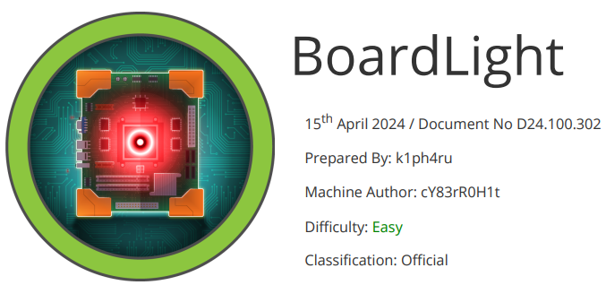

# Scope

BoardLight is an easy difficulty Linux machine that features a Dolibarr instance vulnerable to CVE-2023-30253. This vulnerability is leveraged to gain access as www-data . After enumerating and dumping the web configuration file contents, plaintext credentials lead to SSH access to the machine. Enumerating the system, a SUID binary related to enlightenment is identified which is vulnerable to privilege escalation via CVE-2022-37706 and can be abused to leverage a root shell.

# Index
- [Enumeration](Enumeration.md)
- [Fuzzing](Fuzzing.md)
- [Foothold](Foothold.md)
- [Priv Escalation](Priv_Escalation.md)
- [Software Versions](Software_Versions.md)

Go back to [Hack-The-Box_CTF](https://github.com/jesuscuenca-cyber/Hack-The-Box_CTF)
