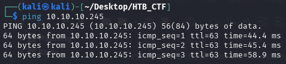
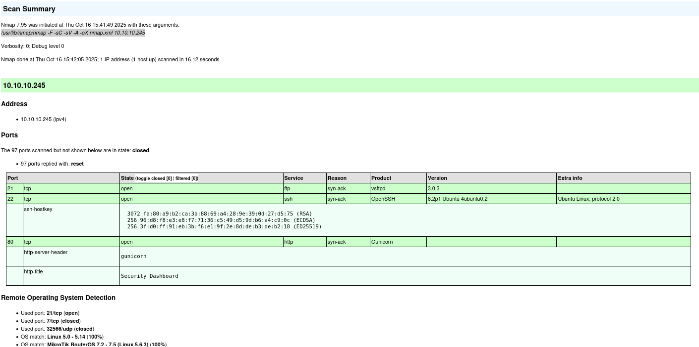
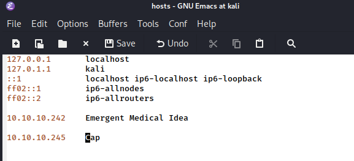
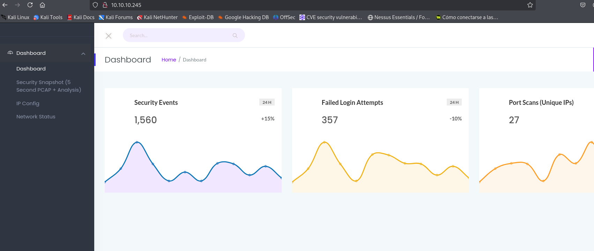
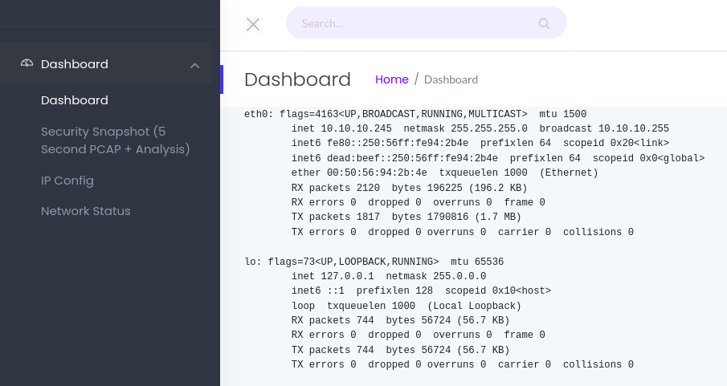
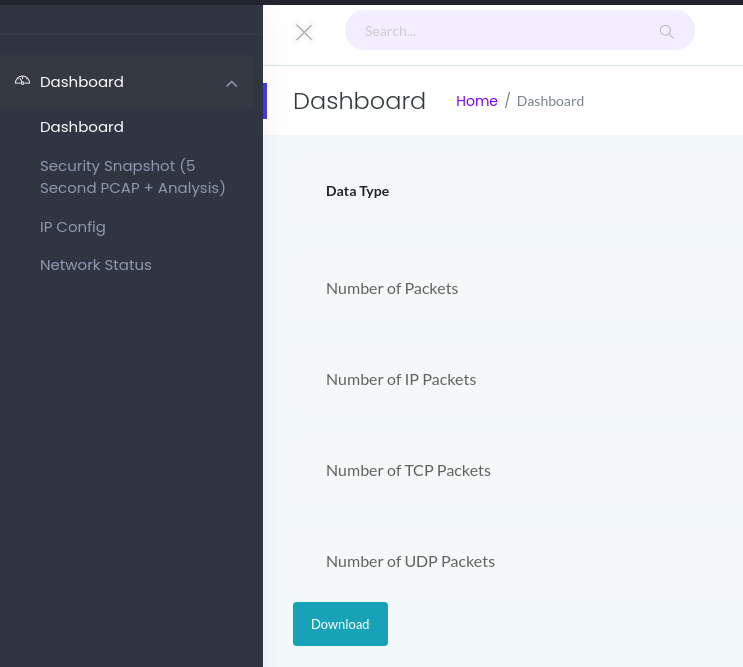
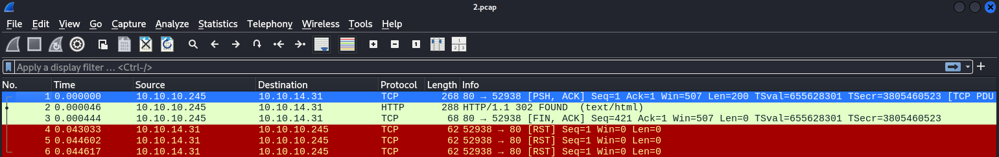
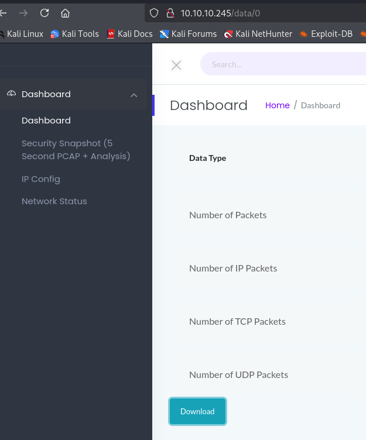

First of all we check that we have connection with IP target.



This TTL value on HTB indicates that is a Linux machine.

We will start with our usual Nmap scan and find two ports open. The first is FTP on port 21, another one is OpenSSH on port 22, and the
other is a website hosted by Nginx over HTTP on port 80.
```bash
$ sudo nmap -F -sC -sV -A -oX nmap.xml 10.10.10.245
$ xsltproc nmap.xml -o nmap.html
```
-F → Scans fewer ports than the default: it scans the set of "top" ports from nmap-services (roughly the top 100 most common ports).

-sC → Run the default NSE (Nmap Scripting Engine) scripts against the target(s).

-sV → Service/version detection.

-A → Performs OS Detection Scan to determinate the OS of the target.

-oX → Output option: write results in XML format to file nmap.xml.  Other formats: -oN (normal), -oG (grepable), -oA (all formats).



To access the website, we must add the domain name planning.htb to our /etc/hosts file to resolve the connection with the IP address.



Now we can navigate to the website in our browser. According to nmap, port 80 is running Gunicorn, which is a python based HTTP server. Browsing to the page reveals a dashboard.



Browsing to the “IP Config” page reveals the output of “ifconfig”.



The “Network Status” page reveals the output for “netstat”.
Clicking on the “Security Snapshot” menu item pauses the page for a few seconds.



Clicking on Download gives us a packet capture file, which can be examined using WireShark.



We don't see anything interesting and the capture just contains HTTP traffic from us.

One interesting thing to notice is the URL scheme when creating a new capture, that is of the form /data/<id> . The id is incremented for every capture. It's possible that there were packet captures from users before us.
Browsing to /data/0 does indeed reveal a packet capture with multiple packets.




This vulnerability is known as Insecure Direct Object Reference (IDOR), wherein a user can directly access data owned by another user. 
Let's examine this capture for potential sensitive data.


[Back](README.md)