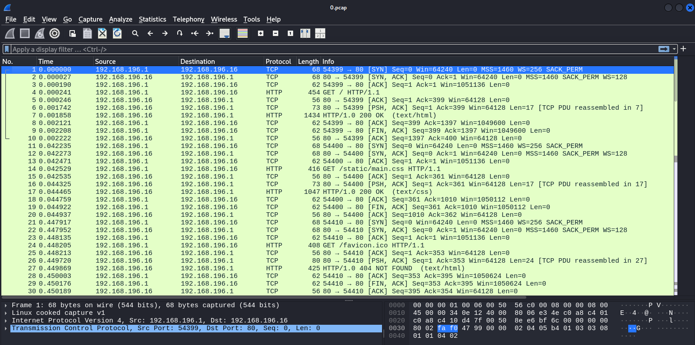
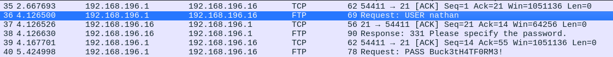
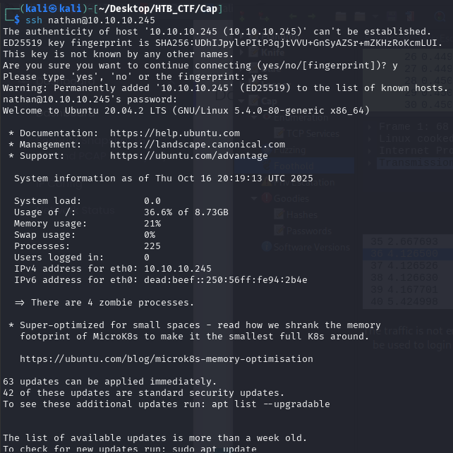
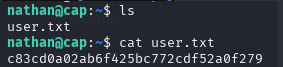

Opening the ID 0 capture file in Wireshark reveals FTP traffic, including the user authentication.

The traffic is not encrypted, allowing us to retrieve the user credentials i.e. nathan /Buck3tH4TF0RM3! . These are found to be valid not only for FTP but can be used to login via SSH.

Now we can get the user flag

[Back](README.md)