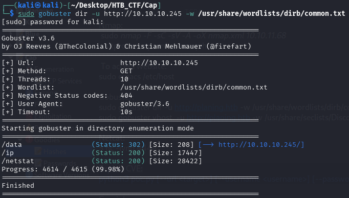

The Gobuster tool will allow us to scan for hidden resources such as subdomains, directories, and parameters.
Let's look for hidden subdomains. To construct our command, we will need to specify:

-u → The target URL to Gobuster.

-w → Wordlist of potential subdomains to test.

Does not reveal anything of interest.

[Back](README.md)