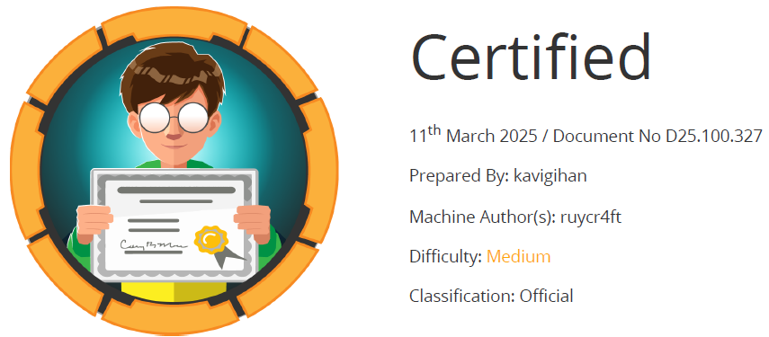

# Scope

Certified is a medium-difficulty Windows machine designed around an assumed breach scenario, where credentials for a low-privileged user are provided. To gain access to the management_svc account, ACLs (Access Control Lists) over privileged objects are enumerated leading us to discover that judith.mader which has the write owner ACL over management group, management group has GenericWrite over the management_svc account where we can finally authenticate to the target using WinRM obtaining the user flag. Exploitation of the Active Directory Certificate Service (ADCS) is required to get access to the Administrator account by abusing shadow credentials and ESC9.

# Index
- [Enumeration](Enumeration.md)
- [Foothold](Foothold.md)
- [Lateral movement](Lateral_movement.md)
- [Priv Escalation](Priv_Escalation.md)

Go back to [Hack-The-Box_CTF](https://github.com/jesuscuenca-cyber/Hack-The-Box_CTF)

