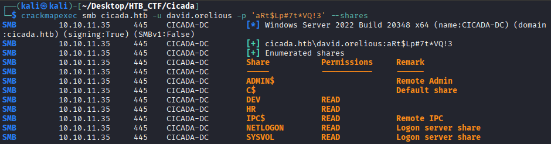
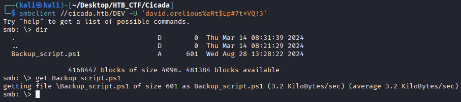
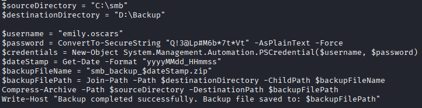
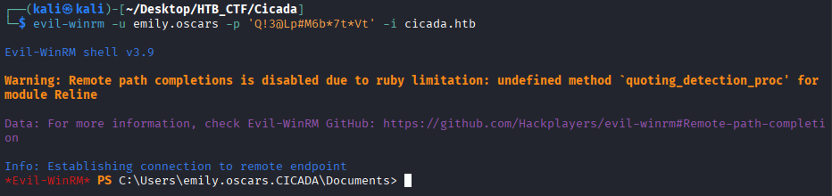
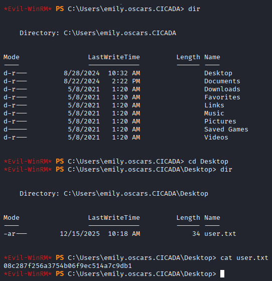

Using david.orelious's credentials, we can verify which shares he is able to access.
```bash
$ crackmapexec smb cicada.htb -u david.orelious -p 'aRt$Lp#7t*VQ!3' --shares
```


It looks like we have access to the DEV share, so we can check if it contains anything useful. By using smbclient again and providing David's credentials, we come across an interesting file. We then download it to our machine to examine its contents.
```bash
$ smbclient //cicada.htb/DEV -U 'david.orelious%aRt$Lp#7t*VQ!3'
```


The PowerShell script generates a zip backup of the C:\smb directory and stores it in D:\Backup using a timestamped filename. After completing the process, it notifies the user of the backup and its location. More importantly, the script exposes another set of plaintext credentials that we can leverage: emily.oscars with the password “Q!3@Lp#M6b”



Now that we have new credentials, we can attempt to use them to obtain a shell on the system. We’ll try using "Evil-WinRM" to see if the credentials we discovered are valid.
```bash
$ evil-winrm -u emily.oscars -p 'Q!3@Lp#M6b*7t*Vt' -i cicada.htb
```



We successfully obtained a WinRM session as Emily and can navigate to C:\Users\emily.oscars.CICADA\Desktop to locate the user flag.
```bash
User flag → 08c287f256a3754b06f9ec514a7c9db1
```

[Back](README.md)