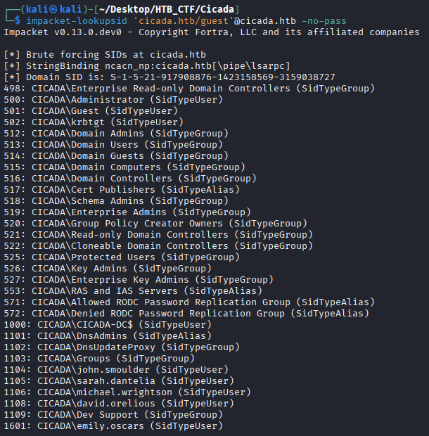
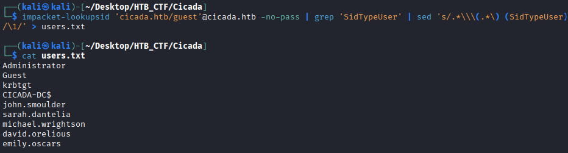

Now that we have found this password we could try checking to see if any accounts are still using this password. To do this, we must find out all the users that are in the domain, and we can do this
using Impacket's lookupsid module. This tool will try brute forcing Windows Security Identifiers (SIDs) of any users in the AD domain. Each user has a unique SID, which is comprised of their relative identifier (RID) concatenated with the domain SID. User SIDs are typically issued by a Domain Controller and are used in authorization and access mechanisms such as to form a part of the access token created during sign-in. 

To enumerate the domain, we will specify the guest user, the domain name, and -no-pass for no password.
```bash
$ impacket-lookupsid 'cicada.htb/guest'@cicada.htb -no-pass
```



By enumerating groups, users, and aliases in the domain, we can get a clearer picture of its overall structure. Since our goal is to obtain a list of users, we focus only on entries categorized asSidTypeUser. Instead of filtering this information manually, we rerun the command with additional arguments. We use >grep< to extract only user-related entries and>sed< to clean up everything except the usernames. Finally, we redirect the output to a file named users.txt
```bash
$ impacket-lookupsid 'cicada.htb/guest'@cicada.htb -no-pass | grep 'SidTypeUser' | sed 's/.*\\\(.*\) (SidTypeUser)/\1/' > users.txt
```



[Back](README.md)