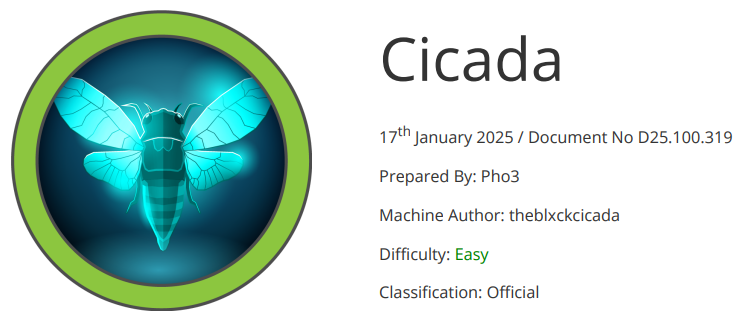

# Scope

Cicada is an easy-difficult Windows machine that focuses on beginner Active Directory enumeration and exploitation. In this machine, players will enumerate the domain, identify users, navigate shares, uncover plaintext passwords stored in files, execute a password spray, and use the SeBackupPrivilege to achieve full system compromise.

# Index
- [Enumeration](Enumeration.md)
- [SMB](SMB.md)
- [Lookupsid](Lookupsid.md)
- [Password Spraying](Password_Spraying.md)
- [Foothold](Foothold.md)
- [Priv Escalation](Priv_Escalation.md)

Go back to [Hack-The-Box_CTF](https://github.com/jesuscuenca-cyber/Hack-The-Box_CTF)