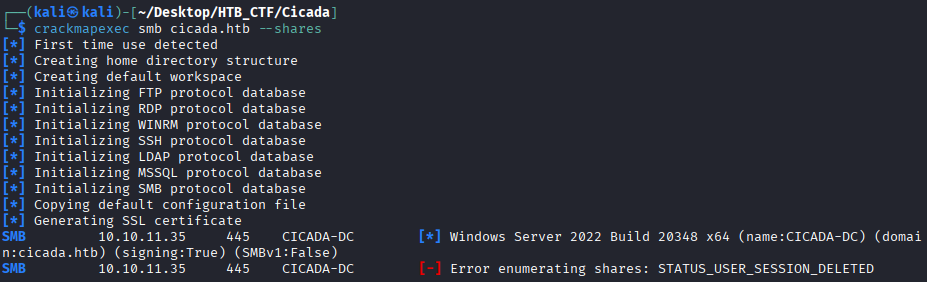
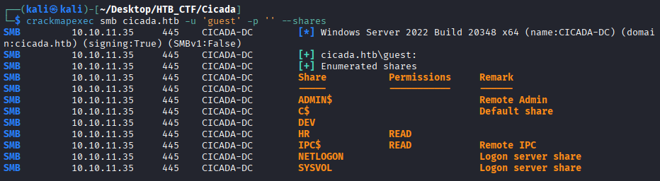
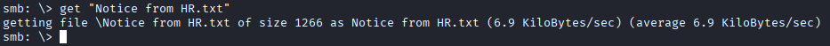

Let's start by checking to see if an anonymous user can access the SMB share drives. We will use crackmapexec , a popular tool to automate enumerating domains (including users, files/ directories, and shares). It can also brute force with supplied credentials (which we will see later) or dump usernames and hashed passwords in Active Directory environments. Let's try to enumerate the SMB shares by specifying the protocol, domain name, and --shares parameters.
```bash
$ crackmapexec smb cicada.htb --shares
```


If we try to enumerate the shares without specifying a user, we are denied. So perhaps we can try some typical credentials that might be in use, such as the username guest with no password.
```bash
$ crackmapexec smb cicada.htb -u 'guest' -p '' --shares
```


Guest user can access the HR share. So we will use smbclient to view the share and see what files may be inside.
```bash
$ smbclient //cicada.htb/HR
```


Using the dir command to list the contents, we see the file Notice from HR.txt, and we can download it to our machine with the get command. Viewing the file reveals a default password!
```bash
$ get "Notice from HR.txt"
```


```bash
Dear new hire!

Welcome to Cicada Corp! We're thrilled to have you join our team. As part of our security protocols, it's essentia\
l that you change your default password to something unique and secure.

Your default password is: Cicada$M6Corpb*@Lp#nZp!8

To change your password:

1. Log in to your Cicada Corp account** using the provided username and the default password mentioned above.
2. Once logged in, navigate to your account settings or profile settings section.
3. Look for the option to change your password. This will be labeled as "Change Password".
4. Follow the prompts to create a new password**. Make sure your new password is strong, containing a mix of upper\
case letters, lowercase letters, numbers, and special characters.
5. After changing your password, make sure to save your changes.

Remember, your password is a crucial aspect of keeping your account secure. Please do not share your password with\
 anyone, and ensure you use a complex password.

If you encounter any issues or need assistance with changing your password, don't hesitate to reach out to our sup\
port team at support@cicada.htb.

Thank you for your attention to this matter, and once again, welcome to the Cicada Corp team!

Best regards,
Cicada Corp
```

[Back](README.md)