We can use Gobuster to scan for possible vhosts that might exist on the machine.
Let's look for hidden subdomains. To construct our command, we will need to specify:

-u → The target URL to Gobuster.

-w → Wordlist of potential subdomains to test.

```bash
$ sudo gobuster dir -u http://devvortex.htb/ -w /usr/share/wordlists/dirb/common.txt
```

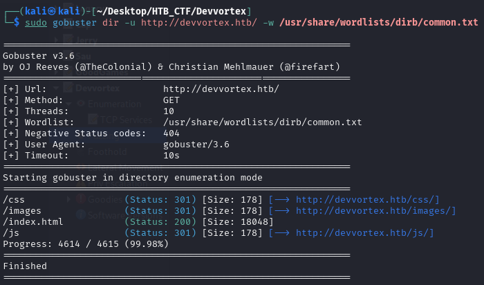

We can't obtain any usefull information, so we can enumerate subdomains with wfuzz

```bash
$ wfuzz -c --hc=404,302 -t 200 -w /usr/share/seclists/Discovery/DNS/subdomains-top1million-110000.txt -H "Host: FUZZ.devvortex.htb" http://devvortex.htb
```

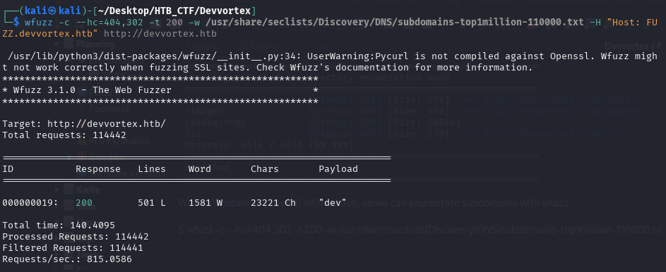

We discover the subdomain dev.devvortex.htb , which we also add to our /etc/hosts file.

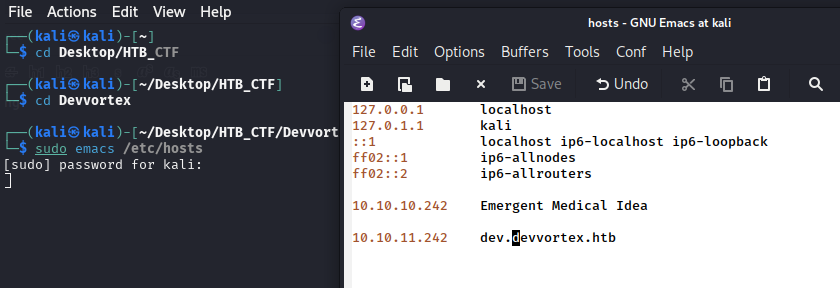

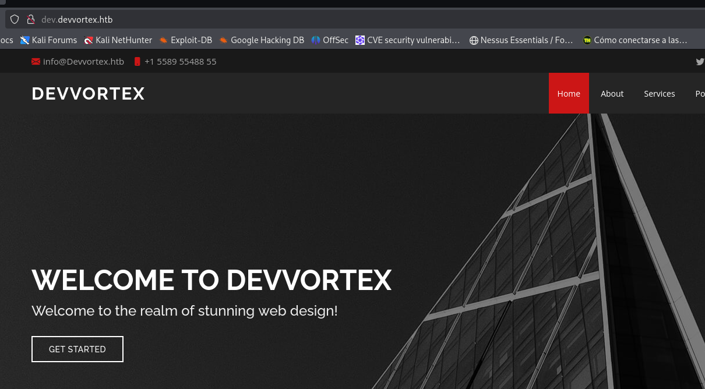

Now, we are able to visit http://dev.devvortex.htb .

Looking around the website, we see that all its content is static. We can do a quick directory scan in order to identify any files and directories that are hosted on the server.
```bash
$ sudo gobuster dir -u http://dev.devvortex.htb/ -w /usr/share/wordlists/dirb/common.txt
```
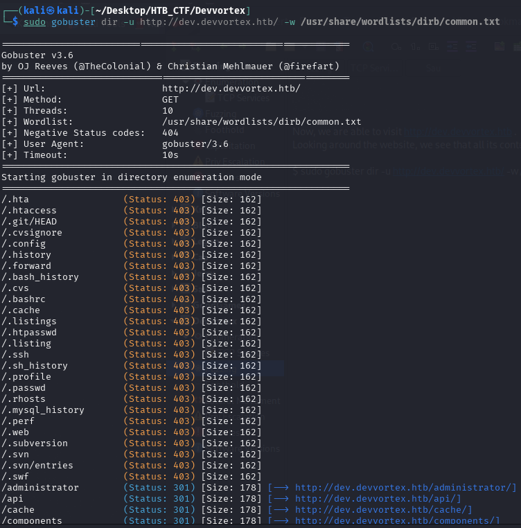

Our scan reveals the /administrator endpoint, which reveals that the site is running on Joomla CMS .

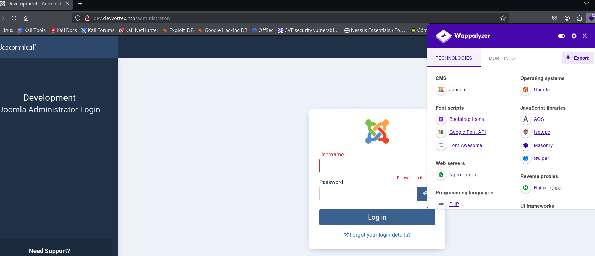

Now if we visit https://github.com/joomla/joomla-cms, we can see a lot of content management sis.

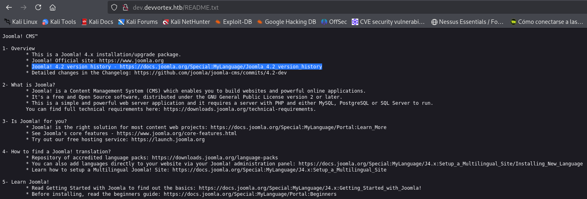

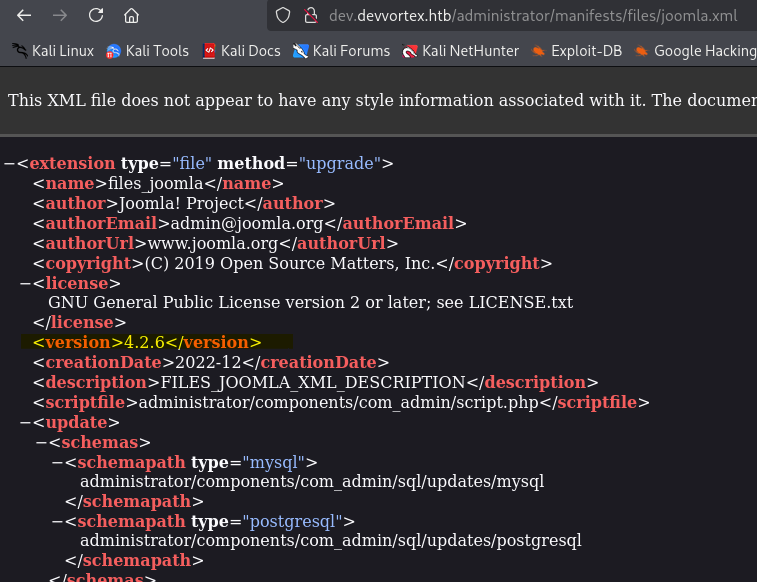

Now We know that We have in front off Joomla 4.2.6 versions. And We can search if exist any vulnerability

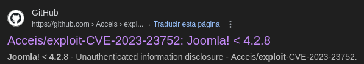

Knowing the CVE we can use metasploit to search exploits

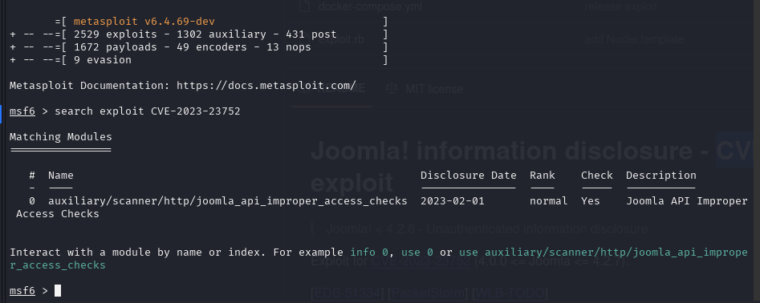

If We use this exploit...

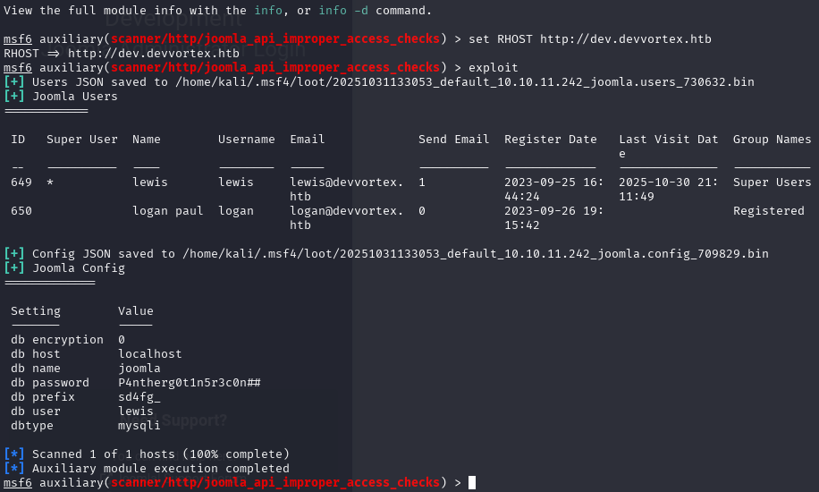


We uncover the cleartext credentials lewis:P4ntherg0t1n5r3c0n## .


[Back](README.md)
