we don't have permissions to see the flag


so we try to login as logan with our previous password

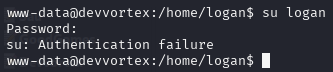

But this doesn't work

If we remember, this passord is for a mysql so we try to login with user logan but in mysql

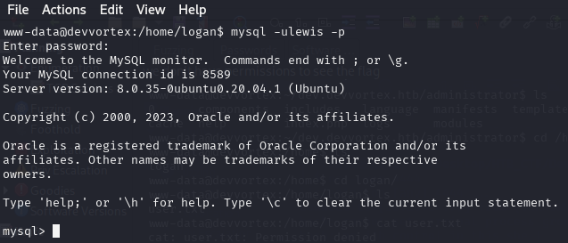

Now we navigate throw the tables

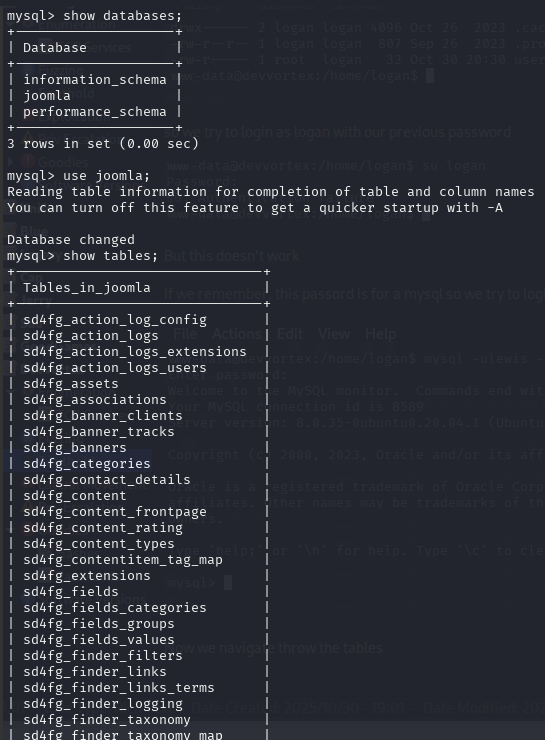

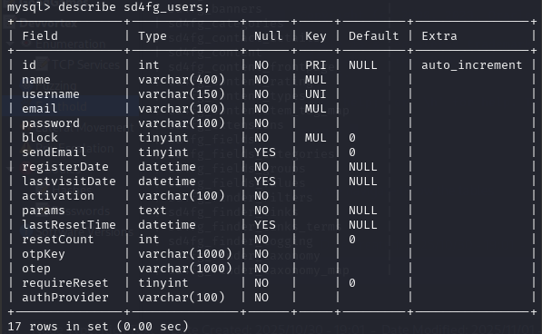

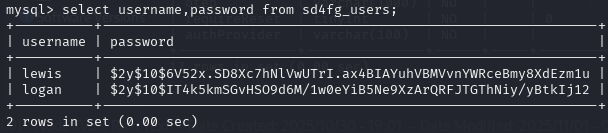

To identify the password format we can do
```bash
$  hashid '$2y$10$IT4k5kmSGvHSO9d6M/1w0eYiB5Ne9XzArQRFJTGThNiy/yBtkIj12'
```
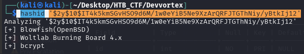

Now we can use hashcat
```bash
$ hashcat --example-hashes | grep -i “blowfish”

$ hashcat --example-hashes | grep -i “blowfish” -B 5
```
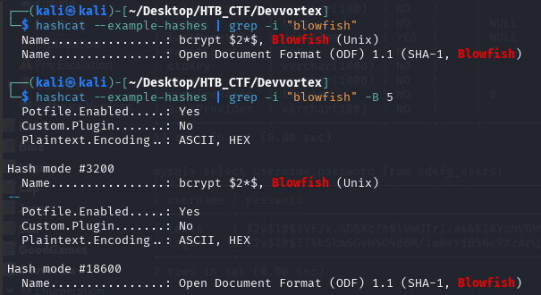

We can create a file hash
```bash
$ emacs hash
```
And paste de password in blowfish

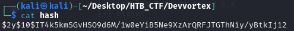


Now we use anothertime haschat (0 indicate brute force)
```bash
$ hashcat -m 3200 -a 0 -w 3 hash /usr/share/wordlists/rockyou.txt
```
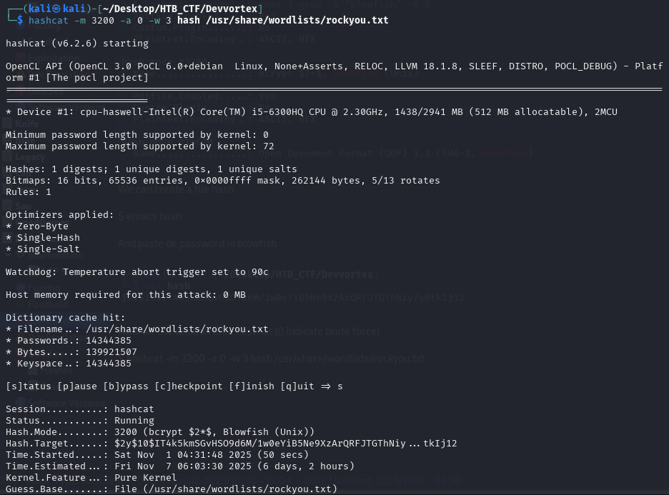

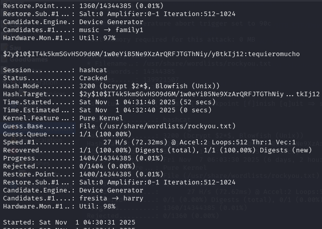

And got a password for user lewis. We turn to our reverse shell connection

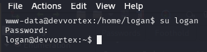

And we logged 

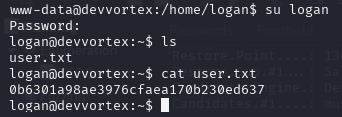


[Back](README.md)
