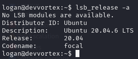
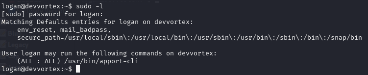
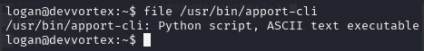
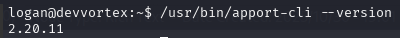
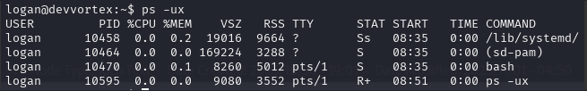
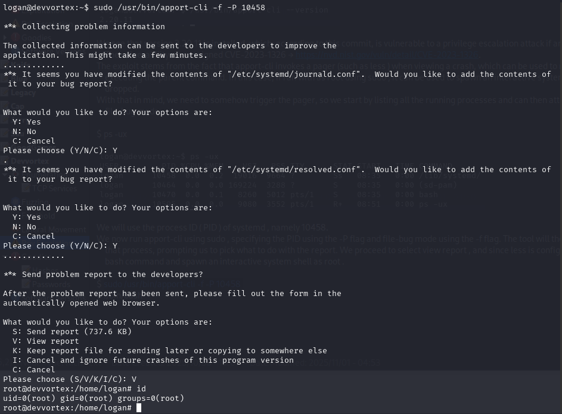
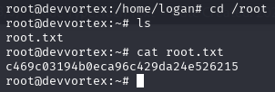

Now we can move on to final privilege escalation. 







apport-cli is a command-line tool for reporting and analysing application crashes and errors in Ubuntu and other Debian-based Linux distributions.

We take a look at the tool's version.
```bash
$ /usr/bin/apport-cli --version
```


We see that version 2.20.11 is installed, which, according to this commit, is vulnerable to a privilege escalation attack if an unprivileged user is allowed to run it with sudo . The vulnerability was assigned CVE-2023-1326 → https://nvd.nist.gov/vuln/detail/CVE-2023-1326.

The exploit stems from the fact that apport-cli invokes a pager (such as less ) when viewing a crash, which can be used to run system commands in the context of the user executing the parent command. In this case, if ran with as root using sudo , it can be used to spawn an interactive system shell, as the elevated privileges are not dropped.

With that in mind, we need to somehow trigger the pager, so we start by listing all the running processes and can then attempt to report a problem using apport-cli in --file-bug mode.

```bash
$ ps -ux
```



We will use the process ID ( PID ) of systemd , namely 10458.

We now run apport-cli using sudo , specifying the PID using the -P flag and file-bug mode using the -f flag. The tool will then gather information and report any issues with that process, prompting us to pick what to do with the report. We proceed to select view report , and since less is configured as the default pager, we can run the !/bin/bash command and spawn an interactive system shell as root .
```bash
$ sudo /usr/bin/apport-cli -f -P 10458 
$ !/bin/bash
```


The final flag can be obtained at /root/root.txt .



[Back](README.md)
