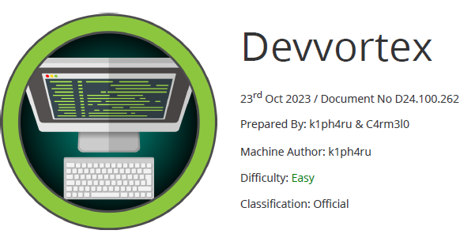

# Scope

Devvortex is an easy-difficulty Linux machine that features a Joomla CMS that is vulnerable to information disclosure. Accessing the service's configuration file reveals plaintext credentials that lead to Administrative access to the Joomla instance. With administrative access, the Joomla template is modified to include malicious PHP code and gain a shell. After gaining a shell and enumerating the database contents, hashed credentials are obtained, which are cracked and lead to SSH access to the machine. Post-exploitation enumeration reveals that the user is allowed to run apport-cli as root, which is leveraged to obtain a root shell.

# Index
- [Enumeration](Enumeration.md)
- [Fuzzing](Fuzzing.md)
- [Foothold](Foothold.md)
- [Lateral Movement](Lateral_Movement.md)
- [Priv Escalation](Priv_Escalation.md)
- [Software Versions](Software_Versions.md)

Go back to [Hack-The-Box_CTF](https://github.com/jesuscuenca-cyber/Hack-The-Box_CTF)