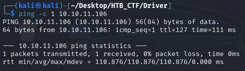
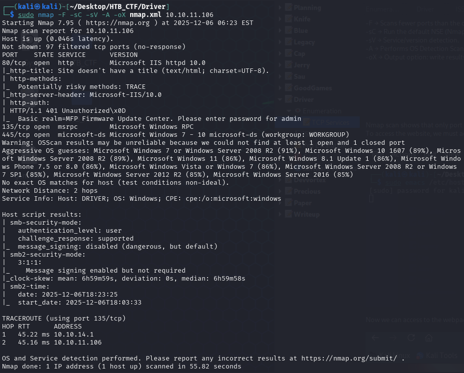
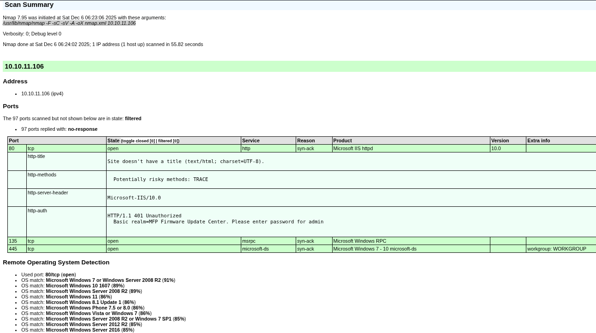
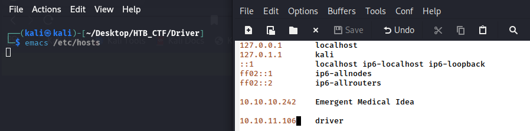
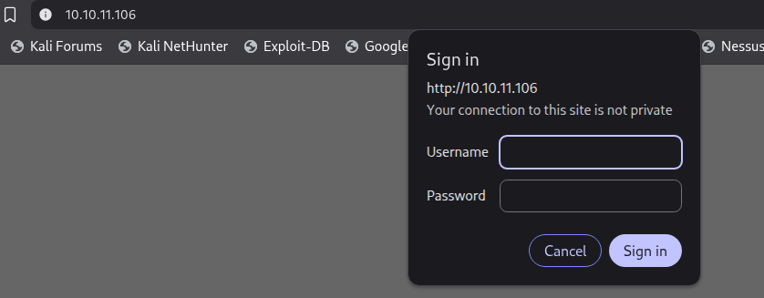
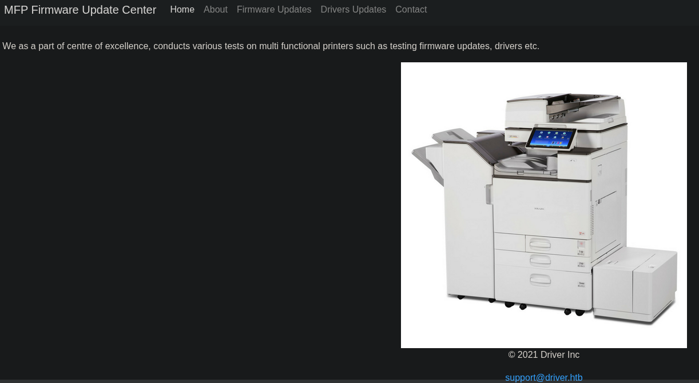
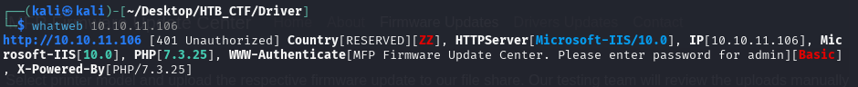
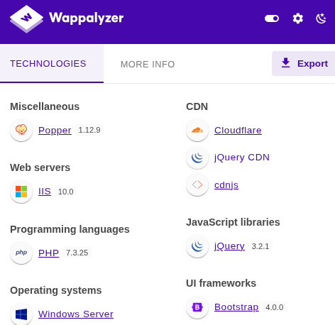

First of all we check that we have connection with IP target.
```bash
$ ping -c 1 10.10.11.106
```


This TTL value on HTB indicates that is a Windows machine.

We will start with our usual Nmap scan and find two ports open. We find the port ISS web 80, port ssh 135, https 445.
```bash
$ sudo nmap -F -sC -sV -A -oX nmap.xml 10.10.11.106
$ xsltproc nmap.xml -o nmap.html
```
-F → Scans fewer ports than the default: it scans the set of "top" ports from nmap-services (roughly the top 100 most common ports).

-sC → Run the default NSE (Nmap Scripting Engine) scripts against the target(s).

-sV → Service/version detection.

-A → Performs OS Detection Scan to determinate the OS of the target.

-oX → Output option: write results in XML format to file nmap.xml.  Other formats: -oN (normal), -oG (grepable), -oA (all formats).





To access the website, we must add the domain name 10.10.11.106 to our /etc/hosts file to resolve the connection with the IP address.



Now we can access to the webpage. 



We can see the login to this webpage. Trying common username and password combinations we were able to login using admin:admin



With our Wappalyzer tool we can obtain more information about this website and the command 
```bash
$ whatweb 10.10.11.106
```





[Back](README.md)