The webapage states that the MFP Firmware Update Center conducts various tests on printer firmwares and drivers. Let's navigate to Firmware Updates and check what options we have.

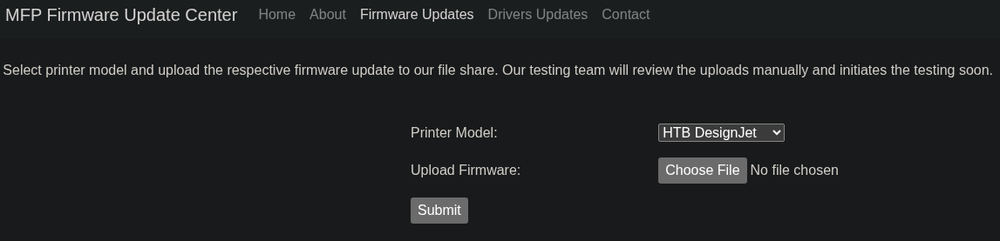

Since each file is reviewed manually and it is uploaded to an SMB share we could potentially upload a file that, when executed, makes a connection back to our local machine using SMB, thus allowing us to grab an NTLM hash. Since every file is opened for review purposes we can upload a Shell Command File (.scf) with a simple command to grab a single file from our local machine.
To this we can do a search in google to fing a malicious SCF file.

https://pentestlab.blog/2017/12/13/smb-share-scf-file-attacks/

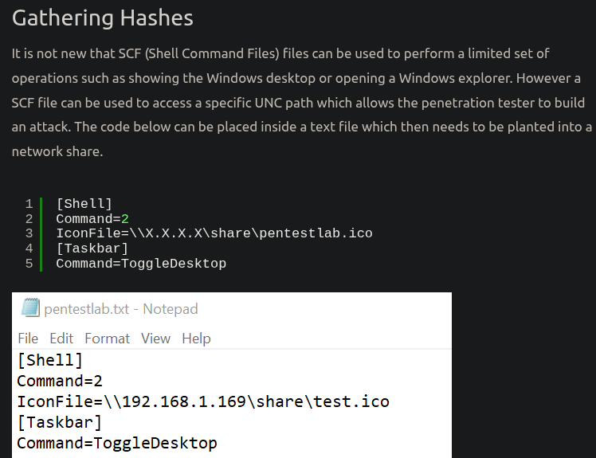

In this webpage tell us how to do a SCF file attack throw SMB Share. So let's follow the steps.

SCF file creation. We oppen nanto to create the file and save this file as SCF.

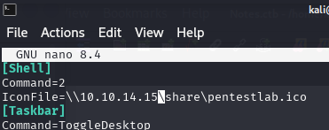

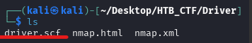

Saving the pentestlab.txt file as SCF file will make the file to be executed when the user will browse the file.

Responder needs to be executed with the following parameters to capture the hashes of the users that will browse the share.
```bash
$ sudo responder -w -I tun0
```
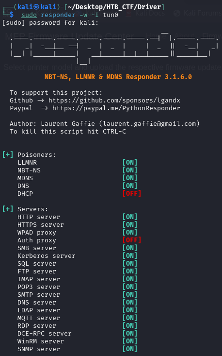

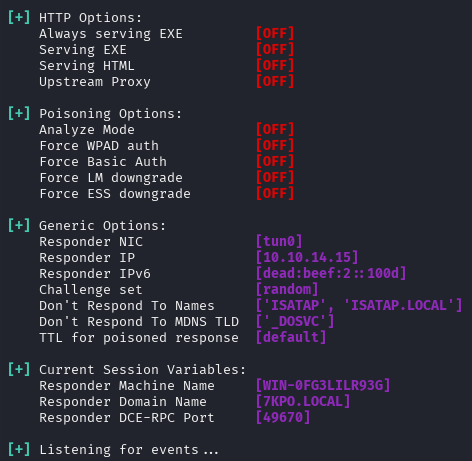

Then we upload a .scf file

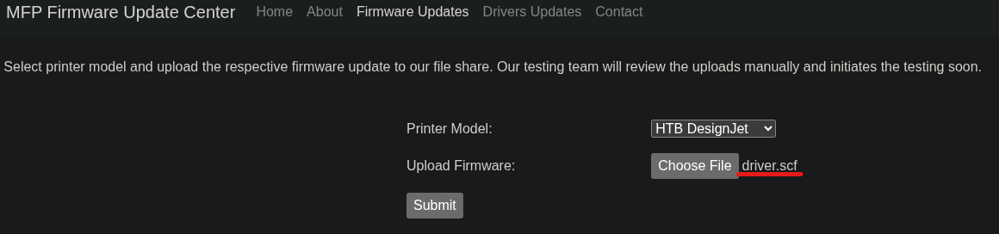

And then in our responder we received a hash for the “tony” user

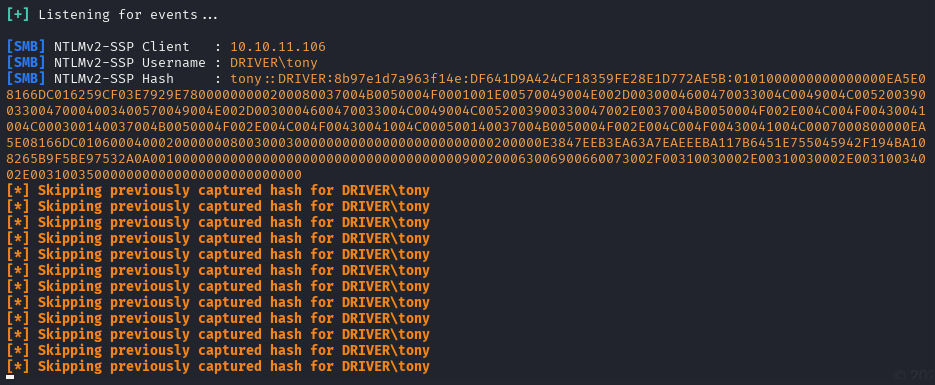

Then, we save the hash and use John to crack it and retrieve the plaintext password.

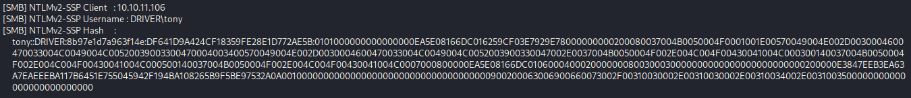

```bash
$ john TonyHash --wordlist=/usr/share/wordlists/rockyou.txt
```
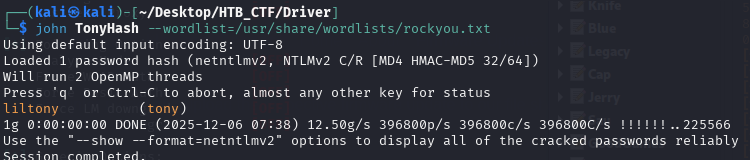

The has is successfully cracked and we get the credentials tony / liltony . Using these credentials we can attempt to login to the remote machine using WinRM.
```bash
$ evil-winrm -i 10.10.11.106 -u tony -p liltony
```
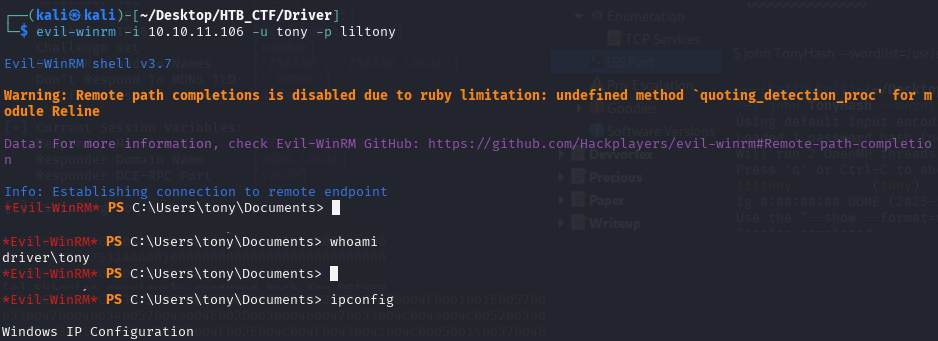

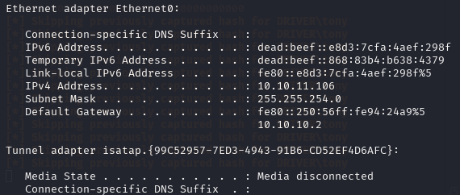

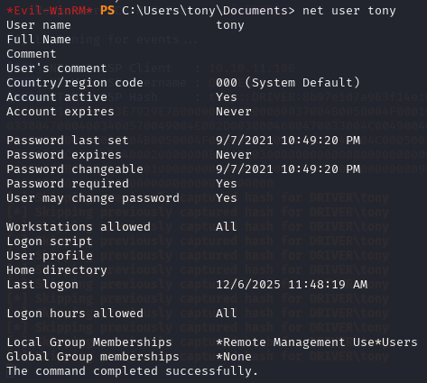

Searching trhow the directories we can find the user flag

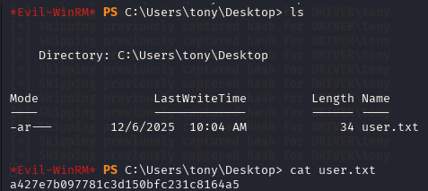
```bash
User flag → a427e7b097781c3d150bfc231c8164a5
```

[Back](README.md)