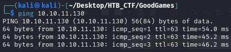
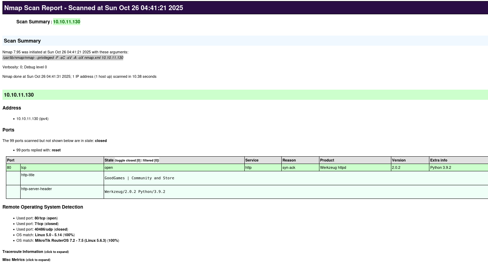
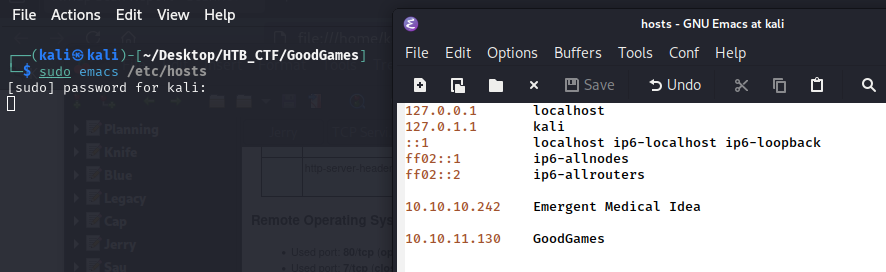
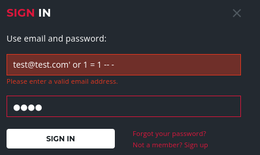
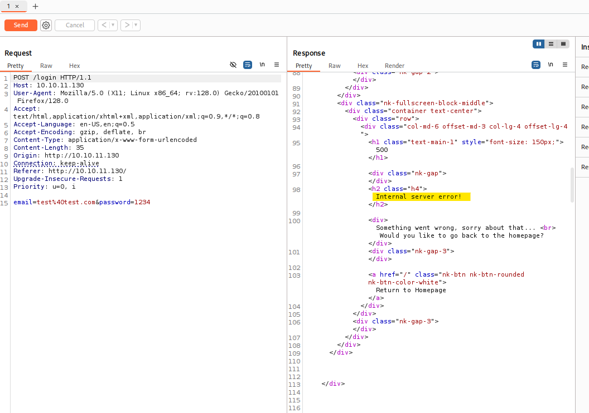
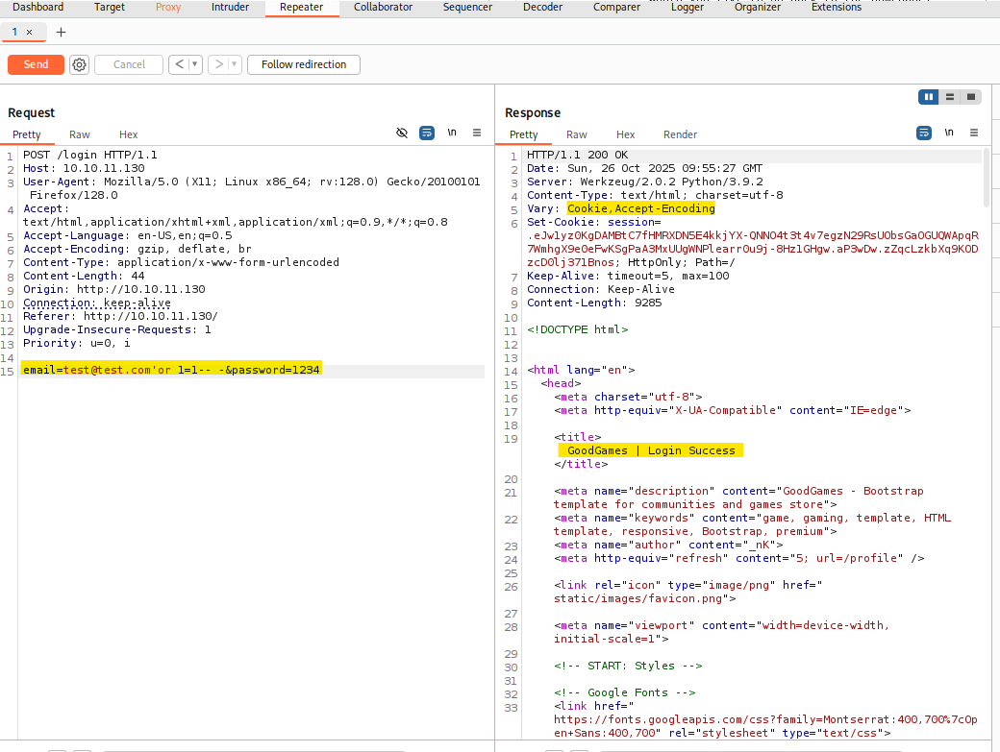
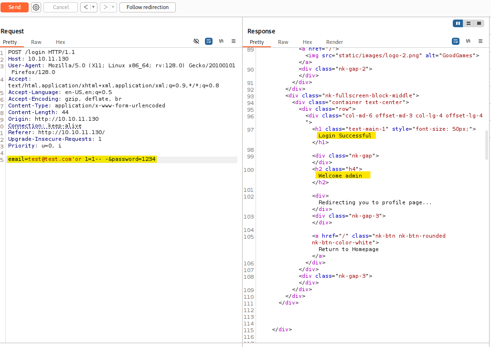

First of all we check that we have connection with IP target.



This TTL value on HTB indicates that is a Linux machine.


We will start with our usual Nmap scan and find two ports open. We find the port http 80.
```bash
$ sudo nmap -F -sC -sV -A -oX nmap.xml 10.10.11.130
$ xsltproc nmap.xml -o nmap.html
```
-F → Scans fewer ports than the default: it scans the set of "top" ports from nmap-services (roughly the top 100 most common ports).

-sC → Run the default NSE (Nmap Scripting Engine) scripts against the target(s).

-sV → Service/version detection.

-A → Performs OS Detection Scan to determinate the OS of the target.

-oX → Output option: write results in XML format to file nmap.xml.  Other formats: -oN (normal), -oG (grepable), -oA (all formats).




Nmap scan shows that only port 80 hosting a Python 3.9.2 application is listening.

To access the website, we must add the domain name planning.htb to our /etc/hosts file to resolve the connection with the IP address.



Now we can access to the webpage. We have a Python webserver V3.9.2


We can get more information using the wappalayzer tool.


Inspecting the login feature we try a simple SQL injection as part of our basic checks consisting of test@test.com' or 1 = 1 -- - and see that we need to enter a valid email address.



As we can see, the login menu report an error “Please enter a valid email address”.
Capture a valid email login request in BurpSuite and manually change the email to the test@test.com payload then hit SIGN IN and we see a response welcoming the admin.



To see the correct @ we can press Ctrl+shift+u
So we can try to send the folloging email in our Repeater windows on Burpsuit to see if the SQL injections works properly→ test@test.com' or 1=1-- - to try a SQL injection command.

Valid SQL injection for an authentication bypass





So we turn to the “Proxy” in Burpsuit windows to send the SQL injection command to login as Admin.


[Back](README.md)