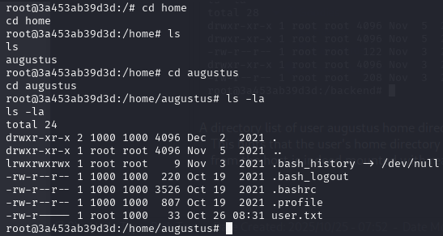
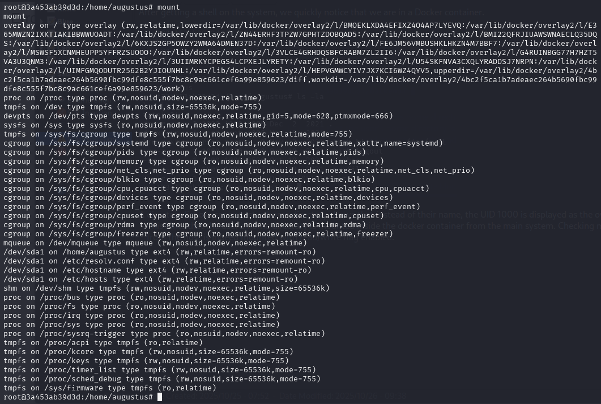
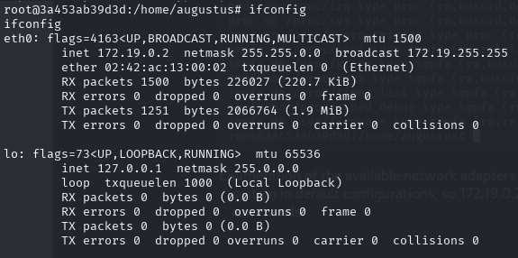
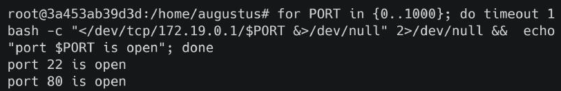
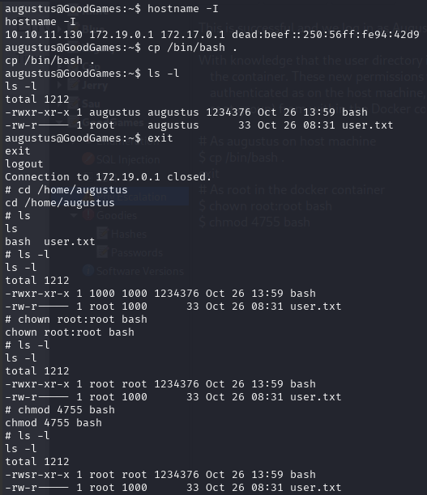
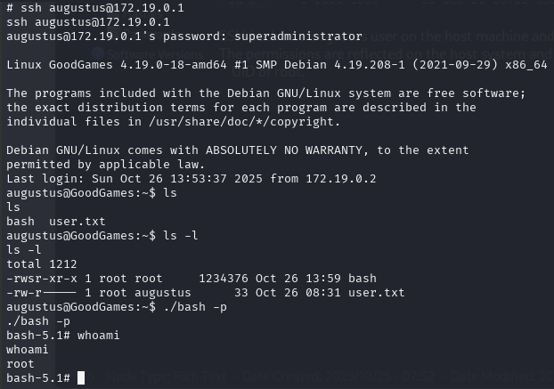
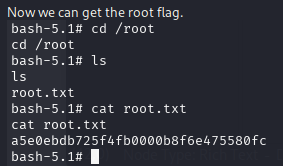

After getting a shell on the system, we quickly notice that we are in a Docker container.



A directory list of user augustus home directory shows that instead of their name, the UID 1000 is displayed as the owner for the available files and folders. This hints that the user's home directory is mounted inside the docker container from the main system. 

Checking mount we see that the user directory from the host is indeed mounted with read/write flag enabled.



Enumeration of the available network adapters shows that the container IP is 172.19.0.2 . Docker usually assigns the first address of the subnet to the host system in default configurations, so 172.19.0.2 might be the internal Docker IP address of the host . This IP address we found in previous steps ussing SSTI commands.



Let's scan the host at 172.19.0.1 to see what ports are available as part of the basic checks for lateral movement. As nmap is not installed we can use Bash instead.
```bash
for PORT in {0..1000}; do timeout 1 bash -c "</dev/tcp/172.19.0.1/$PORT &>/dev/null" 2>/dev/null && echo "port $PORT is open"; done
```



We find that SSH is listening internally. We attempt to password reuse on both root and augustus accounts.


This is successful and we log in as Augustus.

With knowledge that the user directory is mounted in the Docker container, we can write files in the Host and change their permissions to root from within the container. 

These new permissions will be reflected to the Host system as well. Copy bash to the user directory as augustus which we are already authenticated as on the host machine, then exit out of the SSH session. Change the ownership of the bash executable to root:root (owned by root and in root group) from within the Docker container and apply the SUID permissions to it.
```bash

# As augustus on host machine
$ cp /bin/bash .
exit
# As root in the docker container
$ chown root:root bash
$ chmod 4755 bash
```


SSH back into augustus user on the host machine and check the permissions of the bash executable.
The permissions are reflected on the host system and the duplicate Bash now has SUID permissions. Execute ./bash -p and spawn a shell with the effective UID of root.



Now we can get the root flag.



[Back](README.md)