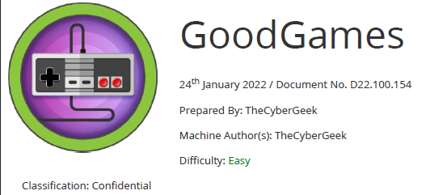

# Scope

GoodGames is an Easy linux machine that showcases the importance of sanitising user inputs in web applications to prevent SQL injection attacks, using strong hashing algorithms in database structures to prevent the extraction and cracking of passwords from a compromised database, along with the dangers of password re-use. It also highlights the dangers of using render_template_string in a Python web application where user input is reflected, allowing Server Side Template Injection (SSTI) attacks. Privilege escalation involves docker hosts enumeration and shows how having admin privileges in a container and a low privilege user on the host machine can be dangerous, allowing attackers to escalate privileges to compromise the system.

# Index
- [Enumeration](Enumeration.md)
- [SQLInjection](SQLInjection.md)
- [SSTI](SSTI.md)
- [Priv Escalation](Priv_Escalation.md)
- [Software Versions](Software_Versions.md)

Go back to [Hack-The-Box_CTF](https://github.com/ChusLee/Hack-The-Box_CTF)