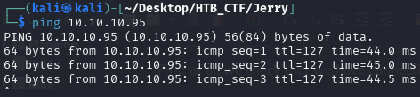
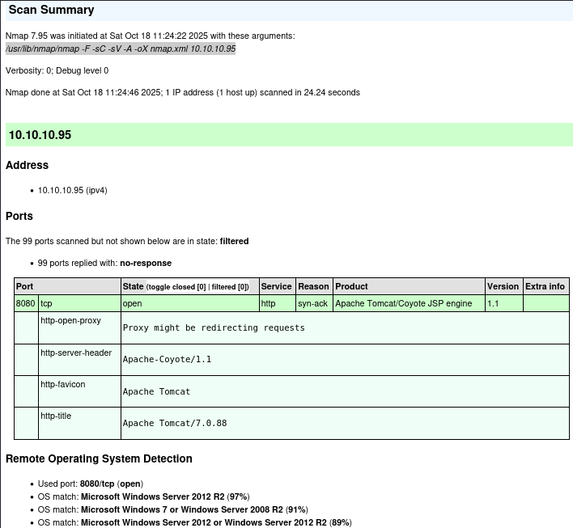
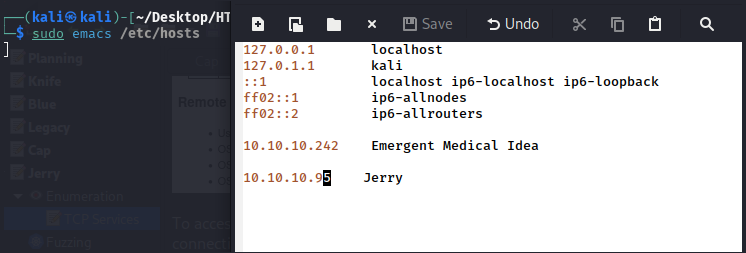
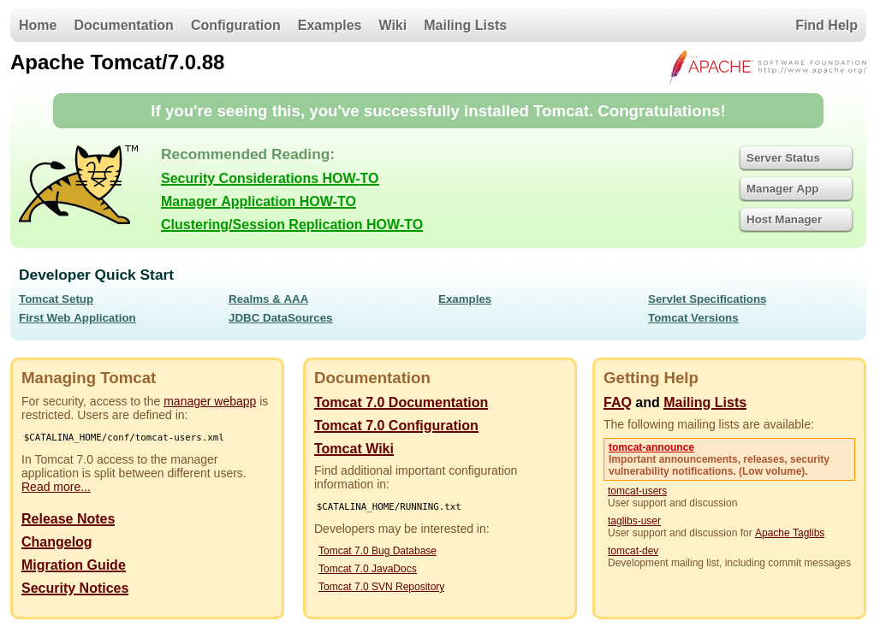

First of all we check that we have connection with IP target.



This TTL value on HTB indicates that is a Windows machine.

We will start with our usual Nmap scan and find two ports open. The only port that we found was 8080 http server.
```bash
$ sudo nmap -F -sC -sV -A -oX nmap.xml 10.10.11.95
$ xsltproc nmap.xml -o nmap.html
```
-F → Scans fewer ports than the default: it scans the set of "top" ports from nmap-services (roughly the top 100 most common ports).

-sC → Run the default NSE (Nmap Scripting Engine) scripts against the target(s).

-sV → Service/version detection.

-A → Performs OS Detection Scan to determinate the OS of the target.

-oX → Output option: write results in XML format to file nmap.xml.  Other formats: -oN (normal), -oG (grepable), -oA (all formats).



To access the website, we must add the domain name planning.htb to our /etc/hosts file to resolve the connection with the IP address.



Now we can navigate to the website in our browser



Accessing port 8080 shows Tomcat's default landing page.


[Back](README.md)