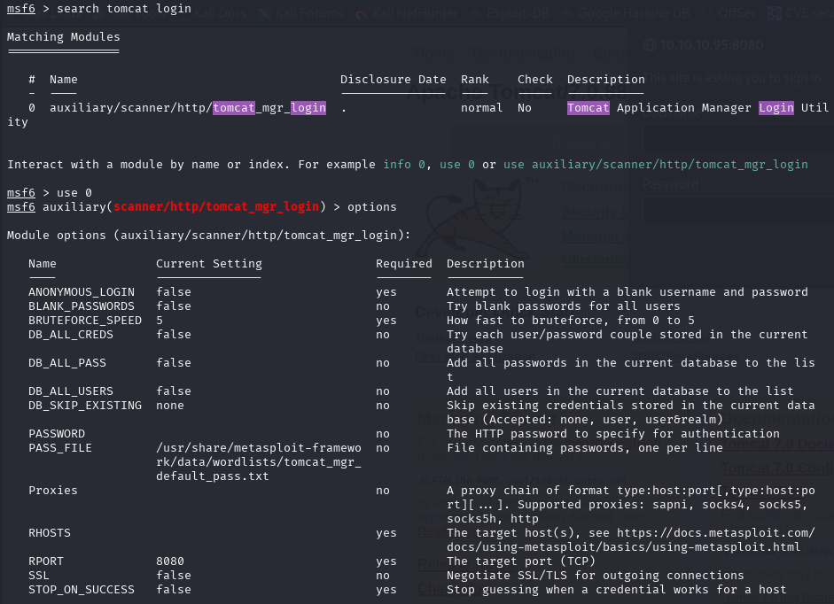
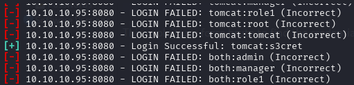
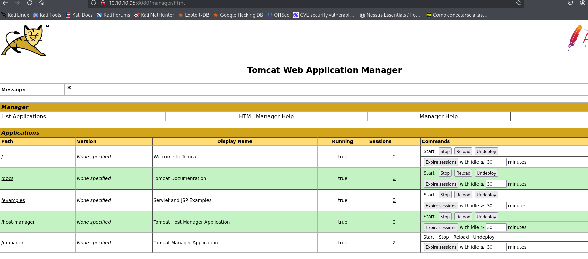
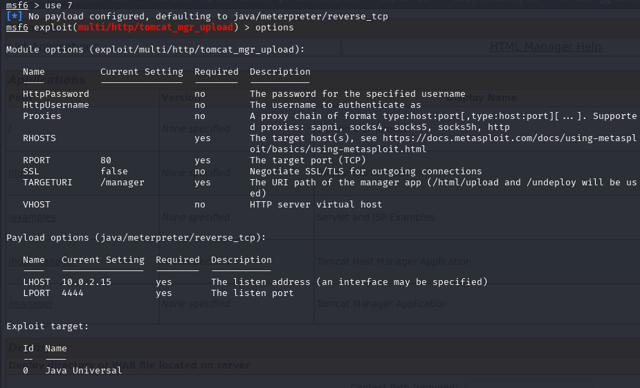
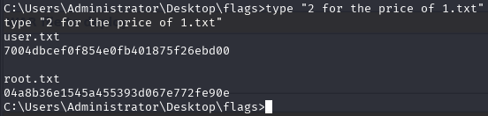

This exploit use force brute to find the credentials

Now we got the credentials --> tomcat:s3cret

Using this knowledge, we can exploit Tomcat with Metasploit by creating a custom malicious WAR file and deploying a new application.

After running exploit we successfully obtain a meterpreter shell on the target. Now that we have successfully compromised the target, we can spawn an interactive shell and read the flags in C:\Users\Administrator\Desktop\flags\2 for the price of 1.txt .

[Back](README.md)