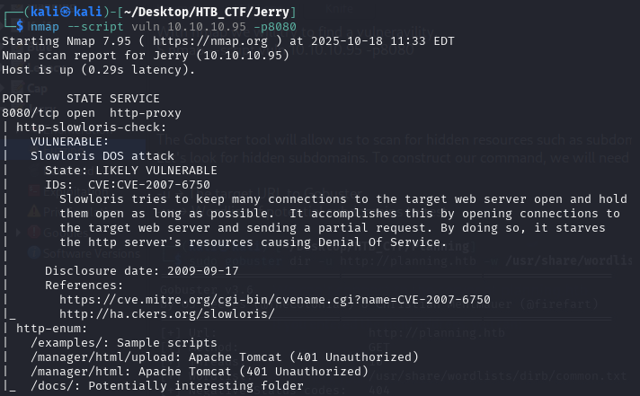
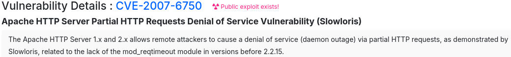
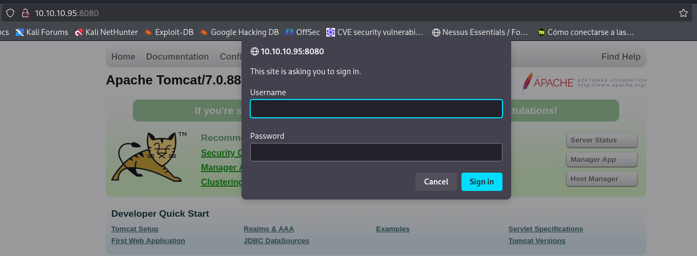

With nmap we will try to find a vulneravility.
```bash
$ nmap --script vuln 10.10.10.95 -p8080
```



We found that our Tomcat versions is vulnerable to CVE-2007-6750 (Slowloris DOS attack)



Navigate throw the web page, in the “Manager App” options, returns a login.



We don't find to do this attack, so we will know the credentials, so we use Metasploit tool to find some exploit to login.

[Back](README.md)