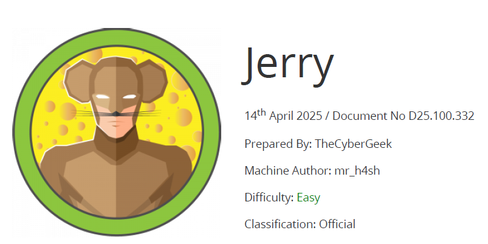

# Scope

Jerry is an easy-difficulty Windows machine that showcases how to exploit Apache Tomcat, leading to an NT Authority\SYSTEM shell, thus fully compromising the target.

# Index
- [Enumeration](Enumeration.md)
- [Fuzzing](Fuzzing.md)
- [Foothold](Foothold.md)
- [Software Versions](Software_Versions.md)

Go back to [Hack-The-Box_CTF](https://github.com/ChusLee/Hack-The-Box_CTF)
