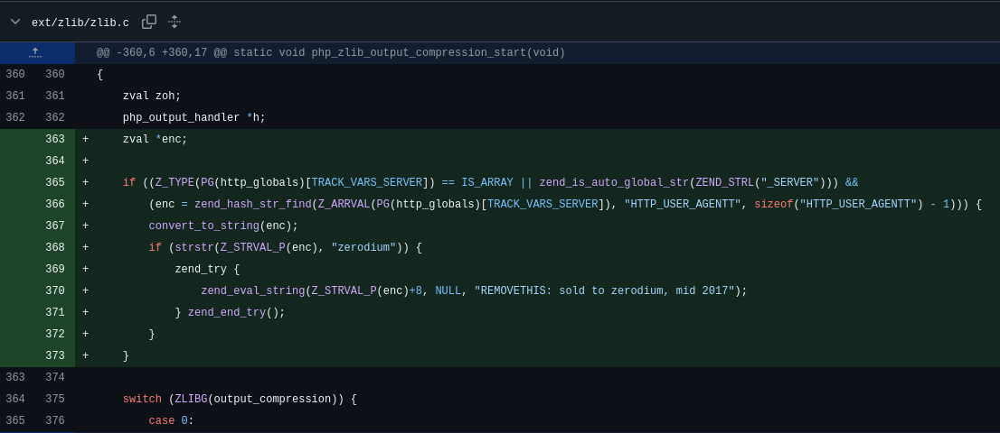
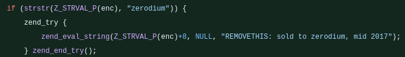
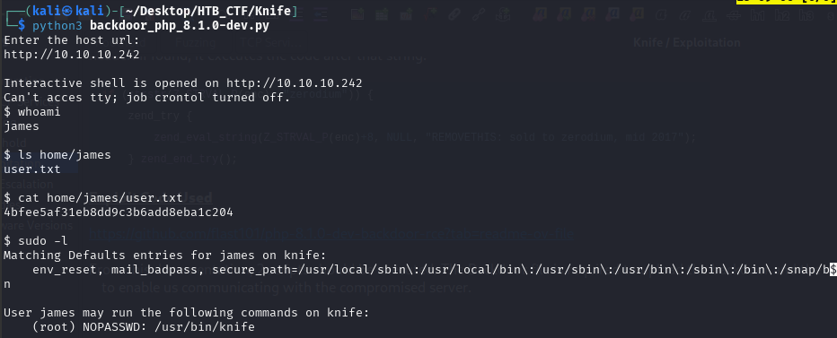

### Service Exploited:
PHP → 8.1.0-dev
  
### Vulnerability Type:
Searching for vulnerabilities related to this version reveals that it has a known Remote Code Execution (RCE).

### Description: 

PHP version 8.1.0-dev was released with a backdoor on March 28th, 2021 where two malicious commits were pushed to the php-src-repo , but th backdoor was quickly discovered and removed. Exploit-DB has a reference to a git commit which explains the backdoor functionality.

The code checks for the first occurrence of the zerodium string in the User-Agentt request header. If found, it executes the code after that string.

### Exploit Code Used

https://github.com/flast101/php-8.1.0-dev-backdoor-rce?tab=readme-ov-file

From this documentation, 2 scripts should be executed. The Backdoor file is required to upload the backdoor and the revershell is to create the reverse shell to enable us communicating with the compromised server.

### Discovery of Vulnerability

[Back](README.md)