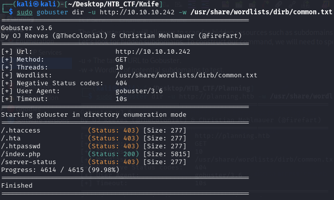
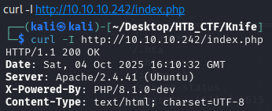

The Gobuster tool will allow us to scan for hidden resources such as subdomains, directories, and parameters.
Let's look for hidden subdomains. To construct our command, we will need to specify:

-u → The target URL to Gobuster.
-w → Wordlist of potential subdomains to test.

Nothing interesting from the results. We send a cURL request to index.php page and observe the response headers.

The X-Powered-By header reveals that the application is using PHP/8.1.0-dev version. Searching for vulnerabilities related to this version reveals that it has a known Remote Code Execution (RCE) exploit.

[Back](README.md)