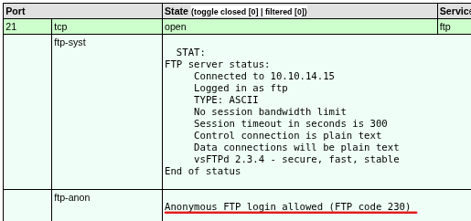
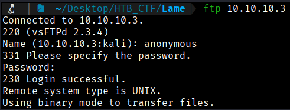
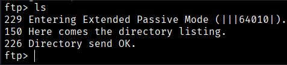
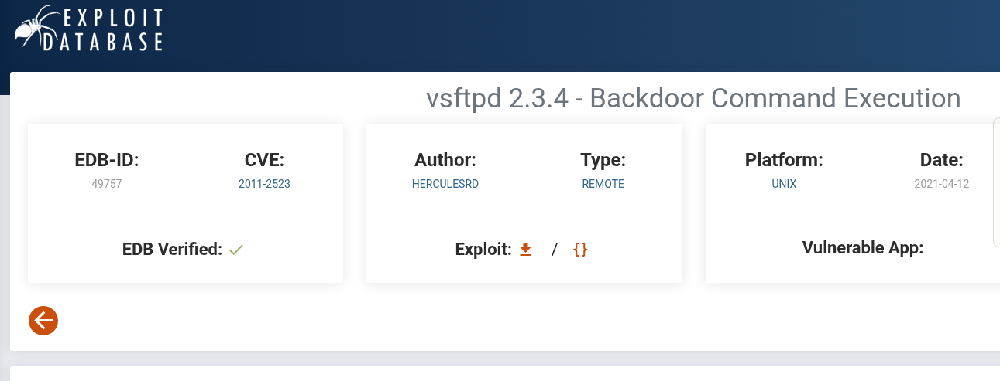
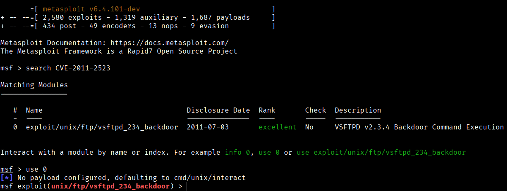
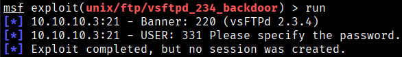

First of all we can try to conect via FTP with the  credentials anonymous:anonymous because our Nmap scan showed this credentials.


```bash
$ ftp 10.10.10.3
```


We can see that we are in with this credentials. So we can try to enumerate the different directories.



Well diden't find anything...

If we check again our Nmap scan, we can see that the FTP version is  2.3.4, so we can check if exist any vulnerability.



As we can see this version have a Backdoor command execution vulnerability. CVE 2011-2523.

Let's search in Metasploit this CVE.
```bash
$ msfconsole
$ search CVE-2011-2523
$ use 0
S options
$ run
```


Now we can go to options to set all the required variables.


 In this case, setting RHOST variable is enough. Now we can run the exploit.

 

  The exploit failed to send us a shell... So we can try to enumerate SMB protocol.

[Back](README.md)