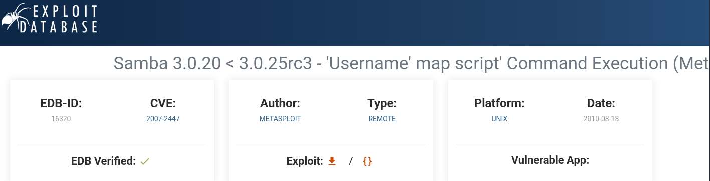
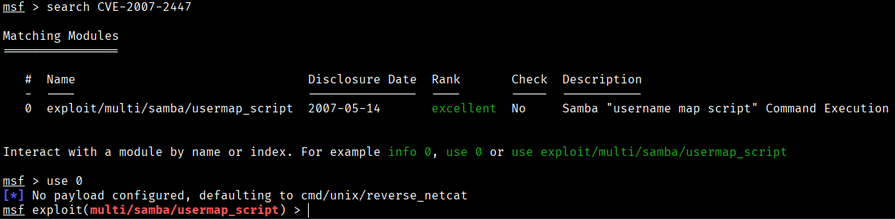
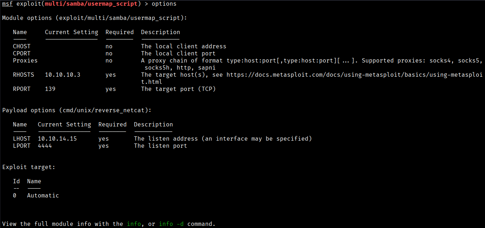
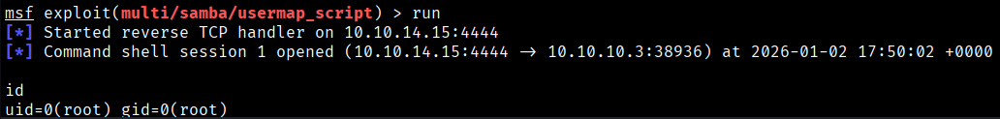

As I mentioned in the SMB enumeration step, we will check in google if exist any vulnerability in the SMB 3.0.20 version.



We're in luck, it seems that the version of SMB we have in front of us has a vulnerability of the “Username map script command execution” type. So, as we did with the FTP protocol, we will use Metasploit to search for any exploits for the CVE-2007-2447 vulnerability we have found.



Metasploit has an exploit for this CVE, so we are going to set the required options to see if we can get the shell.



A listener is started on the designated port, and we get a callback, landing us a shell on the target system as the root user.

The user flag can be found at /home/makis/user.txt , and the root flag can be found at /root/root.txt .


```bash
User flag → 8983b644148311e291a9d4bd696c1e79
Root flag → 229e55a5b1211b746bd5dab508a9371e
```


[Back](README.md)