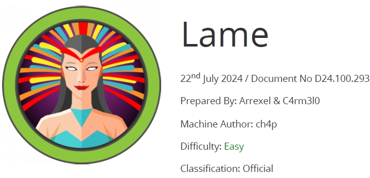

# Scope

Lame is an easy Linux machine, requiring only one exploit to obtain root access. It was the first machine published on Hack The Box and was often the first machine for new users prior to its retirement.

# Index
- [Enumeration](Enumeration.md)
- [FTP](FTP.md)
- [SMB](SMB.md)
- [Foothold](Foothold.md)
- [Software Versions](Software_Versions.md)

Go back to [Hack-The-Box_CTF](https://github.com/jesuscuenca-cyber/Hack-The-Box_CTF)
