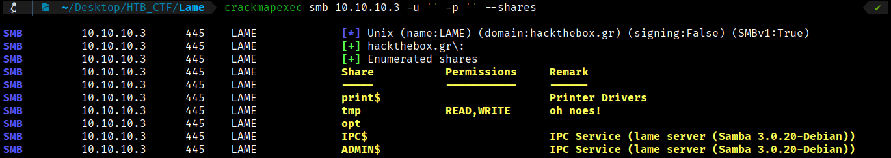
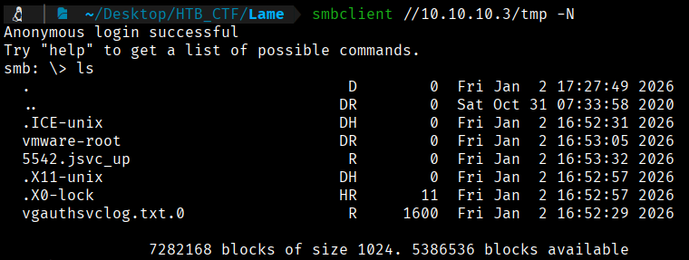
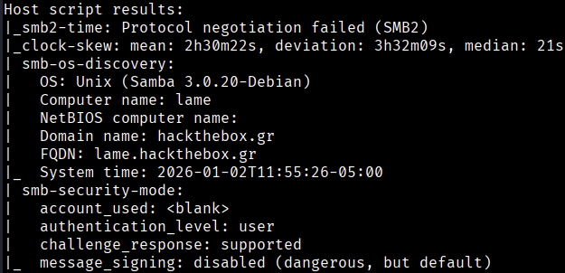

All attempts to access the FTP port have been ruled out, so we will proceed with the SMB service, which, according to the report obtained with Nmap, is also open. We will therefore proceed with enumeration via the SMB protocol.

We can try to enumerate the shares directory  with crackmapexec tool without credentials:
```bash
$ crackmapexec smb 10.10.10.3 -u ' ' -p ' ' --shares
```



We can see that without credentials we have Read and Write permisions in tmp directory. To enumerate this directory we use smbclient tool:
```bash
$ smbclient //10.10.10.3/tmp -N
```


We did not find any useful files, but we have the advantage of being able to write in this directory.

If we look at our Nmap report, we see that the SMB version is 3.0.20. With this information, we can search Google to see if there are any vulnerabilities.




[Back](README.md)