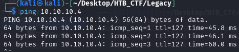
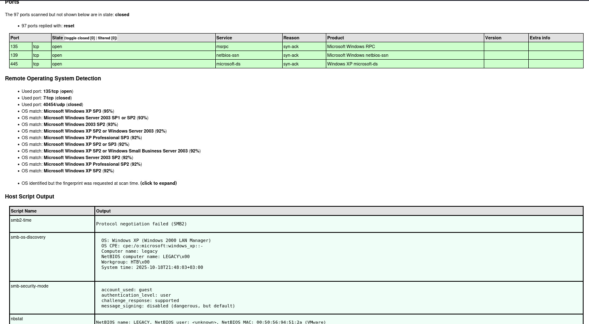
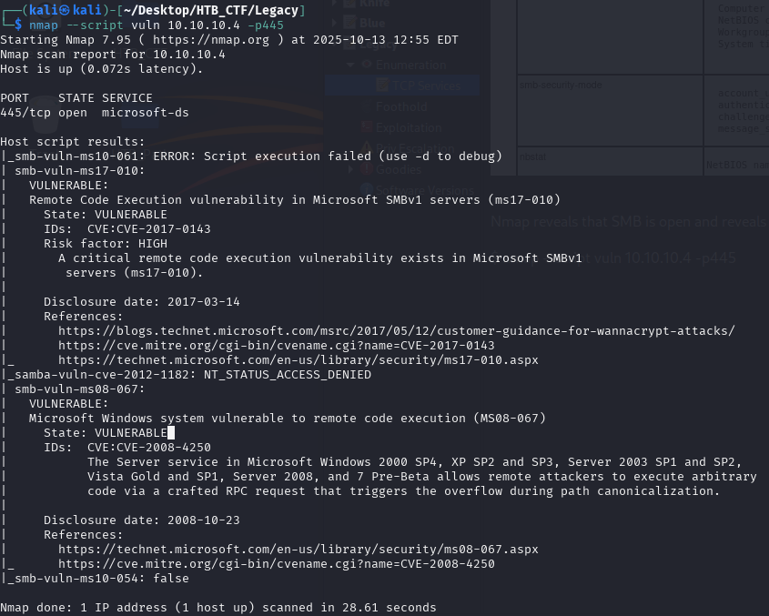

First of all we check that we have connection with IP target.



This TTL value on HTB indicates that is a Windows machine.

We will start with our usual Nmap scan and find two ports open. 
```bash
$ sudo nmap -F -sC -sV -A -oX nmap.xml 10.10.10.40
$ xsltproc nmap.xml -o nmap.html
```
-F → Scans fewer ports than the default: it scans the set of "top" ports from nmap-services (roughly the top 100 most common ports).
-sC → Run the default NSE (Nmap Scripting Engine) scripts against the target(s).
-sV → Service/version detection.
-A → Performs OS Detection Scan to determinate the OS of the target.
-oX → Output option: write results in XML format to file nmap.xml.  Other formats: -oN (normal), -oG (grepable), -oA (all formats).



Nmap reveals that SMB is open and reveals that the target is running Windows Server 2003, which have a vulnerabilty ms08-067
```bash
$ nmap --script vuln 10.10.10.4 -p445
```



[Back](README.md)